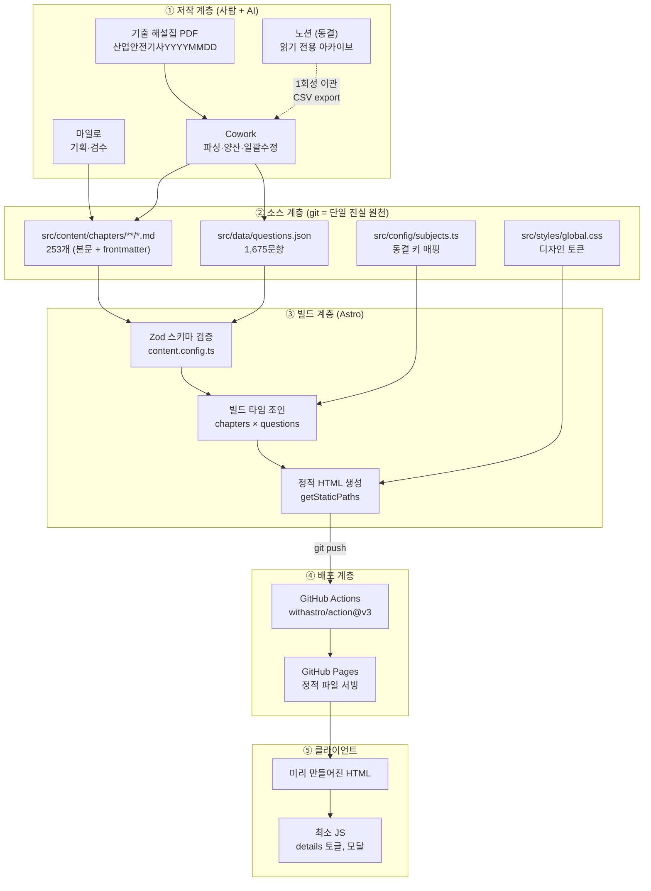
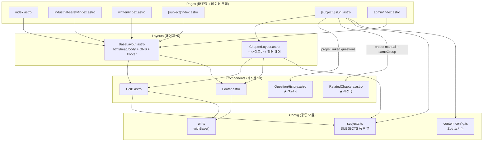
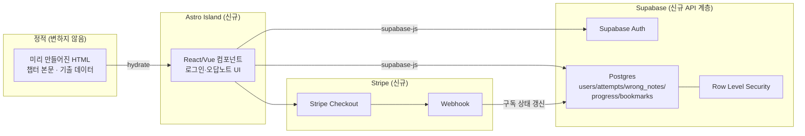
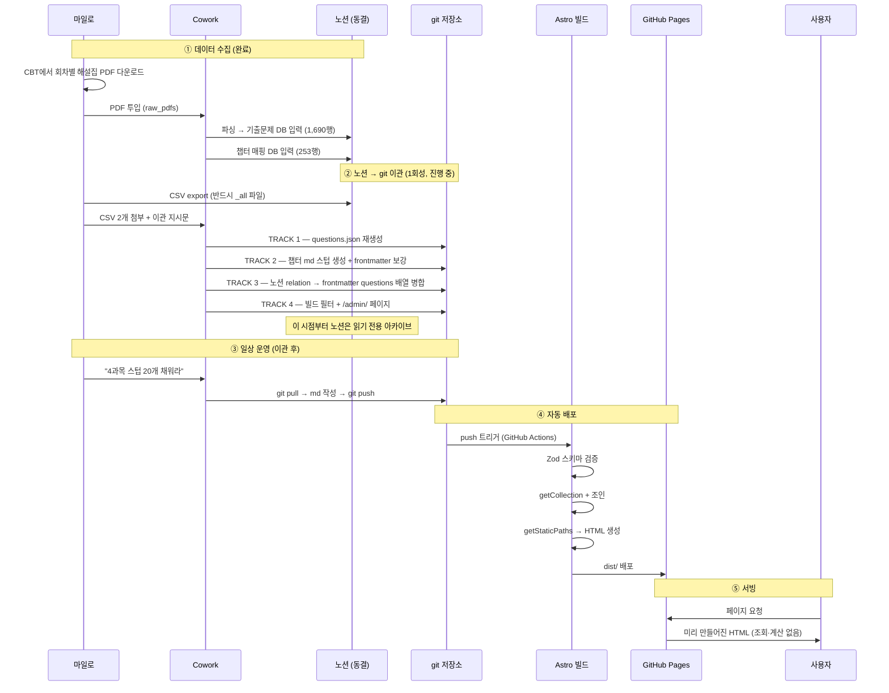
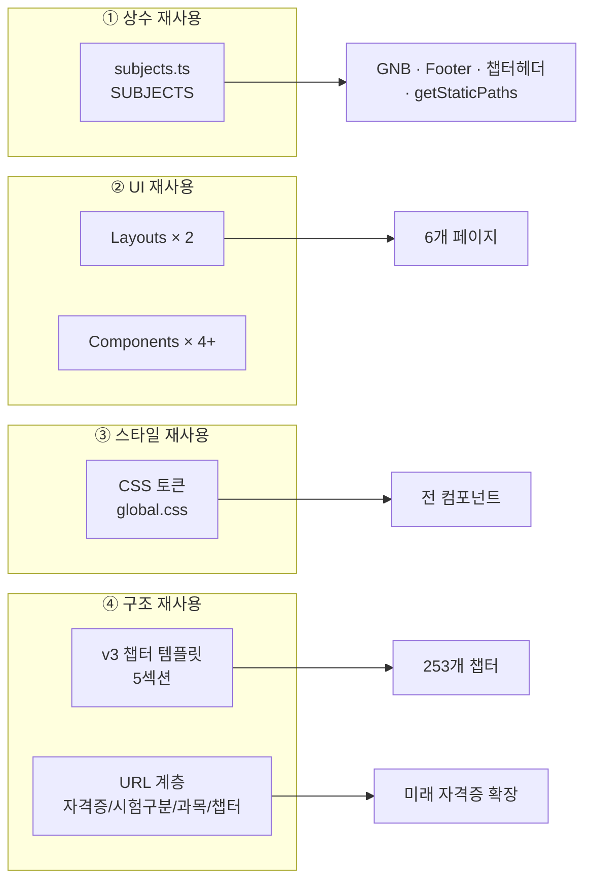
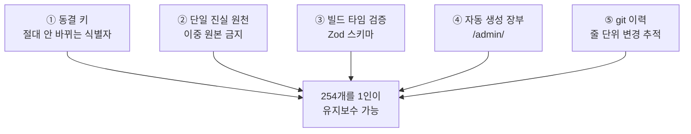
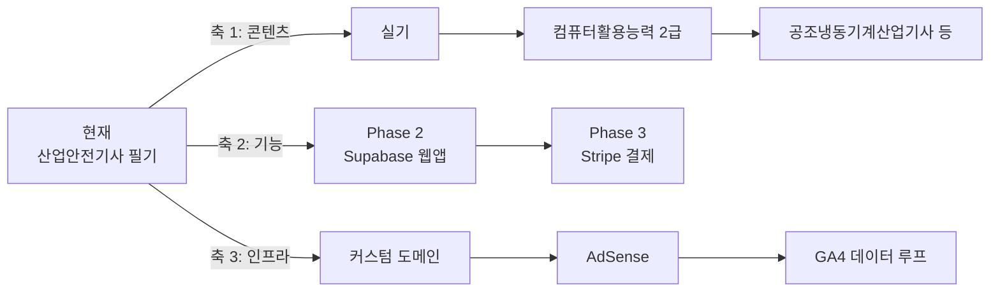

# ARCHITECTURE.md — GetPassLab 시스템 아키텍처

> **선행 문서**: `PROJECT_CONTEXT.md` (배경·철학), `PRD.md` (기능 정의)
> **작성 기준일**: 2026-07-14 / **버전**: v1.0
> **작성자**: Claude (대화 기록 + 실제 구현 코드 기반 재구성)

---

## 0. 이 문서의 신뢰도 등급

이 문서는 **실제 저장소를 직접 읽지 않고** 작성됐다. 근거의 출처를 등급으로 표시한다.

| 등급 | 의미 |
|------|------|
| 🟢 **코드 확인** | 대화 중 실제로 작성·빌드 검증된 코드 원문에서 확인. **높은 신뢰도** |
| 🟡 **설계 확정** | 정책으로 확정됐으나 실제 코드 반영 여부는 미확인 |
| 🔴 **문서-코드 불일치** | 문서와 실제 코드가 다르다. **반드시 실물 확인 필요** |
| ⚪ **추정** | 정황상 추정. 근거 약함 |

> **최종 진실 원천은 저장소다.** `git clone` 후 이 문서를 검증하고 갱신할 것. §14의 체크리스트를 사용하라.

---

## 1. 아키텍처 한 줄 요약

> **"런타임이 없는 시스템."**
> 서버도, DB도, API도, 상태 관리도 없다. 모든 연산은 **빌드 타임**에 끝나고, 사용자는 **미리 만들어진 HTML 파일**을 받는다.

이 한 문장이 이 아키텍처의 거의 모든 것을 설명한다. 아래의 모든 설계 결정은 이 원칙에서 파생됐다.

### 1.1 핵심 원칙 5가지

| # | 원칙 | 구체적 귀결 |
|---|------|-------------|
| 1 | **모든 것은 빌드 타임에** | 서버 비용 0, DB 비용 0, 응답 속도 최고, SEO 최적 |
| 2 | **단일 진실 원천 (이중 원본 금지)** | 챕터 = md, 기출 = questions.json, 관계 = frontmatter `questions` 배열. 각 데이터의 집은 **정확히 한 곳** |
| 3 | **동결 키 불변** | `slug` / `subject_id` / `question_id`는 URL·조인·(미래) 유저 데이터 참조를 동시에 담당 → **변경 불가** |
| 4 | **프레임워크 없음** | React/Vue 미사용. Astro 컴포넌트 + 네이티브 HTML/JS. **JS 번들 거의 0** |
| 5 | **웹앱 확장을 전제로 설계** | Phase 2에서 Supabase를 붙일 때 **콘텐츠 계층은 건드리지 않는다** |

---

## 2. 기술 스택

### 2.1 확정 스택 🟢 (코드에서 확인됨)

| 영역 | 도구 | 버전 | 근거 |
|------|------|------|------|
| **정적 사이트 생성기** | **Astro** | `^5.0.0` | `package.json` 확인 |
| **콘텐츠 포맷** | Markdown (`.md`) + YAML frontmatter | — | `src/content/chapters/**/*.md` |
| **콘텐츠 계층** | **Astro Content Layer API** (`glob` / `file` loader) | Astro 5 신기능 | `src/content.config.ts` |
| **스키마 검증** | **Zod** (Astro 내장) | — | `src/content.config.ts` |
| **수식 렌더링** | **KaTeX** + `remark-math` + `rehype-katex` | katex `^0.16.0`, remark-math `^6.0.0`, rehype-katex `^7.0.0` | `package.json`, `astro.config.mjs` |
| **스타일링** | **순수 CSS + CSS Custom Properties** | — | `src/styles/global.css` 🔴 (아래 §2.2 참조) |
| **폰트** | **Pretendard Variable** (jsDelivr CDN) | v1.3.9 | `ChapterLayout.astro` 🔴 |
| **호스팅** | **GitHub Pages** | — | — |
| **CI/CD** | **GitHub Actions** (`withastro/action@v3` + `actions/deploy-pages@v4`) | — | `.github/workflows/deploy.yml` |
| **언어** | TypeScript (Astro 컴포넌트 frontmatter) | — | `subjects.ts`, `url.ts` |

**런타임 의존성 전체 (`package.json`)** 🟢
```json
{
  "name": "getpasslab",
  "type": "module",
  "version": "0.1.0",
  "scripts": {
    "dev": "astro dev",
    "build": "astro build",
    "preview": "astro preview"
  },
  "dependencies": {
    "astro": "^5.0.0",
    "remark-math": "^6.0.0",
    "rehype-katex": "^7.0.0",
    "katex": "^0.16.0"
  }
}
```

> **의존성이 4개뿐이다.** 이것은 사고가 아니라 설계다. 1인 운영에서 의존성은 곧 유지보수 부채다.
> ⚠️ **주의**: 이후 `@astrojs/sitemap`이 추가되었을 가능성이 높다 (이관 지시문 PART 6에서 `sitemap({ filter: ... })` 설정을 요구). **실물 확인 필요.**

---

### 2.2 🔴 문서-코드 불일치 (가장 중요한 섹션)

**정책 문서와 실제 코드가 다르다.** 새로 투입되는 AI는 반드시 이 차이를 인지해야 한다.

| 항목 | 정책 문서 (노션·정책서) | **실제 코드** | 판정 |
|------|------------------------|--------------|------|
| **CSS** | Tailwind CSS | **순수 CSS + CSS 변수** (`global.css`). `package.json`에 Tailwind **없음** | 🔴 **코드가 맞다.** Tailwind는 도입되지 않았다 |
| **검색** | Pagefind | `package.json`에 **없음** | 🔴 **검색 미구현.** Pagefind는 계획 단계에 머물렀다 |
| **폰트** | Pretendard 자체 호스팅 | **jsDelivr CDN 로드** | 🔴 CDN 방식 |
| **KaTeX CSS** | (미기재) | **jsDelivr CDN 로드** | 코드 확인 |
| **View Transitions** | Astro 네이티브 `<ClientRouter />` | `astro.config.mjs`에 흔적 없음 | ⚪ 미적용 추정 |
| **`data/chapters.json`** | 초기 폴더 구조안에 존재 | **존재하지 않음.** 챕터는 md 파일 + Content Collections | 🔴 초기안 폐기됨 |
| **`scripts/sync-notion.ts`** | 초기 폴더 구조안에 존재 | **존재하지 않음.** 노션 동기화 스크립트는 만들어지지 않았고, 노션 자체가 동결됨 | 🔴 초기안 폐기됨 |

**시사점 3가지**

1. **Tailwind가 없다는 것은 중요하다.** Cowork나 AI에게 "Tailwind 클래스로 만들어줘"라고 지시하면 **동작하지 않는 코드**가 나온다. 스타일은 반드시 `global.css`의 **CSS 변수(디자인 토큰)** 를 사용해야 한다.
2. **검색이 없다.** GNB의 검색 아이콘·홈 Hero 검색창은 **설계만 존재**할 가능성이 크다. (실제 GNB 코드에는 로고와 "필기 과목" 드롭다운만 있다)
3. **CDN 의존이 2개 있다.** Pretendard와 KaTeX CSS. 네트워크 장애 시 폰트·수식이 깨진다. 자체 호스팅 전환은 저비용 개선 항목.

---

### 2.3 스택 선정 근거 (그리고 기각된 대안)

#### Astro를 택한 이유

| 근거 | 설명 |
|------|------|
| **Content Collections** | 254개 md의 frontmatter를 **빌드 타임에 Zod로 검증**. 스키마 위반 시 배포 전에 빌드가 실패한다 |
| **Islands Architecture** | 기본 JS 번들이 0. 필요한 곳에만 JS를 보낸다 → 모바일 성능 |
| **Markdown 네이티브** | 콘텐츠가 md인 이 프로젝트의 기본 전제와 정확히 일치 |
| **View Transitions 기본 지원** | `<ClientRouter />` 한 줄 (실제 적용은 미확인) |
| **React/Vue 혼용 가능** | **Phase 2 웹앱 확장 대비.** 정적 사이트를 버리지 않고 인터랙티브 섬만 추가할 수 있다 |

#### 기각된 스택

| 기각안 | 사유 |
|--------|------|
| **Notion + Super.so (노코드)** | ① AdSense 삽입 제약 → 수익 모델 자체가 불가능 ② 포트폴리오 서사 약화("콘텐츠 운영"으로 읽힘) ③ 웹앱 확장 시 구조적 한계 |
| **Next.js / 일반 SSR 프레임워크** | 서버 비용 발생. 정적으로 충분한 콘텐츠 사이트에 과잉 |
| **노션 API 런타임 fetch (A안)** | 빌드 안정성 저하 + API 호출 부담. **JSON export 방식(B안)** 채택 |
| **Firebase** | Stripe 연동이 수동. Supabase-Stripe 공식 통합이 우수 |
| **Tailwind** | 🔴 채택 결정은 했으나 **실제로는 도입되지 않았다.** (의도적 회피인지 단순 미도입인지 불명확 ⚪) |

---

## 3. 프로젝트 구조 (시스템 레벨)

### 3.1 전체 시스템 다이어그램



### 3.2 3개 계층의 책임

| 계층 | 무엇을 하는가 | 무엇을 하지 않는가 |
|------|--------------|-------------------|
| **저작** | 콘텐츠 생산, 데이터 파싱, 검수 | 런타임에 관여하지 않음 |
| **빌드** | 검증 · 조인 · HTML 생성 | 사용자 요청을 처리하지 않음 |
| **런타임(클라이언트)** | HTML 표시, 토글/모달 인터랙션 | **데이터를 가져오지 않음. 계산하지 않음** |

### 3.3 이 시스템에 **존재하지 않는 것** (중요)

새 AI가 습관적으로 만들려 할 수 있는 것들. **전부 없고, 필요 없다.**

| 없는 것 | 이유 |
|---------|------|
| **백엔드 서버** | 정적 사이트. GitHub Pages가 파일만 서빙 |
| **데이터베이스** | 콘텐츠는 git. 사용자 데이터는 Phase 2까지 존재하지 않음 |
| **REST/GraphQL API** | 요청-응답 자체가 없다. §6 참조 |
| **상태 관리 라이브러리** (Redux, Zustand, Pinia…) | 관리할 상태가 없다. §8 참조 |
| **React / Vue / Svelte** | Astro 컴포넌트만 사용 |
| **인증 / 세션** | Phase 2 |
| **환경 변수 / 시크릿** | 호출할 외부 API가 없다 |
| **`localStorage` 사용** | MVP에는 저장할 사용자 상태가 없다 |
| **번들러 설정 (webpack/vite 커스텀)** | Astro 기본값 사용 |

---

## 4. 디렉토리 구조

### 4.1 실제 트리 🟢 (코드 확인 + 이관 지시문 반영)

```
getpasslab/
│
├─ .github/
│  └─ workflows/
│     └─ deploy.yml                      # GitHub Actions 배포 (withastro/action@v3)
│
├─ public/                               # 그대로 복사되는 정적 자산
│  ├─ robots.txt                         # Disallow: /admin/  🟡
│  └─ (favicon, og image 등)             # ⚪ 존재 여부 미확인
│
├─ src/
│  │
│  ├─ config/                            # ★ 공통 상수 · 유틸 (프레임워크 아님, 순수 TS)
│  │  ├─ subjects.ts                     # 🟢 SUBJECTS 동결 키 매핑 + SubjectId 타입
│  │  └─ url.ts                          # 🟢 withBase() — base path 처리 유틸
│  │
│  ├─ content.config.ts                  # ★ 🟢 Content Collections 정의 (Zod 스키마)
│  │
│  ├─ content/
│  │  └─ chapters/                       # ★ 콘텐츠 단일 진실 원천
│  │     ├─ safety-management/           # 1과목
│  │     │  └─ {slug}.md
│  │     ├─ ergonomics/                  # 2과목
│  │     ├─ mechanical/                  # 3과목
│  │     ├─ electrical/                  # 4과목
│  │     │  └─ ohm-law.md                # 🟢 (샘플로 실재 확인)
│  │     ├─ chemical/                    # 5과목
│  │     └─ construction/                # 6과목
│  │                                     # 총 253개 (작성완료 82 + 스텁 171) 🟡
│  │
│  ├─ data/
│  │  └─ questions.json                  # ★ 🟢 기출 1,675문항 (단일 파일)
│  │
│  ├─ layouts/
│  │  ├─ BaseLayout.astro                # 🟢 일반 페이지 공통 셸
│  │  └─ ChapterLayout.astro             # 🟢 챕터 상세 전용 (사이드바 포함)
│  │
│  ├─ components/
│  │  ├─ GNB.astro                       # 🟢 글로벌 네비 (details 드롭다운)
│  │  ├─ Footer.astro                    # 🟢 푸터
│  │  ├─ QuestionHistory.astro           # 🟢 ★ 섹션 4 — 기출 뱃지 + 문제 레이어
│  │  └─ RelatedChapters.astro           # 🟢 ★ 섹션 5 — 관련 챕터 자동 링크
│  │                                     # (Breadcrumb, SubjectTabBar 등은 ⚪ 미확인)
│  │
│  ├─ pages/                             # ★ 파일 기반 라우팅 = URL 구조
│  │  ├─ index.astro                     # /                          홈
│  │  ├─ admin/
│  │  │  └─ index.astro                  # /admin/                    현황 페이지 🟡
│  │  └─ industrial-safety/
│  │     ├─ index.astro                  # /industrial-safety/        자격증 허브
│  │     └─ written/
│  │        ├─ index.astro               # /industrial-safety/written/  필기 허브
│  │        └─ [subject]/
│  │           ├─ index.astro            # .../{subject}/             과목 목차
│  │           └─ [slug].astro           # .../{subject}/{slug}/      챕터 상세 ★
│  │
│  └─ styles/
│     └─ global.css                      # ★ 🟢 디자인 토큰 + 전역 스타일 (단일 파일)
│
├─ astro.config.mjs                      # 🟢 site, base, markdown 플러그인
├─ package.json                          # 🟢 의존성 4개
├─ package-lock.json
└─ README.md                             # ⚪
```

### 4.2 디렉토리별 책임 원칙

| 디렉토리 | 책임 | 넣으면 안 되는 것 |
|----------|------|------------------|
| `src/config/` | **변하지 않는 상수와 순수 유틸.** 동결 키가 사는 곳 | 컴포넌트, 스타일 |
| `src/content/` | **콘텐츠 원본.** 사람이 쓰는 글 | 설정, 코드 |
| `src/data/` | **구조화 데이터.** 기계가 만든 JSON | 사람이 손으로 고칠 것 |
| `src/layouts/` | 페이지 **셸** (html/head/body, 공통 UI) | 페이지별 고유 로직 |
| `src/components/` | **재사용 UI 조각** | 데이터 조회 로직 (페이지가 조회해서 props로 넘긴다) |
| `src/pages/` | **라우팅 + 데이터 조회·조인** | 스타일 정의 |
| `src/styles/` | 디자인 토큰 + 전역 스타일 | 컴포넌트별 스코프 스타일 (그건 컴포넌트 안에) |

> **핵심 패턴**: **데이터 조회는 페이지에서, 표현은 컴포넌트에서.**
> 컴포넌트는 `getCollection()`을 호출하지 않는다. 페이지가 조회·조인해서 **props로 넘긴다.** (실제 코드가 이 패턴을 따른다)

### 4.3 URL ↔ 파일 매핑 🟢

| URL | 파일 | 생성 방식 |
|-----|------|-----------|
| `/` | `src/pages/index.astro` | 정적 |
| `/industrial-safety/` | `src/pages/industrial-safety/index.astro` | 정적 |
| `/industrial-safety/written/` | `src/pages/industrial-safety/written/index.astro` | 정적 |
| `/industrial-safety/written/electrical/` | `.../[subject]/index.astro` | **`getStaticPaths`** (6개) |
| `/industrial-safety/written/electrical/ohm-law/` | `.../[subject]/[slug].astro` | **`getStaticPaths`** (작성완료 챕터 수만큼) |
| `/admin/` | `src/pages/admin/index.astro` | 정적, `noindex` |

**URL 설계의 3가지 의도**

1. **`/industrial-safety/` 계층은 자격증 확장을 위한 것이다.** 컴활2급 추가 시 `/computer-literacy/`가 형제로 붙는다.
2. **`/written/` 계층은 시험구분(필기/실기)을 위한 것이다.** 실기 추가 시 `/practical/`이 형제로 붙는다.
3. **챕터 URL에 번호가 없다.** `order`가 바뀌어도 URL은 불변 → **SEO 인덱스 손실 방지.**

> **⚠️ 폐기된 구(舊) URL 구조**: `/subjects/{과목}/{챕터}` (과목 슬러그도 `accident-prevention` 등 다른 값이었음).
> 배포 전에 교체했으므로 리다이렉트 부채는 없다. 문서에서 발견되면 레거시다.

---

## 5. 컴포넌트 구조

### 5.1 계층도



### 5.2 레이아웃 2종 🟢

#### `BaseLayout.astro` — 일반 페이지 공통 셸
- `<html lang="ko">` / `<head>` (메타, 폰트 CDN, KaTeX CSS) / GNB / `<slot />` / Footer
- 홈·자격증 허브·필기·과목 목차·admin이 사용

#### `ChapterLayout.astro` — 챕터 상세 전용 🟢
실제 코드 (초기 버전):
```astro
---
import '../styles/global.css';
import { SUBJECTS, type SubjectId } from '../config/subjects';
interface Props {
  title: string; summary: string;
  subject_id: number; group: string; tags: string[];
}
const { title, summary, subject_id, group, tags } = Astro.props;
const subject = SUBJECTS[subject_id as SubjectId];
---
<!doctype html>
<html lang="ko">
  <head>
    <meta charset="utf-8" />
    <meta name="viewport" content="width=device-width, initial-scale=1" />
    <title>{title} | 산업안전기사 핵심요약 - GetPassLab</title>
    <meta name="description" content={summary} />
    <link rel="stylesheet" href="https://cdn.jsdelivr.net/gh/orioncactus/pretendard@v1.3.9/dist/web/variable/pretendardvariable-dynamic-subset.min.css" />
    <link rel="stylesheet" href="https://cdn.jsdelivr.net/npm/katex@0.16.11/dist/katex.min.css" />
  </head>
  <body>
    <main>
      <div class="chapter-eyebrow">
        <span>{subject_id}과목 {subject.name}</span>
        <span class="group-badge">{group}</span>
      </div>
      <h1>{title}</h1>
      <p class="summary">{summary}</p>
      <div class="tags">{tags.map(t => <span>#{t}</span>)}</div>
      <article><slot /></article>
    </main>
  </body>
</html>
```

**주목할 점 3가지**
1. **`<title>`과 `<meta description>`이 frontmatter에서 자동 생성된다.** 254개 챕터의 SEO 메타를 수동 작성할 수 없으므로 **`summary` 필드가 곧 meta description**이다. → **`summary`는 SEO 자산이다. 대충 쓰면 안 된다.**
2. **`SUBJECTS[subject_id]`로 과목명을 조회**한다. 과목명이 바뀌면 `subjects.ts` 한 곳만 고치면 전 페이지에 반영된다.
3. 이후 버전에서 `sideChapters` prop이 추가되어 **사이드바**를 렌더한다.

### 5.3 컴포넌트 카탈로그

| 컴포넌트 | 역할 | props | 인터랙션 |
|----------|------|-------|----------|
| **`GNB.astro`** 🟢 | 로고 + "필기 과목" 드롭다운 | 없음 (`SUBJECTS`를 직접 import) | **네이티브 `<details>/<summary>`** + 바깥 클릭 시 닫기 (인라인 `<script>` 6줄) |
| **`Footer.astro`** 🟢 | 브랜드 / 학습 / 서비스 링크 컬럼 | 없음 | 없음 |
| **`QuestionHistory.astro`** 🟢 ★ | **섹션 4.** 기출 빈도 라벨 + 회차 뱃지 + 클릭 시 문제 레이어 | `questions` (조인된 문제 배열), `examComment` (string) | 뱃지 클릭 → 문제 레이어 |
| **`RelatedChapters.astro`** 🟢 ★ | **섹션 5.** 수동 지정 + 동일 그룹 챕터 링크 | `manual`, `sameGroup` | 없음 |

**설계 원칙: 컴포넌트는 데이터를 조회하지 않는다.**
```astro
<!-- ❌ 하지 않는 방식 -->
<QuestionHistory chapterSlug={slug} />   <!-- 컴포넌트가 알아서 조회 -->

<!-- ✅ 실제 방식 -->
<QuestionHistory questions={linked} examComment={chapter.data.examComment} />
```
이유: 조회를 컴포넌트에 넣으면 **동일 데이터를 N번 읽는다** (Astro는 캐싱하지만 빌드 시간이 늘고 의존 관계가 흐려진다). 페이지가 조회하고 props로 내려주면 데이터 흐름이 **한 방향**으로 명확해진다.

### 5.4 인터랙션 구현 방식 — "프레임워크 없이"

| 인터랙션 | 구현 |
|----------|------|
| GNB 드롭다운 | **네이티브 `<details>/<summary>`** + 바깥 클릭 감지 스크립트 |
| 기출 뱃지 → 문제 레이어 | ⚪ 미확인. `<details>` 또는 `<dialog>` 또는 최소 JS 추정 |
| 기출 뱃지 말줄임/펼치기 | ⚪ 미확인. CSS + `<details>` 추정 |
| 모바일 사이드바 드롭다운 | ⚪ 미확인. `<details>` 추정 |
| 그룹 접기/펴기 (과목 목차) | ⚪ 미확인. `<details>` 추정 |

> **핵심 판단**: **JS 프레임워크 없이 접기/펼치기 UI를 전부 만들 수 있다.** HTML `<details>` 요소가 상태·토글·접근성을 전부 처리한다. 이것이 이 사이트의 JS 번들이 거의 0인 이유다.
>
> **AI에게**: 새 인터랙션을 만들 때 **React를 import하지 마라.** 먼저 `<details>`, `<dialog>`, CSS `:target`으로 되는지 확인하라.

**GNB 실제 코드** 🟢
```astro
---
import { SUBJECTS } from '../config/subjects';
import { withBase } from '../config/url';
const entries = Object.entries(SUBJECTS);
---
<header class="gnb">
  <nav class="gnb-inner">
    <a href={withBase('/')} class="gnb-logo">GetPassLab</a>
    <div class="gnb-spacer"></div>
    <details class="gnb-menu">
      <summary>필기 과목 <svg …/></summary>
      <div class="gnb-dropdown">
        {entries.map(([id, s]) => (
          <a href={withBase(`/industrial-safety/written/${s.slug}/`)}>
            {id}과목 · {s.name}
          </a>
        ))}
      </div>
    </details>
  </nav>
</header>
<script>
  document.querySelectorAll('.gnb-menu').forEach(d => {
    document.addEventListener('click', e => {
      if (d instanceof HTMLDetailsElement && d.open && !d.contains(e.target as Node)) d.open = false;
    });
  });
</script>
```

> ⚠️ **여기서 확인되는 사실**: **GNB에 검색 아이콘이 없다.** 정책서의 GNB 구성(로고/필기/검색/소개)과 다르다. **검색은 미구현이 확실시된다.**

---

## 6. API 구조

### 6.1 "API가 없다"는 것 자체가 아키텍처다

**Phase 1에는 API가 단 하나도 없다.** REST 엔드포인트도, GraphQL도, 서버리스 함수도 없다.

이것은 결핍이 아니라 **의도된 설계**다. 그 대가로 얻은 것:

| 얻은 것 | 설명 |
|---------|------|
| **비용 0** | 서버·DB 없음. 총 운영비 = 도메인 연 ₩18,000 |
| **속도** | DB 조회·서버 렌더링 없이 파일만 전달 |
| **SEO 최적** | 크롤러가 완성된 HTML을 그대로 읽는다 |
| **장애 지점 최소** | 죽을 서버가 없다 |
| **보안 표면 최소** | 인증·인젝션·레이트리밋 이슈가 존재하지 않는다 |

지불한 대가:

| 잃은 것 | 대응 |
|---------|------|
| 개인화 불가 | Phase 2로 이연 |
| **정답 데이터 클라이언트 노출** | **의도적 수용.** 무료 시험 준비 서비스의 업계 표준 |
| 실시간 데이터 불가 | 필요 없음 (기출은 3개월에 한 번 늘어난다) |

### 6.2 API를 대신하는 것: 빌드 타임 데이터 접근 계층

"API 호출"에 해당하는 것은 **Astro의 `getCollection()`** 이다. 차이는 **네트워크가 아니라 파일 시스템**이고, **런타임이 아니라 빌드 타임**이라는 점이다.

```astro
// ❌ 일반 웹앱: 런타임 API 호출
const res = await fetch('/api/chapters/ohm-law');
const chapter = await res.json();

// ✅ GetPassLab: 빌드 타임 파일 조회
const chapters = await getCollection('chapters');
const chapter = chapters.find(c => c.data.slug === 'ohm-law');
```

**데이터 접근 인터페이스 (전체)** 🟢

| 호출 | 반환 | 사용처 |
|------|------|--------|
| `getCollection('chapters')` | 253개 챕터 (frontmatter + 본문) | 모든 페이지 |
| `getCollection('questions')` | 1,675문항 | 챕터 상세 (조인용) |
| `render(chapter)` | `{ Content }` — md 본문의 Astro 컴포넌트 | 챕터 상세 |
| `SUBJECTS[subject_id]` | `{ slug, name }` | 전역 |
| `withBase(path)` | base path가 붙은 URL | 모든 링크 |

**이것이 전부다.** 다른 데이터 접근 경로는 없다.

### 6.3 챕터 상세 페이지의 조인 로직 (실제 코드) 🟢

이 파일이 **아키텍처의 심장**이다. 데이터가 어떻게 합쳐져 한 페이지가 되는지가 전부 여기 있다.

```astro
---
// src/pages/industrial-safety/written/[subject]/[slug].astro
import { getCollection, render } from 'astro:content';
import ChapterLayout from '../../../../layouts/ChapterLayout.astro';
import QuestionHistory from '../../../../components/QuestionHistory.astro';
import RelatedChapters from '../../../../components/RelatedChapters.astro';
import { SUBJECTS, type SubjectId } from '../../../../config/subjects';

// ① 라우팅: 어떤 URL들을 생성할지 결정
export async function getStaticPaths() {
  const chapters = await getCollection('chapters');
  return chapters.map(ch => ({
    params: {
      subject: SUBJECTS[ch.data.subject_id as SubjectId].slug,  // ← 동결 키 조인
      slug: ch.data.slug,                                        // ← 동결 키
    },
    props: { chapter: ch },
  }));
}

const { chapter } = Astro.props;
const { Content } = await render(chapter);   // ② 본문(md) → 렌더 가능한 컴포넌트

// ③ 조인 A: 챕터 → 기출문제 (섹션 4 데이터)
const allQuestions = await getCollection('questions');
const linked = chapter.data.questions            // frontmatter의 ID 배열
  .map(id => allQuestions.find(q => q.data.id === id)?.data)
  .filter(Boolean)
  .sort((a, b) => b!.id.localeCompare(a!.id));   // 최신 회차 먼저

// ④ 조인 B: 챕터 → 관련 챕터 (섹션 5 데이터)
const allChapters = await getCollection('chapters');
const manual = chapter.data.related              // 수동 지정 슬러그
  .map(s => allChapters.find(c => c.data.slug === s)?.data)
  .filter(Boolean);
const sameGroup = allChapters                    // 동일 그룹 자동
  .filter(c => c.data.group === chapter.data.group && c.data.slug !== chapter.data.slug)
  .map(c => c.data);

// ⑤ 조인 C: 사이드바 (같은 과목 전체 챕터)
const sideChapters = allChapters
  .filter(c => c.data.subject_id === chapter.data.subject_id)
  .map(c => ({ slug: c.data.slug, title: c.data.title, group: c.data.group }));
---
<ChapterLayout {...chapter.data} sideChapters={sideChapters}>
  <Content />                                                    <!-- 섹션 1~3 (수동 작성) -->
  <QuestionHistory questions={linked} examComment={chapter.data.examComment} />  <!-- 섹션 4 (자동) -->
  <RelatedChapters manual={manual} sameGroup={sameGroup} />      <!-- 섹션 5 (자동) -->
</ChapterLayout>
```

**이 30줄이 담고 있는 설계 결정들**

| 코드 | 담긴 결정 |
|------|-----------|
| `SUBJECTS[subject_id].slug` | 과목 슬러그는 **코드 한 곳**(`subjects.ts`)에만 존재. md에는 `subject_id: 4` 숫자만 |
| `chapter.data.questions.map(...)` | **기출-챕터 관계의 유일한 저장처가 frontmatter 배열**임을 코드가 강제 |
| `<Content />` + `<QuestionHistory />` | **수동 영역과 자동 영역의 경계**가 물리적으로 분리됨 |
| `sort(b.id.localeCompare(a.id))` | 문제 ID가 `YYYYMMDD_NNN`이라 **문자열 정렬 = 날짜 역순**. ID 설계의 부수 효과 |
| `filter(Boolean)` | 존재하지 않는 ID는 조용히 제외 → **오타가 빌드를 깨지 않고 조용히 사라진다** ⚠️ (§13 리스크) |

> ⚠️ **이관 후 추가되어야 할 필터**: `getStaticPaths`에 `.filter(ch => ch.data.status === '작성완료')`가 들어가야 스텁이 새어나오지 않는다. `sideChapters`에도 동일 필터 필요.

### 6.4 Phase 2에서 처음 등장할 API



**Phase 2 아키텍처 원칙 (반드시 지킬 것)**

| 원칙 | 이유 |
|------|------|
| **콘텐츠 계층은 건드리지 않는다** | 챕터·기출은 계속 git + 정적 빌드. DB로 옮기면 속도·비용·SEO를 전부 잃는다 |
| **DB에 들어가는 것은 "사람마다 다른 값"뿐** | "이 사용자의 오답", "이 사용자의 진도". 챕터 본문은 모두에게 동일 → 정적 |
| **Astro Islands로 부분 하이드레이션** | 페이지 전체를 SPA로 바꾸지 않는다. 로그인/오답 UI만 섬으로 |
| **동결 키가 외래 키가 된다** | `wrong_notes.question_id` → `questions.json`의 `id`. `progress.chapter_slug` → md의 `slug` |
| **RLS(Row Level Security) 필수** | Supabase는 클라이언트에서 직접 DB를 호출한다. RLS 없으면 남의 데이터가 보인다 |

**변수가 들어가는 순간 DB가 필요하다** — 이 판단 기준이 Phase 1/2의 경계선이다.

| 기능 | 정적 가능 | DB 필요 |
|------|-----------|---------|
| 챕터 요약 보기 | ✅ | |
| 기출문제 풀기 | ✅ | |
| 정답 확인 | ✅ | |
| **모의고사 (랜덤 출제 + 채점)** | ✅ | (기록 저장만 DB) |
| 오답노트 저장 | | ✅ |
| 학습 진도 저장 | | ✅ |
| 로그인 | | ✅ |
| 구독 여부 확인 | | ✅ |

---

## 7. 데이터 흐름

### 7.1 End-to-End 콘텐츠 파이프라인



### 7.2 questions.json 변환 규칙 🟢 (실제 실행된 코드)

```python
# 노션 CSV → questions.json 변환 (Cowork/Claude가 실행)
df = pd.read_csv('questions.csv', encoding='utf-8-sig')
df = df.drop_duplicates(subset='문제 ID', keep='first')   # 20190427_021~030 중복 10건 제거

ans_map = {'①':1,'②':2,'③':3,'④':4,'1':1,'2':2,'3':3,'4':4}

out = []
for _, r in df.iterrows():
    d = str(r['문제 ID']).split('_')[0]        # 20220424
    out.append({
        'id':         r['문제 ID'],                              # 동결 키
        'subject_id': int(str(r['과목'])[0]),                    # "4과목 전기…" → 4
        'date':       f"{d[:4]}-{d[4:6]}-{d[6:]}",              # 2022-04-24
        'label':      f"{d[:4]}년 {int(d[4:6])}월 시행",         # "2022년 4월 시행"
        'number':     int(r['문제 번호']),
        'body':       str(r['문제 본문']),
        'choices':    [str(r[f'선택지 {i}']) if pd.notna(...) else '' for i in range(1,5)],
        'answer':     parse_ans(r['정답']),                      # ①②③④ → 1~4
        # 'review':   r['검수 상태']   ← 이관 세션에서 추가 (이미지 문제 식별용)
    })
```

**문항 수의 정확한 계보** 🟢 — 세 숫자의 정체가 여기서 확정된다

| 단계 | 문항 수 | 설명 |
|------|---------|------|
| 노션 CSV export | **약 1,690** | 원본 (중복 포함) |
| 중복 제거 후 | **1,680** | `20190427_021~030` 중복 10건 제거 |
| **정답 파싱 실패 5건 제외** | **1,675** | ← **`questions.json` 최종 문항 수** |

> 이로써 `PROJECT_CONTEXT.md`에 남긴 "1,675 vs 1,680" 불확실성이 **해소된다.** 둘 다 맞고, **최종 탑재값은 1,675**다.

**정답 파싱 실패가 빌드를 깨는 이유**: Zod 스키마가 `answer: z.number().min(1).max(4)`이므로 `answer: 0`이 있으면 **빌드가 실패한다.** 그래서 파싱 실패 문항은 반드시 제외해야 한다. → **스키마가 데이터 품질을 강제하는 구조.**

### 7.3 클라이언트 런타임 데이터 흐름

```
사용자 → GitHub Pages → HTML 파일 (끝)
```

**추가로 일어나는 일 (전부)**
1. jsDelivr에서 Pretendard 폰트 CSS 로드
2. jsDelivr에서 KaTeX CSS 로드
3. GNB 드롭다운 바깥 클릭 감지 스크립트 실행 (6줄)
4. (승인 후) AdSense 스크립트 로드
5. (연동 시) GA4 스크립트 로드

**데이터 fetch는 0건이다.** 기출문제 데이터도 이미 HTML에 인라인되어 있다.

> ⚠️ **`questions.json`은 클라이언트에 통째로 내려가지 않는다.** 빌드 타임에 챕터별로 필요한 문제만 HTML에 박힌다. 즉 **한 챕터 페이지에는 그 챕터의 기출 N개만 존재한다.** (정답 노출은 여전하지만, 1,675문항 전체가 한 번에 새는 것은 아니다)

---

## 8. 상태 관리

### 8.1 결론: 관리할 상태가 없다

**Phase 1에는 상태 관리 라이브러리가 없고, 필요하지도 않다.** Redux·Zustand·Pinia·Context — 전부 부재.

이유는 단순하다: **상태란 "시간에 따라 변하는 값"인데, 이 사이트에는 변하는 값이 없다.** 사용자가 무엇을 하든 데이터는 바뀌지 않는다.

### 8.2 실제로 존재하는 3종류의 "상태"

| 종류 | 어디에 사는가 | 관리 방식 | 예시 |
|------|--------------|-----------|------|
| **① 빌드 타임 데이터** | HTML에 박제됨 | Astro Content Collections | 챕터 본문, 기출 데이터, 과목 정보 |
| **② DOM 상태 (일시적)** | 브라우저 DOM | **네이티브 HTML** (`<details open>`) | 드롭다운 열림/닫힘, 모달 열림/닫힘, 그룹 접힘 |
| **③ URL 상태** | 주소창 | 브라우저 | 현재 페이지 = 현재 챕터 |

**②가 핵심이다.** `<details>` 요소는 `open` 속성으로 상태를 스스로 관리한다. JS 변수도, 스토어도 필요 없다.

```html
<!-- 상태 관리 라이브러리 없이 토글 상태를 관리하는 방법 -->
<details class="gnb-menu">
  <summary>필기 과목</summary>
  <div class="gnb-dropdown">…</div>
</details>
```
브라우저가 `open` 속성을 토글한다. 접근성(키보드 조작, 스크린리더)도 공짜로 따라온다.

### 8.3 Phase 2에서 처음 등장할 상태

| 상태 | 저장소 | 관리 방식 |
|------|--------|-----------|
| 인증 세션 | Supabase Auth (JWT, localStorage) | `supabase-js` 클라이언트 |
| 학습 진도 | Supabase Postgres | 서버 상태 (TanStack Query 등 검토 가능) |
| 오답 노트 | localStorage(비회원) → Supabase(회원) | 하이브리드 |
| 구독 상태 | Supabase (Stripe Webhook이 갱신) | 서버 상태 |
| 모의고사 진행 중 답안 | 컴포넌트 로컬 상태 | React `useState` 수준으로 충분 |

> **Phase 2에서도 전역 상태 관리 라이브러리는 아마 필요 없다.** 상태의 대부분이 **서버 상태**(Supabase)이고, 클라이언트 전역 상태는 "로그인 여부" 하나뿐이다. Redux를 도입하려는 충동은 억제할 것.

---

## 9. 공통 모듈

### 9.1 `src/config/subjects.ts` — 동결 키의 집 🟢

```typescript
// ⚠️ 동결 키: 배포 후 변경 불가. 출시 전 최종 확정할 것.
export const SUBJECTS = {
  1: { slug: 'safety-management', name: '산업재해 예방 및 안전보건교육' },
  2: { slug: 'ergonomics',        name: '인간공학 및 위험성평가·관리' },
  3: { slug: 'mechanical',        name: '기계·기구 및 설비 안전관리' },
  4: { slug: 'electrical',        name: '전기설비 안전관리' },
  5: { slug: 'chemical',          name: '화학설비 안전관리' },
  6: { slug: 'construction',      name: '건설공사 안전관리' },
} as const;

export type SubjectId = keyof typeof SUBJECTS;
```

**이 12줄이 프로젝트에서 가장 위험하고 가장 중요한 파일이다.**

| 이 파일이 지배하는 것 | 설명 |
|----------------------|------|
| **URL 경로** | `/industrial-safety/written/{slug}/...` |
| **파일 경로** | `src/content/chapters/{slug}/*.md` |
| **GNB 드롭다운** | 6개 메뉴 항목 |
| **챕터 헤더의 과목명** | `SUBJECTS[subject_id].name` |
| **`getStaticPaths` 라우팅** | 모든 챕터 URL 생성 |

**`as const` + `keyof typeof`의 의미**: `subject_id`가 1~6이 아니면 **TypeScript가 컴파일 단계에서 잡는다.** 런타임 오류가 아니라 빌드 오류로 만든다.

> 🚨 **이 파일의 `slug` 값을 바꾸면**: 모든 URL이 바뀌고 → SEO 인덱스가 전부 죽고 → 파일 경로도 전부 옮겨야 하고 → Phase 2의 유저 데이터가 고아가 된다. **절대 건드리지 마라.**

### 9.2 `src/config/url.ts` — `withBase()` 🟢

```typescript
// 실제 구현은 미확인이나, 용도는 명확하다:
// GitHub Pages 서브패스(/getpasslab/)를 모든 링크 앞에 붙인다.
export function withBase(path: string): string {
  return `${import.meta.env.BASE_URL}${path}`.replace(/\/+/g, '/');
}
```
🟡 *(정확한 구현 코드는 미확인. 위는 표준 패턴 기반 재구성)*

**왜 이 모듈이 필요한가**

GitHub Pages의 임시 주소는 `syjy813.github.io/**getpasslab**/` 이다. 즉 사이트가 **서브디렉토리**에 산다. 그래서 링크를 `/industrial-safety/`로 쓰면 `syjy813.github.io/industrial-safety/`로 가버려서 **404**가 난다.

`withBase()`는 이 문제를 **한 곳에서** 해결한다.

```astro
<a href={withBase('/industrial-safety/written/electrical/')}>4과목</a>
<!-- 임시 주소: /getpasslab/industrial-safety/written/electrical/ -->
<!-- 커스텀 도메인: /industrial-safety/written/electrical/ -->
```

> ⚠️ **커스텀 도메인(`getpasslab.site`) 연결 시 반드시 해야 할 일**:
> `astro.config.mjs`의 `base` 설정을 제거(또는 `/`로 변경)한다. **`withBase()`가 모든 링크를 감싸고 있으므로, 설정 한 줄만 바꾸면 전체 사이트의 링크가 동시에 정상화된다.**
> 이것이 이 유틸을 만든 이유다. 만약 링크를 하드코딩했다면 254개 페이지를 전부 고쳐야 했다.
>
> 배포 초기에 **"임시 주소에서 스타일이 깨지는 문제"**가 실제로 발생했다. 원인은 `site: 'https://getpasslab.site'`로 설정한 상태에서 `github.io/getpasslab/`로 접속했기 때문이다. 이후 임시 주소 기준으로 설정을 조정했다.

### 9.3 `src/content.config.ts` — 스키마 계약 🟢

```typescript
import { defineCollection, z } from 'astro:content';
import { glob, file } from 'astro/loaders';

const chapters = defineCollection({
  loader: glob({ pattern: '**/*.md', base: './src/content/chapters' }),
  schema: z.object({
    title:       z.string(),
    slug:        z.string(),                      // 동결 키
    subject_id:  z.number().min(1).max(6),        // 동결 키
    group:       z.string(),
    tags:        z.array(z.string()).default([]),
    summary:     z.string(),                      // = 목록 미리보기 + meta description
    questions:   z.array(z.string()).default([]), // 기출 ID 참조 (섹션 4 자동 렌더)
    related:     z.array(z.string()).default([]), // 관련 챕터 slug (섹션 5 수동분)
    examComment: z.string().optional(),           // 섹션 4 출제 경향 코멘트 (챕터당 1줄)

    // ↓ 이관 세션(TRACK 2-1)에서 추가되는 필드 🟡
    priority:    z.enum(['출시 필수','1차','2차']).default('1차'),
    status:      z.enum(['작성완료','미작성']).default('미작성'),
    order:       z.number().default(999),
  }),
});

const questions = defineCollection({
  loader: file('./src/data/questions.json'),
  schema: z.object({
    id:         z.string(),                       // 동결 키 (예: 20220424_061)
    subject_id: z.number(),
    date:       z.string(),                       // YYYY-MM-DD
    label:      z.string(),                       // 표기용: "2022년 4월 시행"
    number:     z.number(),
    body:       z.string(),
    choices:    z.array(z.string()).length(4),    // 정확히 4개
    answer:     z.number().min(1).max(4),         // 0이면 빌드 실패

    // ↓ 이관 세션(TRACK 1-2)에서 추가 🟡
    review:     z.string().optional(),            // 검수 상태 (예: "jpg 확필")
  }),
});

export const collections = { chapters, questions };
```

**이 파일의 아키텍처적 의미**

| 역할 | 설명 |
|------|------|
| **데이터 계약(contract)** | 253개 md와 1,675문항이 지켜야 할 형태를 **단 한 곳에** 선언 |
| **빌드 게이트** | 위반 시 **배포 전에 빌드가 실패한다.** 잘못된 데이터가 프로덕션에 나갈 수 없다 |
| **타입 생성기** | Astro가 이 스키마에서 TypeScript 타입을 자동 생성 → 페이지에서 자동완성·타입체크 |
| **문서** | 이 파일만 읽어도 데이터 모델 전체를 알 수 있다 |

> **`loader` 2종의 차이**
> - `glob(...)`: 여러 md 파일 → 각각 하나의 엔트리 (챕터)
> - `file(...)`: 하나의 JSON 배열 → 각 원소가 하나의 엔트리 (기출문제)
>
> Astro 5의 **Content Layer API**다. Astro 4 이하와 문법이 다르므로 옛 예제를 복사하지 말 것.

### 9.4 `src/styles/global.css` — 디자인 토큰 🟢

**단일 파일. Tailwind 없음. CSS Custom Properties로 토큰을 정의**한다.

확인된 토큰 (일부):

| 카테고리 | 토큰 예시 |
|----------|-----------|
| 색상 | `--primary-600: #1D4ED8`, `--gray-900`, `--gray-600`, `--gray-200` |
| 폰트 크기 | `--fs-caption`, `--fs-label` |
| 폰트 굵기 | `--fw-bold`, `--fw-semibold` |
| 간격 (4px 그리드) | `--space-2`, `--space-3`, `--space-4`, `--space-6` |
| 레이아웃 | `--container-max` |
| 접근성 | `@media (prefers-reduced-motion: reduce) { * { transition: none !important } }` |

**출처**: Claude Design 아카이브(`GetPassLab_Design_System.zip`) → 파싱 → Astro에 전면 이식.
**스타일**: 토스(Toss) 계열 블루, Pretendard, 4px 그리드.

> 🚨 **AI에게 (가장 자주 어기는 규칙)**
> 1. **Tailwind 클래스(`bg-blue-600`, `px-4`)를 쓰지 마라.** 동작하지 않는다.
> 2. **하드코딩 색상(`#1D4ED8`)을 쓰지 마라.** `var(--primary-600)`을 쓴다.
> 3. **새 디자인을 발명하지 마라.** 기존 토큰과 컴포넌트를 재사용한다. (Cowork 지시문에도 "신규 디자인 금지"가 명시되어 있다)

---

## 10. 재사용 전략

### 10.1 재사용의 4개 축



### 10.2 축별 상세

#### ① 상수 재사용 — `SUBJECTS` 단일 소스
과목명·과목 슬러그를 **6곳 이상**에서 쓰지만 정의는 **한 곳**뿐이다. 과목명 오타를 고치려면 파일 하나만 고치면 된다.

#### ② UI 재사용 — 레이아웃 2종 + 컴포넌트
| 재사용 단위 | 사용처 |
|------------|--------|
| `BaseLayout` | 홈, 자격증 허브, 필기, 과목 목차, admin (5곳) |
| `ChapterLayout` | 챕터 상세 (1곳이지만 **253개 페이지 생성**) |
| `GNB` / `Footer` | 전 페이지 |
| `QuestionHistory` / `RelatedChapters` | 챕터 상세 (253개 페이지에서 반복) |

> **레버리지가 극단적으로 크다.** `QuestionHistory.astro` 한 파일을 고치면 **253개 페이지의 섹션 4가 동시에 바뀐다.** 이것이 "본문에 기출 링크를 하드코딩하지 마라"는 원칙의 실질적 이유다.

#### ③ 스타일 재사용 — 토큰
색상·간격·폰트를 CSS 변수로. 다크모드를 나중에 붙일 때 **토큰 값만 교체**하면 된다 (`:root` vs `[data-theme=dark]`).

#### ④ 구조 재사용 — 템플릿과 URL 계층
- **v3 챕터 템플릿**: 253개 챕터가 동일 구조 → Cowork 양산이 가능해진다
- **URL 계층**: `/{자격증}/{시험구분}/{과목}/{챕터}/` → 컴활2급 추가 시 **같은 페이지 컴포넌트를 그대로 재사용**

### 10.3 재사용하지 **않기로** 한 것

| 항목 | 이유 |
|------|------|
| Claude Design PC 시안의 **레이아웃** | 모바일 퍼스트로 새로 구성. PC 시안을 축소하면 모바일이 망가진다. **컬러·타이포·컴포넌트 스타일만 재사용** |
| 노션 DB 구조 | 동결. git 구조로 완전 이관 |

---

## 11. 유지보수 전략

> **이 프로젝트의 유지보수 전략은 단 하나의 질문으로 요약된다: "1인이 253개 챕터를 유지보수할 수 있는가?"**

### 11.1 5개의 방어선



#### 방어선 ① — 동결 키
`slug` / `subject_id` / `question_id`는 절대 변경 불가. 이것이 URL·조인·유저 데이터의 안정성을 동시에 보장한다.
**실무 규칙**: 슬러그는 CSV 값 그대로. **AI가 임의 생성 절대 금지.** 공란이면 만들지 말고 **보고**.

#### 방어선 ② — 단일 진실 원천
| 데이터 | 유일한 집 |
|--------|-----------|
| 챕터 본문 | `src/content/chapters/**/*.md` |
| 챕터 메타 | 같은 md의 **frontmatter** |
| 기출문제 | `src/data/questions.json` |
| **기출↔챕터 관계** | 챕터 frontmatter의 **`questions` 배열** ← 여기만 |
| 과목 정보 | `src/config/subjects.ts` |
| 디자인 토큰 | `src/styles/global.css` |
| 문서·정책 | 노션 (**읽기 전용**) |

> **`questions.json`에는 챕터 정보를 넣지 않는다.** 관계를 양쪽에 두면 다시 이중 원본이 된다. 이 프로젝트가 가장 크게 데인 문제다.

#### 방어선 ③ — 빌드 타임 검증
Zod 스키마 위반 → **빌드 실패 → 배포 안 됨.** 잘못된 데이터가 프로덕션에 나갈 물리적 경로가 없다.
(실제로 `answer: 0` 5건이 빌드를 깨뜨려서 발견됐다 — **스키마가 데이터 품질 문제를 잡아낸 실증 사례**)

#### 방어선 ④ — `/admin/` 자동 생성 장부
- **노션 표** = 사람이 갱신하는 장부 → 실물과 어긋난다
- **`/admin/`** = md 파일에서 자동 생성되는 장부 → **어긋날 방법이 물리적으로 없다**

챕터가 push되는 순간 표도 갱신되어 있다.
**수용한 한계**: 조회 전용(편집 불가). 마일로의 워크플로가 이미 "편집은 지시, 확인만 직접"이라 실질 손실 없음.

#### 방어선 ⑤ — git 이력
"이 챕터 언제 뭐가 바뀌었나"가 **줄 단위**로 남는다. 노션·DB보다 우수하다. **이것이 본문을 DB화하지 않은 결정적 이유 중 하나다.**

### 11.2 일괄 수정 패턴 (DB의 UPDATE를 대체)

DB가 없어도 일괄 수정은 가능하다.

| 작업 | DB 방식 | **GetPassLab 방식** |
|------|---------|---------------------|
| 전 챕터의 특정 표현 교체 | `UPDATE chapters SET ...` | **Cowork가 253개 md 일괄 찾아바꾸기** |
| 현황 집계 | `SELECT COUNT(*) GROUP BY status` | **`/admin/` 페이지** (빌드 타임 집계) |
| 백업 | DB 백업 | **git** |
| 이력 추적 | 감사 로그 | **git blame** |

### 11.3 Cowork 운영 규칙 (사고 방지)

| 규칙 | 이유 |
|------|------|
| **시작 전 `git pull`, 완료 후 `git push`** | 충돌 방지 |
| **동시 세션 금지** | 파일 충돌 |
| **세션은 과목 단위 분할** | 한 번에 253개를 시키지 않는다. 실패 시 롤백 범위 축소 |
| **작업 전 폴더 연결 확인** | 로컬 경로: `C:\Users\Guns\Documents\GitHub\getpasslab` ⚠️ (이전에는 `C:\Users\정해준\...` — **경로가 변경된 이력 있음. 확인 필요**) |
| **노션 CSV export는 `_all` 파일만** | 기본 파일은 현재 뷰의 필터·숨긴 컬럼이 반영 → **행 누락** (실제로 겪음) |
| **Include subpages 옵션은 끈다** | 켜면 md 1,690개가 딸려온다 (실제로 겪음) |
| **빌드 검증 필수** | `npm run build` 성공 + **dist에 스텁 페이지가 새어나오지 않았는지** 확인 |

### 11.4 유지보수 리듬 (권장)

| 주기 | 작업 |
|------|------|
| 콘텐츠 추가 시 | Cowork 세션 → 빌드 검증 → push → `/admin/` 확인 |
| 시험 회차 종료 후 (연 3회) | 신규 기출 PDF 수집 → questions.json 갱신 → 미매칭 문제 → 신규 챕터 도출 |
| 연 1회 (1월) | 시험 일정·응시료 수동 갱신 (Q-net 확인) |
| 법령 개정 시 | ⚠️ **프로세스 없음. 리스크** (§13) |

---

## 12. 확장 전략

### 12.1 확장의 3개 축



### 12.2 축 1 — 콘텐츠 확장 (자격증)

**URL 구조가 이미 준비되어 있다.**

```
현재:  /industrial-safety/written/{subject}/{slug}/
확장:  /computer-literacy/written/{subject}/{slug}/    ← 형제 노드로 추가
       /industrial-safety/practical/{subject}/{slug}/  ← 실기도 형제 노드
```

**실제로 해야 할 일**

| 단계 | 작업 | 난이도 |
|------|------|--------|
| 1 | `src/config/certifications.ts` 신설 (자격증 메타 + 과목 맵) | 중 |
| 2 | `subjects.ts`를 자격증별로 분리 또는 중첩 | **중~상** ⚠️ 현재 `SUBJECTS`가 산업안전기사 전용으로 하드코딩되어 있음 |
| 3 | 페이지를 `[cert]/[exam]/[subject]/[slug].astro`로 일반화 | 중 |
| 4 | `content/chapters/` 아래에 자격증 계층 추가 | 하 |
| 5 | GNB에 자격증 선택 계층 추가 | 중 |
| 6 | 홈 재설계 (현재 홈은 사실상 산업안전기사 전용) | **상** |

> ⚠️ **현재 코드의 확장 부채**: `subjects.ts`의 `SUBJECTS`가 **자격증 개념 없이** 1~6 숫자 키로 정의되어 있다. 두 번째 자격증이 들어오면 `subject_id: 1`이 어느 자격증의 1과목인지 모호해진다.
> **대응**: `subject_id`를 동결 키로 유지하되, **자격증 스코프를 추가**해야 한다. 예: `cert_id` 필드 신설 (`slug`·`question_id`는 그대로).
> **이 작업은 두 번째 자격증을 추가하기 직전에 하는 것이 맞다.** 지금 미리 일반화하면 YAGNI다.

**확장 순서 (확정)**: 산업안전기사 → **컴퓨터활용능력 2급** (연 응시자 약 50만 명) → 공조냉동기계산업기사 등

**절대 금지**: 무관 카테고리(정치·선거 등) 추가. **AdSense 계정 자체가 위험**하다.

### 12.3 축 2 — 기능 확장 (Phase 2/3)

**핵심: 정적 사이트를 버리지 않는다.**

```
[현재]  정적 HTML  ──────────────────────────► 사용자

[Phase 2]  정적 HTML  ─────────────────────►  사용자
              └─ Astro Island (React) ──► Supabase (Auth + DB)
```

| 하는 것 | 하지 않는 것 |
|---------|-------------|
| Astro Islands로 **인터랙티브 섬만** 추가 | 사이트 전체를 SPA/SSR로 전환 |
| **사용자 데이터**만 Supabase | 콘텐츠를 DB로 이전 |
| `slug`/`question_id`를 **외래 키**로 사용 | 새 식별자 체계 도입 |
| Astro의 React 통합(`@astrojs/react`) 추가 | 프로젝트를 Next.js로 마이그레이션 |

**Supabase 무료 티어**: MAU 50,000까지 무료. 산업안전기사 연 응시자가 약 10만 명 수준이므로 **회원가입 도입 ≠ 즉시 비용 발생.**

### 12.4 축 3 — 인프라 확장 (즉시 실행 큐)

| 순서 | 작업 | 기술적 영향 |
|------|------|------------|
| 1 | **노션 → git 이관 Cowork 세션 실행** | 스키마 3필드 추가, 스텁 171개 생성, 빌드 필터 4곳, `/admin/` 신설 |
| 2 | 1차 145개 챕터 양산 | 스텁 채우기 |
| 3 | 검색 구현 (Pagefind 또는 대안) | **신규 의존성 추가.** 현재 미구현 |
| 4 | **커스텀 도메인 연결** | `astro.config.mjs`의 `base` 변경 → `withBase()`가 전체 링크를 자동 정정 |
| 5 | 정책 페이지 2종 (`/terms`, `/privacy`) | 신규 페이지 |
| 6 | AdSense 신청·삽입 | 광고 슬롯 컴포넌트 신설 (CLS 방지용 고정 높이 필수) |
| 7 | GA4 연동 | BaseLayout `<head>`에 스크립트 |
| 8 | 구조화 데이터 (JSON-LD) | BaseLayout/ChapterLayout에 추가 |

### 12.5 확장 시 반드시 지킬 불변식

| 불변식 | 위반 시 |
|--------|---------|
| **`slug` / `subject_id` / `question_id`는 불변** | URL·SEO·유저 데이터 동시 붕괴 |
| **콘텐츠는 git, 사용자 데이터만 DB** | 속도·비용·SEO 손실 |
| **기출↔챕터 관계는 frontmatter 배열 한 곳** | 이중 원본 부활 |
| **디자인 토큰 재사용, 신규 디자인 금지** | 253개 페이지의 시각적 일관성 붕괴 |
| **인접 자격증으로만 확장** | AdSense 계정 위험 |

---

## 13. 알려진 기술 부채 · 리스크

| # | 항목 | 심각도 | 설명 | 대응 |
|---|------|--------|------|------|
| 1 | **문서-코드 불일치** (Tailwind/Pagefind/폰트) | 🔴 높음 | AI가 문서를 믿고 Tailwind 코드를 짜면 동작 안 함 | 이 문서 §2.2를 신뢰. 실물 확인 후 정책서 정정 |
| 2 | **검색 미구현** | 🟠 중 | GNB에 검색 아이콘이 없음. 정책상 P1 기능 | Pagefind 도입 또는 정책 수정 |
| 3 | **`filter(Boolean)`의 조용한 실패** | 🟠 중 | frontmatter `questions` 배열에 오타 ID가 있으면 **빌드가 통과하고 조용히 누락**된다. 253개 중 어디서 누락됐는지 알 수 없다 | 빌드 시 미매칭 ID를 **경고 출력**하는 검증 스크립트 추가 |
| 4 | **조인의 O(n×m) 복잡도** | 🟡 낮음 | `chapter.questions.map(id => allQuestions.find(...))`. 253챕터 × 평균 N개 × 1,675 선형 탐색 | 문제가 되면 `Map`으로 인덱싱 (`new Map(questions.map(q => [q.id, q]))`) |
| 5 | **CDN 의존 2건** (Pretendard, KaTeX) | 🟡 낮음 | jsDelivr 장애 시 폰트·수식 깨짐 | 자체 호스팅 전환 (저비용) |
| 6 | **이미지 포함 기출문제 미처리** | 🔴 높음 | `review: "jpg 확필"` 표기만 있고 이미지가 없음 → **문제 모달에 텍스트만 나와 이해 불가** | 이미지 수집·삽입 또는 해당 문제 노출 제외 |
| 7 | **법령 개정 대응 프로세스 없음** | 🟠 중 | 산업안전보건법은 개정이 잦다. 콘텐츠가 구법 기준일 수 있다 | 면책 조항 필수 + 연 1회 점검 리듬 수립 |
| 8 | **`/all` 페이지 중복 콘텐츠** | 🟠 중 | 챕터 페이지와 동일 콘텐츠를 별도 인덱싱 → SEO 페널티 가능 | `rel=canonical`로 챕터 페이지를 정본 지정 |
| 9 | **`SUBJECTS`가 자격증 스코프 없음** | 🟡 낮음(지금) | 두 번째 자격증 추가 시 `subject_id` 충돌 | 두 번째 자격증 직전에 `cert_id` 도입 |
| 10 | **`/admin/` 무인증 공개** | 🟡 낮음 | URL을 알면 누구나 접근 (noindex만 적용) | 민감 정보 없으므로 수용. 필요 시 Basic Auth (GitHub Pages는 미지원 → Cloudflare 등 필요) |
| 11 | **로컬 작업 경로 변경 이력** | 🟡 낮음 | `C:\Users\정해준\...` → `C:\Users\Guns\...` | Cowork 지시문의 경로를 최신값으로 통일 |
| 12 | **View Transitions 미적용 추정** | ⚪ 낮음 | 정책서에만 존재 | 도입 시 **AdSense 재로드 이슈** 주의 |

---

## 14. 부록 — 저장소 검증 체크리스트

> **이 문서를 신뢰하기 전에, `git clone` 후 아래를 직접 확인하라.**

```bash
# ① 의존성 확인 — Tailwind/Pagefind/sitemap이 있는가?
cat package.json | grep -E "tailwind|pagefind|sitemap|react|vue"

# ② Astro 설정 — base, site, integrations
cat astro.config.mjs

# ③ 스키마 — priority/status/order/review 필드가 추가됐는가? (이관 완료 여부)
cat src/content.config.ts

# ④ 동결 키 — 과목 슬러그 6종
cat src/config/subjects.ts

# ⑤ withBase 구현
cat src/config/url.ts

# ⑥ 챕터 수 / 스텁 수 (이관 완료 여부의 결정적 증거)
find src/content/chapters -name "*.md" | wc -l          # 253이면 이관 완료
grep -rl "status: 미작성" src/content/chapters | wc -l   # 스텁 수

# ⑦ 기출 문항 수 (1,675 검증)
python3 -c "import json;print(len(json.load(open('src/data/questions.json'))))"

# ⑧ 컴포넌트 목록
ls src/components/

# ⑨ 페이지 목록 (/admin/, /all 존재 여부)
find src/pages -name "*.astro"

# ⑩ 빌드 검증 — 스텁이 새어나오는가?
npm run build && find dist -name "index.html" | wc -l
```

**체크리스트 대조표**

| 확인 항목 | 이 문서의 주장 | 실제 (직접 기입) |
|-----------|---------------|-----------------|
| Tailwind 사용 여부 | ❌ 미사용 | |
| Pagefind 사용 여부 | ❌ 미사용 (검색 미구현) | |
| `@astrojs/sitemap` | 🟡 추가되었을 것 | |
| 챕터 md 파일 수 | 253 | |
| `status: 미작성` 스텁 수 | ~171 | |
| `questions.json` 문항 수 | **1,675** | |
| `/admin/index.astro` 존재 | 🟡 이관 세션 결과물 | |
| `/all` 페이지 존재 | ⚪ 미구현 추정 | |
| `astro.config.mjs`의 `base` | `/getpasslab` 추정 | |
| 컴포넌트 개수 | 최소 4개 (GNB, Footer, QuestionHistory, RelatedChapters) | |
| React/Vue 통합 | ❌ 없음 | |

---

## 다음에 읽을 문서

| 문서 | 내용 |
|------|------|
| `AI_HANDOVER.md` | **인수인계 진입점 — 새 AI는 여기부터** |
| `DECISION_LOG.md` | 동결 키·아키텍처 결정의 근거 (76건) |
| `UI_UX_GUIDE.md` | `global.css` 토큰, 컴포넌트 스타일 규칙 |
| `CODING_RULES.md` | 코드 규칙, Cowork 운영 규칙 |
| `KNOWN_ISSUES.md` | 이 문서에서 발견한 🔴 코드 불일치·버그의 트래킹 |

> ⚠️ **미작성(계획됨)**: `DATA_MODEL.md`(전용 스키마·8엔티티 ERD·Phase 2 유저 레이어)와 `CONTENT_SYSTEM.md`(v3 템플릿 상세), `OPERATIONS_RUNBOOK.md`(배포·도메인 절차). 현재 정보는 본 문서 §9(스키마)·§7(조인), `PRD.md` F-15, `CODING_RULES.md` §11에 분산.
