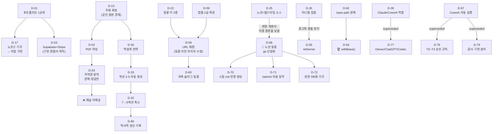

# DECISION_LOG.md — GetPassLab 의사결정 전체 기록

> **선행 문서**: `PROJECT_CONTEXT.md` / `PRD.md` / `ARCHITECTURE.md` / `UI_UX_GUIDE.md` / `CODING_RULES.md`
> **최초 작성 기준일**: 2026-07-14 / **개정 버전**: v1.1
> **수정 전 저장소 기준선**: `e1482e892de12abe358edf695b67106f882a96d1`
> **현재 문서 상태**: 미커밋 수정본
> **저장소·build 사실**: AUDIT-001 기준 `2c47d065010f90eef639eddbbcba841b8806beb1`
> **최종 커밋 SHA**: 현재는 기록하지 않음
> **기록 범위**: 2026-06-15 (프로젝트 최초 대화) ~ 현재
> **기존 결정 ID**: `D-01`~`D-76` 보존 / 현행 운영 결정 `D-77`~`D-81` 추가
> **출시 일정**: **UNKNOWN — Owner 승인 전까지 확정 금지**
> **Production 상태**: **UNVERIFIED — 별도 배포·런타임 검증 증거 필요**

> [!IMPORTANT]
> 이 문서는 **의사결정의 이유, 승인 주체, 변경·대체 관계와 역사**를 보존하는 정본이다. 현재 구현 상태와 동적 수치의 정본은 저장소, 테스트, build, 배포 증거다. 문서에 적힌 과거 수치나 완료 표현만으로 현재 상태를 확정하지 않는다.

---

## 0. 이 문서를 읽는 법

### 0.1 결정 상태와 구현 상태

결정 상태와 구현 상태를 분리한다. 필요한 결정에만 아래 메타데이터를 최소한으로 기록한다.

| 결정 상태 | 의미 |
|----------|------|
| **ACTIVE** | 현재도 유효한 결정 |
| **SUPERSEDED** | 후속 결정으로 대체됨. `Superseded by` 필수 |
| **RETIRED** | 채택하지 않거나 더 이상 적용하지 않는 결정 |
| **HISTORICAL_ONLY** | 특정 시점의 실행·도구·수치 기록. 현재 지시로 사용하지 않음 |

| 구현 메타데이터 | 의미 |
|----------------|------|
| **Implementation status** | 구현됨 / 일부 구현 / 미구현 / 미검증 등 실행 상태 |
| **Verification evidence** | 저장소·테스트·build·배포 증거 |
| **Last verified baseline** | 검증한 commit 또는 감사 ID |

과거의 ✅/⚠️/🔄/❌/⏳/🔴 표기는 당시 평가를 보여주는 역사적 표현으로만 읽고, 현재 결정 상태는 위 네 상태를 우선한다.

### 0.2 타임라인 개요

| 기간 | 국면 | 핵심 성과 |
|------|------|-----------|
| **2026-06-15 ~ 06-17** | **탐색기** | 주제 선정, 수익 모델, 확장 전략, 데이터 수집 방식 |
| **2026-06-17 ~ 06-24** | **설계기** | 브랜드, 기술 스택, IA, DB 스키마, 디자인 시스템, 콘텐츠 템플릿 |
| **2026-06-24 ~ 06-26** | **구축기** | 기출 DB 파이프라인, Astro 구조, 제품 로드맵, Phase 2 스택 |
| **2026-06-26 ~ 07-13** | **구현·양산기** | questions.json, 디자인 이식, URL 재편, 5페이지 구현, 배포, 74챕터 |
| **2026-07-13 ~ 현재** | **정리·이관기** | 노션 동결, git 단일화, /admin/, 스텁 시스템 |

### 0.3 ⚠️ 출시 일정 충돌의 역사 기록

> **🚨 출시 목표 시점 단서 발견**
>
> 2026-06-16 대화(창업 지원금)에서 Claude가 **"target launch in August"**(8월 출시 목표)를 근거로 지원금을 후순위로 권고했다.
>
> 이는 프로젝트 설정의 "기간: **2025년** 8월 12일 ~ **2026년** 1월 15일"과 노션 정책서의 "정식 출시 목표: 2025.12 말 ~ 2026.01 초"와 **모순된다.**
>
> 당시 가장 정합적인 해석으로 **2026년 8월**이 제안됐지만, 이는 대화 기록을 바탕으로 한 추론이며 승인된 일정이 아니다. 초기 문서의 "2025년" 역시 오기라고 확정하지 않는다.
>
> **현재 일정 상태: UNKNOWN.** Owner가 승인한 `ROADMAP.md` 또는 release plan만 출시 일정의 정본으로 인정한다. 과거 대화에서 추론한 날짜를 현재 판단이나 완료 시한으로 사용하지 않는다.

---

### 0.4 동적 수치와 검증 스냅샷

이 문서에 남아 있는 **224 / 253 / 254 챕터**, **74 / 82 / 71 완료 챕터**, **1,675문항**, **의존성 4개 또는 5개** 등의 수치는 각 작성 시점의 역사·감사 스냅샷이다. 현재 영구값이 아니며 저장소와 감사 증거를 우선한다.

| 스냅샷 | 확인 내용 |
|--------|-----------|
| **AUDIT-001 at `2c47d065010f90eef639eddbbcba841b8806beb1`** | Astro static build PASS / **82 total pages built** / production runtime **UNVERIFIED** |
| **DOC-AUDIT-001 at `e1482e892de12abe358edf695b67106f882a96d1`** | 저장소의 챕터 md 253개 / frontmatter 상태 `완료` 71, `미시작` 182 / `questions.json` 1,675문항 |

> **82 total pages built는 완료 챕터 수가 아니다.** build 페이지 수, 콘텐츠 완료 수, 데이터 레코드 수를 서로 대체해 사용하지 않는다.

---

# PHASE 0 — 탐색기 (2026-06-15 ~ 06-17)

---

## D-01. 프로젝트 목적의 우선순위 — 포트폴리오 1순위, 수익 2순위

**일시**: 2026-06-15 (수익 기대값 대화에서 명시화)

**결정 내용**
이 프로젝트의 1순위 목적은 **이직 포트폴리오 / 제품 빌딩 역량 증명**이고, 2순위가 **수익화**다.

**결정 이유**
- AdSense 수익을 계산해보니, **이직 시점(수개월 내)까지 유의미한 금액이 되지 않는다**는 결론이 나왔다
- 여러 자격증으로 확장해 높은 월수익에 도달하려면 **SEO 성숙에 2~3년**이 필요하며, 이는 마일로의 이직 타임라인과 정면으로 어긋난다
- 반면 "문제 정의 → IA 설계 → 구현 → 출시 → 데이터 분석 전 사이클 혼자 수행"이라는 **면접 서사의 가치는 즉시 발생**한다

**고려했던 대안**

| 대안 | 기각 이유 |
|------|-----------|
| 수익 최대화를 1순위로 | 시간 대비 수익이 낮고, 이직 데드라인과 맞지 않음 |
| 수익 목적을 완전히 배제 | 수익 파이프라인 구축·운영 경험 자체가 포트폴리오 자산 |

**현재 유효성**: ✅ **유효.** 이 우선순위가 이후 **모든** 의사결정의 준거가 됐다.
> **AI에게**: "이게 수익에 더 좋다"만으로는 마일로를 설득할 수 없다. **"포트폴리오 서사에 어떤 영향을 주는가"**를 반드시 함께 답해야 한다.

---

## D-02. 기출문제 데이터 수집 방식 — PDF 파싱

**일시**: 2026-06-15

**결정 내용**
기출문제 DB는 **PDF 파싱**으로 구축한다.

**결정 이유**
- **한국산업인력공단은 문항 단위 구조화 API를 제공하지 않는다.** 공공데이터포털에 PDF 기반 API만 존재
- comcbt, 모두CBT 등 기존 플랫폼도 **전부 수작업 또는 사용자 기여**로 DB를 구축했다 — 지름길이 없다는 뜻
- PDF 파싱이 가장 합법적이면서 자동화 가능한 경로

**고려했던 대안**

| 대안 | 기각 이유 |
|------|-----------|
| **웹 스크래핑** (comcbt 등에서 긁기) | **법적 리스크.** 명시적으로 배제 |
| **직접 수기 입력** | 1,675문항 × 6분 = 비현실적 |
| 공식 API 사용 | **존재하지 않는다** |

**Decision status**: **ACTIVE — 공식 PDF를 데이터 수집 원본으로 사용**

**역사적 실행 기록**: 당시 CBT 해설집 PDF를 Google Drive에 올려 Cowork가 파싱했다. 현재 작업 주체·도구·정본 규칙은 `D-77`~`D-80`을 따른다.

---

## D-03. 저작권 원칙 — 문제·정답만 사용, 해설은 자체 작성

**일시**: 2026-06-15

**결정 내용**
기출문제 **본문과 정답만** 데이터로 사용하고, **해설은 절대 가져오지 않는다.**

**결정 이유**
- 당시에는 한국산업인력공단 기출문제 본문과 정답을 이용 가능한 범위로 판단했다
- 타 사이트·유튜버의 해설과 표현은 별도의 권리 검토가 필요하다고 판단했다
- 해설 복제는 저작권 및 AdSense 승인 리스크가 있다고 판단했다

**고려했던 대안**

| 대안 | 기각 이유 |
|------|-----------|
| 유튜브 해설 영상 자막에서 해설까지 추출 | **저작권 침해 위험** |
| 해설을 전부 자체 작성 | 1,675문항 규모에서 **1인 운영으로 불가능** |

**현재 유효성**: ✅ **유효.** 그 귀결로 **기출문제 모달에 해설이 없다.**
> **법무·승인 주의**: 기출문제와 정답의 이용 가능 범위에 관한 내용은 당시 판단이다. 실제 공개·가공·재배포 범위는 원출처의 이용 조건, 공공누리 표시 및 적용 시점의 법률 검토 후 Owner가 승인한다.
> **부활 조건**: 고빈출 문제 일부에 **자체 작성 해설**을 점진 추가하는 방안은 별도 권리 검토와 Owner 승인 후 검토할 가치가 있다.

---

## D-04. YouTube 자막 파싱 방식 — 검토 후 미채택 ❌

**일시**: 2026-06-15

**검토했던 내용**
유튜브의 "기출 복원·해설" 영상에서 자막(yt-dlp 또는 유튜브 스크립트 기능)을 추출 → Claude에 붙여넣기 → JSON 구조화.
Claude가 추정한 처리량: **영상당 6분, 10~15문제.**

**미채택 이유**
- 실제로는 **CBT 해설집 PDF**라는 더 정확하고 구조화된 소스가 있었다
- 자막은 구어체라 파싱 정확도가 낮고, 회차·번호 매핑이 불확실
- **회차당 120문제를 완전히 커버하지 못한다** (영상은 일부 문제만 다룸)

**Decision status**: **RETIRED**
**관련 결정**: PDF 파싱 `D-02`

**당시 평가**: 미채택. PDF 파싱(D-02)이 실무 경로가 됐다.
> **기록 가치**: 이 검토 과정에서 **저작권 원칙(D-03)이 도출**됐다. 폐기안이 원칙을 낳은 사례.

---

## D-05. 수익 모델 — AdSense (MVP)

**일시**: 2026-06-15

**결정 내용**
MVP의 수익 모델은 **Google AdSense** 배너 광고.

**결정 이유**
- 정적 사이트에서 즉시 적용 가능
- 결제·회원 시스템 없이 수익 파이프라인을 검증할 수 있는 유일한 방법
- 초기 트래픽이 낮아도 진입 비용이 0

**고려했던 대안**

| 대안 | 기각 이유 |
|------|-----------|
| 처음부터 구독 모델 | 콘텐츠 신뢰도·트래픽이 없는 상태에서 결제를 요구할 수 없다 |
| 제휴 마케팅 | 수험 시장에 적합한 제휴 상품이 마땅치 않음 |
| 후원/기부 | 수익 규모가 예측 불가 |

**현재 유효성**: ✅ **유효.** Phase 3에서 구독으로 확장 예정.

---

## D-06. AdSense 수익 기대치를 낮게 설정하고 수용

**일시**: 2026-06-15

**결정 내용**
AdSense 수익은 **비수기에 미미하고, 시험 시즌에만 스파이크**한다는 현실을 받아들인다. 연간 수익도 **그 자체로 유의미한 소득이 되지 않는다.**

**결정 이유**
- 타겟 모수가 제한적 (산업안전기사 연 응시자 약 10만 명)
- **한국 시장의 RPM이 서구 대비 낮다**
- 시험 주기에 묶인 계절성 트래픽

**현재 유효성**: ✅ **유효.** 이 인식이 D-01(포트폴리오 1순위)을 굳혔다.
> **중요**: 이 냉정한 계산을 **초기에 했다는 것**이 이 프로젝트의 건강함이다. 수익 환상 없이 시작했다.

---

## D-07. 확장 전략 — 인접 자격증만. 무관 카테고리 금지 ❌

**일시**: 2026-06-15

**결정 내용**
콘텐츠 확장은 **인접 자격증으로만** 한다.

> **현재 해석**: 여기서 "인접"은 동일 세부 전공만이 아니라 **자격증 학습·시험이라는 제품 카테고리 안의 확장**을 뜻한다. 정치·정부 정책 등 무관 콘텐츠 확장은 금지한다. `D-09`의 컴퓨터활용능력 2급 확장과 이 의미로 정합성을 유지한다.

**고려했던 대안 (기각)**

| 대안 | 기각 이유 |
|------|-----------|
| **선거·정부 정책 등 무관 카테고리 추가** | ① **도메인 정체성 파편화** — "자격증 사이트" 브랜드 붕괴<br>② **SEO 페널티** — 주제 일관성 상실 → topical authority 하락<br>③ **광고주 리스크** — 정치 콘텐츠는 광고주 기피<br>④ **🚨 AdSense 계정 위험** — 정책 위반 시 **계정 전체가 날아갈 수 있다** |

**현재 유효성**: ✅ **유효.** 이 프로젝트의 **불변식(invariant)** 중 하나.

---

## D-08. 확장 순서 1차안 — 산업안전 → 위험물기능사 → 건설안전기사 🔄

**일시**: 2026-06-16 04:57

**결정 내용 (당시)**
동일 사용자층을 유지하면서 확장: 산업안전기사 → 위험물기능사 → 건설안전기사

**당시 근거**
- 같은 안전·산업 계열 → 사용자층 재사용
- 콘텐츠 구조·템플릿 그대로 재사용

**같은 대화에서 Claude가 제시한 시장 분석 (기록 가치 있음)**

| 자격증 | Claude의 당시 판정 |
|--------|-------------------|
| 정보처리기사 | 기회 큼 |
| 사회복지사 1급 | 기회 큼 |
| 전기기사 | 기회 큼 |
| **컴퓨터활용능력** | **⚠️ "이미 포화 시장"** |
| 한국사능력검정 | ⚠️ "이미 포화 시장" |

**Decision status**: **SUPERSEDED**
**Superseded by**: `D-09`

> **🚨 기록해야 할 모순**: Claude는 06-16 **04:57**에 컴활을 **"포화 시장"**이라고 판정했다가, 같은 날 **06:29**에 **응시자 규모(연 50만)**를 근거로 **확장 2순위로 승격**시켰다.
> **두 판단 모두 Claude가 했고, 마일로가 후자를 채택했다.**
> **교훈**: Claude의 시장 판단은 근거가 바뀌면 뒤집힌다. **"포화"라는 정성적 판단보다 "응시자 50만"이라는 정량 근거가 이겼다.** 앞으로도 정량 근거를 우선할 것.

---

## D-09. 확장 순서 최종안 — 산업안전 → **컴퓨터활용능력 2급** → 공조냉동 등 ✅

**일시**: 2026-06-16 06:29

**결정 내용**

| 순서 | 자격증 | 목적 |
|------|--------|------|
| 1 | 산업안전기사 | **플랫폼 검증** |
| 2 | **컴퓨터활용능력 2급** | **트래픽 볼륨 확보** |
| 3 | 공조냉동기계산업기사 또는 기타 | 카테고리 심화 |

**결정 이유**
- **컴활 2급의 연 응시자가 약 50만 명**으로 압도적. 공조냉동기계산업기사와 비교 불가한 규모
- 원래 2순위였던 공조냉동은 마일로가 **해당 과정평가형 수업을 병행 중**이라는 개인 사정에 근거했으나, **시장 규모 논리가 이겼다**

**고려했던 대안**

| 대안 | 기각 이유 |
|------|-----------|
| 공조냉동을 2순위 유지 | 검색 수요가 컴활 대비 현저히 작음 |
| 위험물기능사 (D-08) | 규모 근거가 약함 |

**현재 유효성**: ✅ **유효.** 마일로가 명시적으로 승인.
> **수치 주의**: "연 응시자 약 50만"은 당시 판단 근거다. 현재 시장 규모로 사용할 때는 날짜와 출처를 다시 검증한다.

---

## D-10. AdSense Rewarded Interstitial 병행

**일시**: 2026-06-16 06:29

**결정 내용**
배너 단독이 아니라 **Rewarded Interstitial 포맷을 병행**한다.

**Decision status**: **ACTIVE — 기술·제품 방향**
**Decision owner**: **Owner — 광고 정책·외부 계정·실제 도입 최종 승인**
**Implementation status**: 적용 위치·트리거 및 production 도입 미확정

**결정 이유**
- 경쟁 CBT 사이트를 조사한 결과, "광고 시청 후 6시간 이용 게이트" 구조가 **Google AdSense Rewarded Interstitial**임을 확인
- 배너 단독 대비 **RPM 향상**에 유리 (단, 극적 개선은 보장되지 않음)

**🚨 이 결정 과정의 중요한 사건**
> **Claude가 처음에 "AdSense로는 강제 광고 시청 게이트를 만들 수 없다. 별도 광고 네트워크 계약이 필요하다"고 단정했다.**
> **마일로가 경쟁 사이트의 광고 정보 버튼 스크린샷을 제시했고, Claude가 오류를 인정하고 정정했다.**
>
> **교훈: 광고 정책·법령·최신 수치를 단정하지 마라. 확인 후 답하라.** 이 사례를 `PROJECT_CONTEXT.md`와 `PRD.md`에도 기록했다.

**현재 유효성**: ⚠️ **부분 유효.** 방향은 확정됐으나 **적용 위치·트리거 조건이 미정의**다.
> ⚠️ **주의**: "광고 시청 게이트" 구조는 서비스 철학("무료가 기본이다")과 **충돌 가능**하다. 도입 시 재검토 필요.

---

## D-11. 사이트 매각 옵션 — 인지만, 실행 계획 아님

**일시**: 2026-06-16 06:29

**결정 내용**
Flippa 등 웹사이트 거래 플랫폼의 존재와 가치평가 방식(**월 순이익 × 20~40배**)을 인지한다. 단, 현재 실행 계획은 아니다.

**현재 유효성**: ✅ **유효 (인지 상태 유지).** 출구 옵션 중 하나로만 존재.

---

## D-12. 정부 창업 지원금 — 보류

**일시**: 2026-06-16 07:55

**결정 내용**
예비창업패키지, 청년창업사관학교, 지자체 프로그램 등 정부 지원금 신청을 **단기적으로 후순위**로 미룬다.

**결정 이유 (불리한 3요소)**

| 요소 | 왜 불리한가 |
|------|-------------|
| **정적 웹사이트 MVP** | 기술적 혁신성 어필이 약함 |
| **광고 기반 수익 모델** | 지원 프로그램이 선호하는 스케일업 서사와 안 맞음 |
| **재직 중 신분** | 상당수 프로그램이 전업 창업을 요구 |

**재검토 조건**
1. **트래픽 지표 확보** 후
2. **구독 모델 전환** 후
3. **"EdTech 개인화 학습 플랫폼"으로 리프레이밍**

**현재 유효성**: ✅ **유효 (보류 상태 유지).**
> 💡 이 재검토 조건이 **Phase 3의 AI 약점 분석 리포트(F-51)**를 정당화한다. 그 기능이 있어야 "개인화 학습 플랫폼"이라고 말할 수 있다.

---

## D-13. 🎯 주제 최종 확정 — 산업안전기사 (조합 추천 사이트 기각) ❌

**일시**: 2026-06-17

**결정 내용**
프로젝트 주제를 **산업안전기사 수험 요약 서비스**로 확정한다.

**마일로가 제기했던 자기검증 질문 (중요)**
> *"나는 산업안전 도메인 전문가가 아닌데, AI 큐레이션에 의존하는 콘텐츠가 괜찮은가? 그러면 '조합 추천 사이트'와 근본적으로 같은 리스크 아닌가?"*

**Claude의 답 — 두 프로젝트를 가른 결정적 차이**

| 기준 | 산업안전기사 | 조합 추천 사이트 |
|------|-------------|-----------------|
| **공인 원본(canonical source)** | ✅ **한국산업인력공단** | ❌ 없음 |
| **정답의 존재** | ✅ 명확 | ❌ 주관적 |
| **갱신 주기** | ✅ 예측 가능 (연 3회) | ❌ 불명확 |
| **유지보수 부담** | 낮음 | **높음** |

> **핵심: "정답이 있는 주제"와 "정답이 없는 주제"의 차이다.**
> 전문가가 아니어도 **공인 원본이 있으면 검증 가능**하다. 원본이 없으면 전문성이 곧 리스크가 된다.

**고려했던 대안 (전부 기각)**

| 대안 | 기각 이유 |
|------|-----------|
| **조합 추천 사이트** (금융 계좌 조합, AI 툴 조합 등) | canonical source 부재 → 주관성·유지보수 부담 |
| 자격증 CBT 사이트 | comcbt 등 경쟁 강함. 우리 강점 아님 |
| 공공데이터 시각화 서비스 | 수익화 경로 불명확 |
| 업종별 법령/규정 요약 사이트 | 갱신 부담 극심 |
| 채용 JD 분석/비교 툴 | 데이터 수집 난이도 |
| 연봉/처우 계산기 모음 | 차별화 어려움 |
| 소규모 사업자 세금/행정 가이드 | 법령 변동 리스크 + 전문성 요구 |

**추가 근거 (산업안전기사만의 장점)**
- 마일로가 **본인이 필기 합격, 실기 준비 중** → 페인포인트를 1인칭으로 앎
- 기존 사이트는 **문제풀이 특화** → **구조화된 요약 사이트가 빈 공간**
- **연 3회 시험** → 트래픽 스파이크가 주기적으로 반복

**현재 유효성**: ✅ **유효.** 프로젝트의 존재 근거.

---

# PHASE 1 — 설계기 (2026-06-17 ~ 06-24)

---

## D-14. 브랜드명 — GetPassLab

**일시**: 2026-06-17 무렵 ⚠️ *(정확한 대화 시점 불명확 — 일부 논의가 프로젝트 스코프 밖에서 이뤄졌을 가능성)*

**결정 내용**
브랜드명을 **GetPassLab**으로 확정.

**후보군 전체 (9개)**

| 계열 | 후보 | 기각 이유 |
|------|------|-----------|
| 기능 중심형 | SafePass | 평범함 |
| | PassNote | 평범함 |
| | QuickSafe | 자격증 특화 약함 |
| 컨셉 중심형 | SafeCore | **"안전"에 갇혀 확장 한계** (컴활 확장 시 모순) |
| | SafeMap | 동일 |
| | Certly | 자격증 특화가 불분명 |
| | **PassLab** | ✅ **1차 선택** → 도메인 취득 불가 |
| 한국어 혼합형 | 합격노트 | 도메인 표기 어색 |
| | SafeGong | 유치함 리스크 |

**PassLab을 1차로 택한 이유**
- **"데이터 기반 학습 설계(Lab)"**라는 서사가 포트폴리오와 시너지
- 나중에 오답 분석·유형별 통계 기능을 붙였을 때 **브랜드와 의미가 연결**됨

**GetPassLab으로 바뀐 경위**
- `passlab` 계열 도메인 **취득 불가** → `getpasslab.site`로 우회

**현재 유효성**: ✅ **유효.**

---

## D-15. 브랜드 = 도메인 완전 일치 (Claude 추천안 거부)

**일시**: D-14와 동일

**결정 내용**
브랜드명을 도메인과 **완전히 일치**시켜 **GetPassLab**으로 통일한다.

**두 가지 선택지**

| 안 | 내용 | 제안자 |
|----|------|--------|
| **A** | 브랜드는 `PassLab`, 도메인만 `getpasslab.site` (Get은 도메인 취득용 접두사) | **Claude 추천** |
| **B** | 브랜드도 `GetPassLab`으로 통일 | **마일로 선택** ✅ |

**마일로가 B를 택한 이유**
> **"Get(얻는다)"의 의미가 좋아서.** 즉 **"합격을 얻는다"는 행동 유도형(action-oriented) 브랜드 의미**를 정체성으로 삼겠다는 판단.

**부수 효과**: 도메인과 브랜드명이 완전 일치 → SEO·기억성 유리

**현재 유효성**: ✅ **유효.**
> **이 결정의 의미**: **기술적 관례(Claude의 A안)보다 의미론적 정체성(마일로의 B안)이 이겼다.** 이 프로젝트 전반의 의사결정 패턴을 보여주는 첫 사례다.

---

## D-16. 도메인 — getpasslab.site

**결정 내용**: 도메인 방향으로 `getpasslab.site`를 사용한다.

**Decision status**: **ACTIVE — 도메인 방향**
**Decision owner**: **Owner — 도메인·외부 계정·production 연결 최종 승인**

**외부 상태**: 과거 기록상 `getpasslab.site` 구매 완료로 보고됐으나, 현재 소유·DNS·연결 상태는 외부 계정 검증 전까지 **UNVERIFIED**다.
- 과거 기록의 배포 주소: `syjy813.github.io/getpasslab/`
- 외부 계정 및 실제 연결은 Owner 승인 범위다.
- 실제 연결 시점과 `astro.config.mjs`의 `base` 변경 필요 여부는 승인된 배포 작업에서 검증한다.

---

## D-17. 🎯 노코드(Notion + Super.so) 기각 → 직접 구현 ❌

**일시**: 2026-06-17 무렵

**결정 내용**
Notion + Super.so 노코드 조합을 **기각**하고, **Astro로 직접 구현**한다.

**기각 이유 (3가지, 전부 결정적)**

| # | 이유 | 설명 |
|---|------|------|
| 1 | **AdSense 삽입 제약** | 수익 모델이 광고인데 광고를 못 넣으면 **근본 모순** |
| 2 | **커리어 포트폴리오 서사 약화** | **"콘텐츠 운영"으로만 읽힌다.** D-01(1순위 목적)과 정면 충돌 |
| 3 | **웹앱 확장 시 구조적 한계** | Phase 2로 갈 길이 막힘 |

**현재 유효성**: ✅ **유효.**
> **🏆 이 프로젝트에서 가장 중요한 결정.**
> 이 결정이 없었다면 **"혼자 전 사이클 수행"이라는 면접 서사 자체가 성립하지 않는다.** 프로젝트의 정체성을 규정했다.

---

## D-18. 기술 스택 — Astro + Markdown + GitHub Pages

**일시**: 2026-06-17 무렵

**결정 내용**
- 정적 사이트 생성기: **Astro**
- 콘텐츠: **Markdown**
- 호스팅: **GitHub Pages** (무료)
- 수식: **KaTeX**
- 검색: **Pagefind** (당시 계획)
- 스타일: **Tailwind CSS** (당시 계획)

**Decision status**: **ACTIVE**
**Implementation status**: 핵심 스택 구현 / Tailwind 계획은 `D-58`로 대체 / Pagefind는 설계 후보이며 구현 완료로 확정하지 않음
**Verification evidence**: `package.json`, `package-lock.json`, `astro.config.mjs`
**Last verified baseline**: `e1482e892de12abe358edf695b67106f882a96d1`

**Astro 채택 근거**

| 근거 | 설명 |
|------|------|
| **Content Collections** | 254개 md의 frontmatter를 **빌드 타임에 Zod로 검증** |
| **Islands Architecture** | 기본 JS 번들 0 → 모바일 성능 |
| **Markdown 네이티브** | 콘텐츠가 md인 전제와 정확히 일치 |
| **React/Vue 혼용 가능** | **Phase 2 웹앱 확장 대비** |

**고려했던 대안**

| 대안 | 기각 이유 |
|------|-----------|
| Next.js 등 SSR 프레임워크 | 서버 비용 발생. 정적으로 충분한 콘텐츠 사이트에 과잉 |
| Gatsby | 생태계 쇠퇴 |
| 순수 HTML/CSS | 254개 페이지를 손으로 못 만든다 |

**현재 유효성**: ⚠️ **부분 유효 / 🔴 일부 코드와 불일치**

| 항목 | 결정 | **실제 코드** |
|------|------|--------------|
| Astro | ✅ | ✅ Astro 5 계열. 정확한 버전은 lockfile이 정본 |
| Markdown | ✅ | ✅ |
| GitHub Pages | ✅ | ✅ |
| KaTeX | ✅ | ✅ |
| **Tailwind** | 당시 계획 | **SUPERSEDED by D-58.** 순수 CSS + CSS Custom Properties |
| **Pagefind** | 당시 계획 | **설계 후보.** 설치·구현 완료 증거 없음 |
| 패키지 관리 | 당시 미기록 | **npm + `package-lock.json` (lockfileVersion 3)** |
| sitemap | 당시 미기록 | **`@astrojs/sitemap` 존재** |

→ **D-58 참조 (Tailwind 미도입)**
> 패키지 목록과 버전의 정본은 `package.json`과 `package-lock.json`이다. 문서에 적힌 개수나 버전을 현재 영구값으로 사용하지 않는다.

---

## D-19. 익명 운영 (MVP)

**일시**: 2026-06-17 무렵

**결정 내용**
MVP 단계에서 **푸터에 운영자 정보를 노출하지 않는다.**

**Decision status**: **ACTIVE — 제품 방향, 법무 검토 전 실행 확정 금지**
**Decision owner**: **Owner — 개인정보·운영자 공개·법무 최종 승인**

**결정 이유**
서비스가 **개인의 사이드 프로젝트가 아니라 하나의 제품**으로 보이는 것이 사용자 신뢰에 유리하다.

**현재 유효성**: ⚠️ **부분 유효 — 충돌 발견**
> 🔴 **미해결 충돌**: **개인정보처리방침에는 통상 "개인정보 보호 책임자"의 실명·연락처 표기가 요구된다.** AdSense 승인 요건과도 관련될 수 있다.
> **이 충돌은 어디서도 검토된 적이 없다. AdSense 신청 전 반드시 해소할 것.**

---

## D-20. MVP 범위 확정 — 무엇을 **넣지 않을 것인가**

**일시**: 2026-06-17 무렵

**결정 내용 — MVP에서 제외한 것들**

| 제외 기능 | 이유 | 부활 시점 |
|-----------|------|-----------|
| **로그인 / 회원** | BaaS 필요, 과스코프. **광고 모델에서 로그인 게이트는 순손실** | Phase 2 |
| **학습 진도 저장** | 로그인 선행 필요 | Phase 2 |
| **오답 노트** | 로그인 + 문제 DB 선행 | Phase 2 |
| **문제 풀이 (CBT)** | comcbt 등 경쟁 강함. **우리 강점이 아님** | 부분적으로 "문제 레이어"로 구현됨 |
| **댓글 / 커뮤니티** | 운영 부담 + 스팸 리스크. **1인 운영에서 모더레이션 불가능** | 계획 없음 |
| **다크모드** | 우선순위 낮음 | 미정 |
| **실기 콘텐츠** | 트래픽 규모 대비 우선순위 낮음 | 출시 후 |

**MVP 규율의 판단 기준 (명시적으로 언급된 원칙)**
> **"기능 부족은 트래픽 손실이 적지만, 콘텐츠 부족은 치명적이다."**
> **AdSense 승인 기준도 기능 다양성이 아니라 콘텐츠 충실도다.**

**현재 유효성**: ✅ **유효.** 이 규율이 74개 챕터 양산을 가능하게 했다.

---

## D-21. 데이터 2계층 모델 — 콘텐츠 레이어 / 유저 레이어

**일시**: 2026-06-22

**결정 내용**
DB를 **2개 계층**으로 분리 설계한다.

| 계층 | 엔티티 | 저장소 | 시점 |
|------|--------|--------|------|
| **콘텐츠 레이어** | `subjects`, `chapters`, `questions`, `options` | 빌드 타임 정적 JSON/Markdown | **Phase 1 (지금)** |
| **유저 레이어** | `users`, `attempts`, `wrong_notes`, `progress`, `bookmarks` | BaaS (Firebase 또는 Supabase) | **Phase 2** |

**결정 이유**
- 콘텐츠는 **모두에게 동일** → 정적으로 충분
- 사용자 데이터는 **사람마다 다름** → DB 필요
- **"변수가 들어가는 순간 DB가 필요하다"** — 이 기준이 Phase 1/2의 경계선

**현재 유효성**: ✅ **유효.** 8개 엔티티의 타입 명세까지 문서화 완료.
> **이 결정이 Phase 2를 "리팩터링"이 아니라 "추가"로 만든다.** 콘텐츠 계층을 건드리지 않고 유저 계층만 얹으면 된다.

---

## D-22. 🔑 동결 키 3종 — `slug` / `subject_id` / `question_id`

**일시**: 2026-06-22

**결정 내용**
아래 3개 필드는 **한 번 확정 후 절대 변경 불가**하다.

| 키 | 3가지 역할 |
|----|-----------|
| `slug` | ① 챕터 URL 식별자 ② 기출↔챕터 조인 키 ③ (Phase 2) 유저 학습 기록의 참조 대상 |
| `subject_id` | ① 과목 URL 세그먼트 ② 조인 키 |
| `question_id` | ① 기출문제 고유 식별자 ② (Phase 2) 오답노트의 참조 대상 |

**결정 이유**
이 세 필드는 **URL 식별자 · 조인 키 · 유저 기록 참조**를 **동시에** 담당한다. 변경하면:
1. 검색 인덱스가 깨진다 (**SEO 손실**)
2. 기출-챕터 관계가 끊긴다 (**데이터 무결성**)
3. Phase 2의 유저 데이터가 **고아(orphan)**가 된다

**도출 경위 (흥미로운 지점)**
> 마일로가 원했던 **UI 요구사항** — "챕터 카드에 어느 회차에 출제됐는지 태그 표시" — 이 **N:M 관계**를 요구했고, 그 조인 키가 **불변이어야 한다**는 결론이 여기서 나왔다.
> **즉 UI 요구가 DB 제약을 낳았다.** 설계가 위에서 아래로만 흐르지 않는다는 사례.

**현재 유효성**: ✅ **유효.** 프로젝트에서 **가장 자주 인용되는 제약.**
> 🚨 **실무 규칙**: 슬러그는 CSV 값 그대로. **AI가 임의 생성 절대 금지.** 값이 없으면 **만들지 말고 보고**한다.

---

## D-23. 정적 사이트의 보안 트레이드오프 수용 — 정답 클라이언트 노출

**일시**: 2026-06-22

**결정 내용**
정적 HTML에 해당 챕터에 필요한 문제와 정답 데이터가 포함되어 사용자가 클라이언트에서 이를 확인할 수 있는 구조를 **의도적으로 수용**한다. `questions.json` 전체가 클라이언트로 전달되는 것은 아니다.

**결정 이유**
- **무료 시험 준비 서비스의 업계 표준**이다
- 정답을 숨기려고 서버를 도입하는 것은 **비용 대비 무의미**
- 애초에 기출 정답은 공개 정보다

**현재 유효성**: ✅ **유효.**
> 💡 **구현 범위**: 빌드 타임에 **챕터별로 필요한 문제만 정적 HTML에 포함**된다. 즉 한 챕터 페이지에는 그 챕터의 기출 N개만 존재하며, `questions.json` 전체가 한 번에 전달되는 구조는 아니다.

---

## D-24. ERD 도구 — Mermaid (주력), dbdiagram.io (보완재)

**일시**: 2026-06-22

**결정 내용**
ERD는 **Mermaid** 텍스트로 관리한다.

**결정 이유**

| 근거 | 설명 |
|------|------|
| **스키마가 계속 바뀌는 단계** | 텍스트 편집이 압도적으로 빠르다 |
| **네이티브 렌더링** | 노션·GitHub에서 그대로 렌더 → **이미지 재업로드 불필요** |
| **포트폴리오 서사** | **"설계를 코드로 관리한다"**는 서사와 정합 |

**고려했던 대안**

| 대안 | 판정 |
|------|------|
| **dbdiagram.io** | **기각(주력으로는).** 단, **Phase 2에서 SQL export가 필요해질 때 보완재로 도입** |
| 손으로 그린 이미지 | 수정 비용 극심 |

**현재 유효성**: ✅ **유효.**

---

## D-25. 노션의 역할 명확화 — 런타임 CMS가 아니라 **빌드 타임 저작 소스**

**일시**: 2026-06-22

**결정 내용**
노션은 **headless CMS(런타임 API 호출)가 아니다.** **빌드 타임 저작 소스**다.
노션에서 쓴 콘텐츠 → Markdown 변환 → Astro Content Collections가 소비.

**배경**
> 마일로가 이 구조를 약간 오해하고 있었고, Claude가 정정했다. 마일로는 **노션에서 마크다운을 직접 쓸 필요가 없고**, 네이티브 노션 블록으로 쓰면 도구가 변환한다는 점을 확인했다.

**Decision status**: **SUPERSEDED**
**Superseded by**: `D-68` (노션 동결)
> 이 결정 자체는 옳았으나, **결국 노션 → md 변환 계층이 이중 원본 문제를 낳았고**, 최종적으로 노션을 아예 동결하게 됐다.
> **교훈: "변환 계층"은 그 자체가 부채다.**

---

## D-26. 디자인 방향 — 미니멀·집중 (C안)

**일시**: 2026-06-24

**결정 내용**
4가지 방향 중 **C. 미니멀·집중** (레퍼런스: Medium, Substack) 채택.

**고려했던 대안**

| 방향 | 인상 | 레퍼런스 | 기각 이유 |
|------|------|----------|-----------|
| A. 신뢰·전문성 | 정제, 학술적 | 노션, 토스(B2B) | 차분하지만 차별성 부족 |
| B. 친근·학습 친화 | 따뜻, 부드러움 | Quizlet, Duolingo | **장시간 체류 시 피로** |
| **C. 미니멀·집중** ✅ | **깔끔, 콘텐츠 중심** | Medium, Substack | — |
| D. 다이내믹·젊은 | 활기, 컬러풀 | 클래스101 | **광고와 충돌, 개발 부담** |

**C를 택한 5가지 근거**

| # | 근거 |
|---|------|
| 1 | **콘텐츠가 핵심** — 디자인이 콘텐츠를 방해하면 안 됨 |
| 2 | **장시간 체류 → 시각적 피로 최소화** |
| 3 | 🎯 **광고 배치가 자연스러움 — 디자인이 과하면 광고와 충돌한다** |
| 4 | **개발 부담↓** — 단순한 디자인 = 빠른 구현 (1인 운영) |
| 5 | **콘텐츠 누적 시 자연스럽게 풍성해짐** — 화려한 디자인은 콘텐츠가 적을 때 더 초라해 보인다 |

**현재 유효성**: ✅ **유효.**
> **③이 결정적이다.** 이 프로젝트에서 디자인은 미학이 아니라 **수익화 인프라**다.

---

## D-27. 시각 레퍼런스 — 토스. 단, **TDS 자산은 쓰지 않는다** ⚖️

**일시**: 2026-06-24

**결정 내용**
- **인상은 토스에서 참고**한다 (마일로 직접 지정)
- **그러나 TDS(토스 디자인 시스템)의 코드·자산은 쓰지 않는다**
- **자체 디자인 토큰을 정의**한다

**라이선스 판단 (법적 리스크 회피)**
- 당시 확인한 조건을 바탕으로 TDS는 앱인토스(미니앱) 파트너 범위에 제공되는 것으로 판단했다
- TDS 자료와 관련 권리의 이용 범위는 공식 약관 확인이 필요하다고 판단했다
- 따라서 외부 일반 웹사이트에서는 TDS 자산과 코드를 사용하지 않는 보수적 프로젝트 원칙을 채택했다

| 프로젝트에서 참고 | 프로젝트에서 사용하지 않음 |
|-------------------|---------------------------|
| 디자인 원칙·인상 참고 | TDS 컴포넌트 코드 복사 |
| 컬러 톤·여백·라운드 감각 차용 | TDS 피그마 라이브러리 |
| 공개 블로그(toss.tech) 학습 | TDS 아이콘, 토스 로고, Toss Product Sans |

**마일로의 최종 승인**
> *"토스풍 인상 + 자체 디자인 토큰 정의 / 토스 블루 계열 차용 / 프리텐다드로 진행"*

**현재 유효성**: ✅ **유효.**
> **현재 원칙**: TDS 자산은 공식 라이선스 범위 밖에서 사용하지 않는다는 보수적 원칙을 유지한다. 실제 허용 범위는 사용 시점의 공식 약관을 다시 확인한다. 기존의 **TDS 자산과 코드를 사용하지 않는다**는 프로젝트 원칙은 유지한다.

---

## D-28. 폰트 — Pretendard

**일시**: 2026-06-24

**결정 이유**
- **한국어 최적화** — 국문 학습 콘텐츠의 장시간 가독성
- **오픈소스·무료 상업 이용** — 라이선스 리스크 0
- **한국 웹의 사실상 표준** — 사용자에게 낯설지 않음

**고려했던 대안**

| 대안 | 기각 이유 |
|------|-----------|
| Toss Product Sans | **라이선스 불확실** |
| Inter + Noto Sans KR | 영문·한글 분리의 복잡도 |

**Decision status**: **ACTIVE**
**Implementation status**: `public/fonts/PretendardVariable.woff2` 자체 호스팅 구조 확인
**Verification evidence**: `src/styles/global.css`, `public/fonts/PretendardVariable.woff2`
**Last verified baseline**: `e1482e892de12abe358edf695b67106f882a96d1`

> ⚠️ AUDIT-001에서 Pretendard runtime asset 경고가 있었으므로 정상 동작 완료로 단정하지 않는다. 이 경고는 감사·이슈 정본에서 추적한다.
> KaTeX CSS는 현재 `BaseLayout.astro`에서 외부 jsDelivr CDN을 사용한다.

---

## D-29. 디자인 토큰 v1 → v2 개정

**일시**: 2026-06-24 (같은 세션 내 개정)

**결정 내용**

| 토큰 | **v1 (폐기)** | **v2 (최종)** |
|------|--------------|--------------|
| primary-500 | `#3182F6` | `#2563EB` |
| **primary-600 (메인)** | `#1B64DA` | **`#1D4ED8`** |
| primary-700 (호버) | `#1957C2` | `#1E40AF` |
| radius-sm | 6px | **4px** |
| radius-md | 10px | **8px** |
| radius-lg | 14px | **10px** |
| radius-xl | 20px | **14px** |

**라운드 하향 조정 이유**
> *"토스풍 라운드는 유지하되 **조금 정제된 강도로 조정**."*
> 학습 콘텐츠 사이트에 과도한 라운드는 가볍고 유치해 보인다는 판단.

**컬러 개정 이유**: ⚠️ **명시적 근거가 대화에 남아 있지 않다.** 정황상 Claude Design 아카이브 제작 과정에서 표준 팔레트 계열로 정렬된 것으로 추정.

**현재 유효성**: ✅ **v2가 유효.** `#1D4ED8`이 실제 코드의 `--primary-600`.
> ⚠️ v1 값(`#3182F6`, `#1B64DA`)이 문서나 코드에서 발견되면 **레거시**다.

---

## D-30. 아이콘 라이브러리 — Lucide

**일시**: 2026-06-24

**결정 이유**
- **깔끔·미니멀** → 토스풍 미니멀 감각과 일치
- **무료·상업 이용 가능**
- **Astro 생태계 표준** (Vercel, Supabase 등에서 사용)
- 필요 아이콘(돋보기, 메뉴, 화살표, 태그 등) 전부 존재

**고려했던 대안**

| 대안 | 기각 이유 |
|------|-----------|
| Heroicons | 300개. Tailwind 팀 제작 — **Tailwind를 안 쓰므로 이점 없음** |
| Phosphor | 800개, 두께 옵션 다양 — **과잉** |
| 직접 SVG 제작 | 시간 + 일관성 문제 |

**현재 유효성**: ✅ **유효.** 단, **구현 방식이 다르다** 🔴
> **`lucide` npm 패키지를 설치하지 않았다.** **Lucide의 SVG path를 인라인으로 복사**해서 쓴다.
> ```html
> <path d="m6 9 6 6 6-6"/>   <!-- Lucide chevron-down -->
> ```
> **이것은 올바른 판단이다.** 아이콘 8개를 쓰자고 npm 패키지를 번들에 넣을 이유가 없다. **JS 번들 0 원칙을 지킨다.**
> **D-30과 D-65의 관계**: D-30은 Lucide 시각 언어 선택, D-65는 인라인 SVG 구현 방식이다. 서로 대체 관계가 아니다.

---

## D-31. 컴포넌트 룰 — 카드 3종 (동일 베이스) / 버튼 3종 / GNB

**일시**: 2026-06-24

**결정 내용**

| 컴포넌트 | 결정 |
|----------|------|
| **카드 3종** | **베이스 동일, 콘텐츠만 차별화** (과목 / 챕터 / 검색 결과) |
| **버튼 3종** | **Primary** (메인 액션) / **Secondary** (보조) / **Ghost** (텍스트 링크형) |
| **GNB** | 높이 56px(모바일)/64px(데스크톱), sticky, z-index 50 |

**진행 방식 선택 (기록 가치 있음)**
Claude가 3가지 진행 방식을 제안했다:

| 옵션 | 내용 | 판정 |
|------|------|------|
| A | 10개 컴포넌트를 1개씩 순서대로 | 세밀하나 시간 소요 |
| B | 카테고리별 묶음 | 균형 |
| **C** | **우선순위 1~3번(카드·버튼·GNB)만 먼저** | ✅ **채택 (Claude 추천)** |

**C의 근거**: *"카드·버튼·GNB만 잡으면 나머지는 패턴 따라가기 쉽다. 개발 시작도 빠르다."*

**현재 유효성**: ✅ **유효.**
> ⚠️ **결과적으로 나머지 7개(입력창, 태그, 사이드바, 푸터, **광고 영역**, 브레드크럼, 모달)의 스펙이 정식으로 정의되지 않았다.** 특히 **광고 영역 스타일**은 AdSense 신청 전에 반드시 정의해야 한다 (CLS 방지용 고정 높이).

---

## D-32. 🎯 챕터 섹션 구조 — 7섹션 → **5섹션**으로 축소

**일시**: 2026-06-24

**결정 내용**

| **v1 (7섹션, 폐기)** | **v2/v3 (5섹션, 최종)** |
|---------------------|------------------------|
| 1. 핵심 공식 | **1. 핵심 공식 / 정의** |
| 2. 단위·기호 | **2. 단위·기호 해설** |
| 3. 해석 | **3. 해석 / 의미** |
| ~~4. 예시 계산~~ | **4. 기출 출제 이력** |
| 5. 기출 출제 패턴 | **5. 관련 챕터** |
| ~~6. 함정·자주 틀리는 부분~~ | (→ 섹션 1의 **⚠️ 함정 주의 인용블록**으로 흡수) |
| 7. 관련 챕터 | |

**결정 이유**
- **254개 양산이 불가능한 수작업량**이었다
- "예시 계산" 섹션은 챕터마다 새 예제를 만들어야 함 → 부담 극심
- "함정" 섹션은 **인용블록 한 줄**로 충분

**현재 유효성**: ✅ **유효.**
> **부수 폐기**: "핵심 섹션 1·2·3 펼침 + 4~7 접기" 정책도 함께 폐기. 5섹션 체제에서는 **전부 펼침**이 맞고, 접기는 **SEO에도 불리**하다.

---

## D-33. 🏆 섹션 4·5를 **빌드 타임 자동 생성**으로 전환

**일시**: 2026-06-24

**결정 내용**

| 섹션 | 생성 방식 |
|------|-----------|
| 1. 핵심 공식 / 정의 | **수동** |
| 2. 단위·기호 해설 | **수동** |
| 3. 해석 / 의미 | **수동** |
| **4. 기출 출제 이력** | **🤖 빌드 자동** (수동은 "출제 경향 코멘트" 1~2줄만) |
| **5. 관련 챕터** | **🤖 빌드 자동** |

**결정 이유**
- 기출 이력은 frontmatter의 `questions` 배열 + `questions.json` **조인으로 자동 생성 가능**
- 본문에 링크를 하드코딩하면 **254개 유지보수가 불가능**해진다
- 관련 챕터도 `group` 필드로 자동 도출 가능

**결과 (정량적)**
> 챕터당 수작업이 **700~900자**로 확정. **원래 추정의 절반 이하.**
> **이 결정 덕분에 74개 양산이 실제로 완료될 수 있었다.**

**현재 유효성**: ✅ **유효.**
> **🏆 콘텐츠 생산성 측면에서 가장 큰 레버리지를 만든 결정.**
> **AI에게**: 챕터 본문에 기출 링크를 **절대 하드코딩하지 마라.** frontmatter 배열에 ID만 넣는다.

---

## D-34. 문체 — 명사형 어미로 전면 통일

**일시**: 2026-06-24

**결정 내용**
챕터 본문의 문체를 **명사형 어미**("~함", "~임", "~하는 구조")로 통일한다.

**결정 이유**
- **수험 요약의 표준 문체**
- **스캔 가독성**이 높다 (문장이 짧아진다)
- 서술형보다 정보 밀도가 높다

**현재 유효성**: ✅ **유효.**

---

## D-35. 🎯 콘텐츠 전략 — 역설계 (Reverse Engineering)

**일시**: 2026-06-24

**결정 내용**
콘텐츠 생산 순서를 **역설계 흐름**으로 확정한다.

```
① 기출문제 DB 전수 구축
      ↓
② 기출 기준으로 챕터 체계 재정비
   (출제되지 않는 챕터는 후순위/삭제, 새 챕터 도출)
      ↓
③ 기출을 기준으로 본문 작성
   (실제 출제된 각도로만 서술)
```

**결정 이유**
- 챕터를 먼저 만들고 기출을 나중에 붙이면, **출제되지 않는 내용을 열심히 쓰는 낭비**가 발생한다
- 기출을 먼저 알면 **무엇을 쓰지 않아도 되는지**를 알 수 있다 — **1인 운영의 최대 레버리지**

**고려했던 대안**

| 대안 | 기각 이유 |
|------|-----------|
| 수험서 목차대로 챕터를 만들고 나중에 기출 태깅 | 낭비 발생 + **"데이터가 주장을 대신한다"는 차별화가 불가능** |

**현재 유효성**: ✅ **유효.**
> **이 순서 덕분에 "옴의 법칙은 단독 출제 0건, 응용 결합형 100%" 같은 인사이트가 데이터에서 자동 도출됐다.**
> **시중 수험서에 없는 콘텐츠이며, 기출 전수 DB를 가진 서비스만 쓸 수 있는 문장이다. = 방어 가능한 해자(moat).**

---

## D-36. 챕터 매핑 DB 224개 입력

**일시**: 2026-06-24

**결정 내용**
6과목 전체의 챕터를 노션 챕터 매핑 DB에 입력. **총 224개.**

| 과목 | 챕터 수 |
|------|---------|
| 1과목 산업재해 예방 및 안전보건교육 | 33 |
| 2과목 인간공학 및 위험성평가·관리 | 44 |
| 3과목 기계·기구 및 설비 안전관리 | 35 |
| 4과목 전기설비 안전관리 | 48 |
| 5과목 화학설비 안전관리 | 32 |
| 6과목 건설공사 안전관리 | 32 |
| **합계** | **224** |

**Decision status**: **HISTORICAL_ONLY**

**역사적 결과**: 이후 기출 기반 재편성(D-35)을 거쳐 당시 집계가 **253~254개**로 증가했다.
> ⚠️ **30개 증가 경위가 대화 기록에 명확히 남아 있지 않다.** 기출 재편성 과정에서 신규 챕터가 도출된 것으로 추정.
> **당시 스냅샷 (노션 CSV `_all` export 기준)**: **253행** / 당시 장부상 작성완료 82 / 우선순위 **출시 필수 77 · 1차 160 · 2차 16**. 현재 상태로 사용하지 않는다.

---

## D-37. 챕터 최소 분량 1,500자 → **폐기.** 자연 분량 원칙 ❌

**일시**: 2026-06-24 (설정) → 이후 폐기

**결정 내용의 변천**

**Decision status**: **ACTIVE — 자연 분량 원칙**
**Retired sub-decision**: 고빈출 챕터 최소 1,500자 하한

| 시점 | 기준 | 상태 |
|------|------|------|
| 초기 | **"고빈출 챕터 최소 1,500자"** | ❌ **폐기** |
| 기출 재편성 후 | 챕터 자연 분량 **1,000~1,300자** | (관찰값) |
| v3 템플릿 확정 후 | 수작업 영역 **700~900자** | ✅ **현재** |

**폐기 이유**
- 1,500자 기준은 **통합형(굵은) 챕터**를 전제한 수치였다
- 기출 기반으로 챕터를 **잘게 재편성**하자 단일 챕터의 자연 분량이 줄어들었다
- **억지로 늘리면 품질이 떨어진다**

**확립된 원칙**
> **자연 분량 원칙: 억지로 늘리지 않는다. 분량 기준은 하한선이 아니라 관찰값이다.**
> **SEO를 위한 분량 부풀리기 금지.**

**현재 유효성**: ✅ **자연 분량 원칙이 유효.** 1,500자 기준은 완전 폐기.

---

## D-38. Claude Design으로 디자인 시안 제작 (토큰 절약)

**일시**: 2026-06-24

**결정 내용**
디자인 시안(프로토타입)은 **메인 대화가 아니라 Claude Design에서** 제작한다.

**결정 이유 (마일로 제안)**
> *"이거 지금 너한테 만들어달라고 하면 토큰이 낭비될 수 있잖아. 클로드 디자인에서 만드는 건 어때? 토큰 공유 안 하잖아 너랑."*

**Decision status**: **HISTORICAL_ONLY**

**역사적 결과**: 산출물이 `GetPassLab_Design_System.zip`으로 아카이브되어 Astro에 이식됐다(D-57). 현재 도구 지시가 아니라 당시 제작 방식의 기록이다.
> **당시 작업 규칙**: 당시에는 토큰과 컴포넌트 재사용을 위해 기존 Claude Design 프로젝트 안에서 작업하는 규칙을 사용했다. 현재 도구 운영 지침으로는 사용하지 않는다.

---

## D-39. Cowork 도입

**일시**: 2026-06-24

**결정 내용**
반복·자동화 실행을 **Cowork**에 위임한다.

**Decision status**: **SUPERSEDED**
**Superseded by**: `D-77`

**역할 분리 (확정)**

| 주체 | 역할 |
|------|------|
| **마일로** | 기획·의사결정·콘텐츠 방향성·검수. **코드는 직접 쓰지 않는다** |
| **메인 대화 (Claude)** | 고수준 설계, 의사결정 근거 제시, **지시문 초안 작성**, 아키텍처 판단 |
| **Cowork** | 반복·자동화 실행 (PDF 파싱, 파일 일괄 생성·수정, 배포) |

**역사적 상태**: 이 3자 구조는 당시 실행 체계였다. 현재 역할과 승인 권한은 `D-77`을 따른다.

---

# PHASE 2 — 구축기 (2026-06-24 ~ 06-26)

---

## D-40. 기출 DB 파이프라인 — CBT PDF → Google Drive → Cowork 파싱

**일시**: 2026-06-26

**결정 내용**
1. 마일로가 CBT 사이트에서 회차별 **해설집 PDF** 다운로드
2. Google Drive 업로드
3. Cowork가 PDF 파싱 → 노션 기출문제 DB 일괄 입력

**세부 규칙**

| 항목 | 값 |
|------|-----|
| PDF 파일명 | `산업안전기사YYYYMMDD(해설집)` |
| 로컬 경로 | `C:\Users\정해준\Claude\Projects\GetPassLab\raw_pdfs` |
| 회차당 문제 수 | **120문제** (6과목 × 20문제) |

**Decision status**: **HISTORICAL_ONLY**

**역사적 상태**: 해당 파싱·노션 입력 파이프라인은 당시 완료된 실행 기록이다. 현재 운영 주체나 정본 규칙으로 사용하지 않는다.
> ⚠️ **역사적 경로 변경 기록**: `C:\Users\정해준\...` → `C:\Users\Guns\Documents\GitHub\getpasslab`. 현재 작업 경로는 실행 환경에서 확인하며, 이 과거 Cowork 경로를 현행 지시로 사용하지 않는다.

---

## D-41. 🔑 문제 ID 형식 — `{YYYYMMDD}_{NNN}`

**일시**: 2026-06-26

**결정 내용**
문제 ID = `{연도}{시험일}_{문제번호 3자리}` — 예: `20220424_061`

**현재 유효성**: ✅ **유효 (동결 키).**
> 🎯 **의도치 않은 이점**: 이 형식이라서 **문자열 정렬 = 날짜 정렬**이 된다. 실제 코드가 이 성질을 이용한다:
> ```ts
> .sort((a, b) => b.id.localeCompare(a.id))   // 최신 회차 먼저
> ```
> **ID 형식을 바꾸면 이 정렬이 조용히 깨진다.**

---

## D-42. 이미지 포함 문제 — 검수 상태 `jpg 확필`로 표기

**일시**: 2026-06-26

**결정 내용**
도형·회로도 등 이미지가 포함된 문제는 노션 DB의 **검수 상태 = `jpg 확필`** (red 옵션)로 표기한다.

**Decision status**: **ACTIVE — 이미지 필요 문제 식별 원칙**

**현재 유효성**: 🔴 **미완결 — 심각한 미해결 이슈**
> **표기만 하고 실제 처리 방식이 정의된 적이 없다.**
> 이 필드는 `questions.json`의 `review` 필드로 이관되지만, **이미지 자체가 없다.**
> → **문제 모달에 텍스트만 나오면 도형·회로도 문제는 시각 장애 여부와 무관하게 누구도 이해할 수 없다.**
>
> **이슈 분리**: 실제 이미지 미확보, 영향 문항 수, 노출 제외 또는 이미지 삽입 조치는 `KNOWN_ISSUES.md` 및 감사의 정본 대상이다. 이번 결정은 식별·표시 원칙만 보존한다.

---

## D-43. 챕터 매칭 실패 시 처리 — `[미매칭: 추정 그룹 - OOO]` 메모

**일시**: 2026-06-26

**결정 내용**
기출문제를 챕터에 매칭하지 못하면, **임의 매핑하지 말고** 페이지 본문에 `[미매칭: 추정 그룹 - OOO]` 메모를 남긴다.

**결정 이유**
잘못된 매핑은 **잘못된 데이터**다. 미매칭 상태로 두는 것이 낫다.

**현재 유효성**: ✅ **유효 (원칙으로 계승).**
> 💡 **활용 가치**: **미매칭 문제 목록은 "새 챕터 도출의 근거"가 된다.** 어느 챕터에도 안 붙는 기출이 있다면, 그건 **챕터 체계에 빠진 주제**라는 뜻이다.
> 이것이 역설계 전략(D-35)의 핵심 루프다. **이 목록을 반드시 관리할 것.**

---

## D-44. 하이브리드 파싱 흐름 — 시범 1회차는 메인 대화, 나머지 14회차는 Cowork

**일시**: 2026-06-26

**결정 내용**
메인 대화에서 **1회차를 시범 처리**해 형식·매핑 정확도를 검증한 뒤, 나머지 14회차를 Cowork로 자동화한다.

**결정 이유**
자동화 전에 **출력 형식을 사람이 검증**해야 한다. 14회차를 잘못된 형식으로 처리하면 전부 다시 해야 한다.

**Decision status**: **HISTORICAL_ONLY**

**보존할 일반 원칙**: 대량 자동화 전에 출력 형식과 정확도를 1건으로 먼저 검증한다.
> **이 패턴은 재사용 가치가 크다.** 대량 자동화 전에 항상 1건을 수동 검증한다.

---

## D-45. Astro 데이터 소스 — JSON export (B안). 노션 API 런타임 fetch (A안) 기각

**일시**: 2026-06-26

**결정 내용**
데이터를 **JSON export 방식(B안)**으로 시작한다.

**Decision status**: **HISTORICAL_ONLY**

**고려했던 대안**

| 안 | 내용 | 판정 |
|----|------|------|
| **A** | 빌드 시 노션 API를 자동 fetch | **기각.** 빌드 안정성 저하 + API 호출 부담. **단, 추후 전환 가능하도록 스키마를 설계** |
| **B** | 노션에서 JSON을 export해 저장소에 커밋 | ✅ **채택** |

**역사적 결과**: 당시에는 노션 JSON export를 저장소에 커밋하는 B안을 이관 경로로 사용했다. 현재 일상 운영 방식으로 사용하지 않는다.
> **보존할 일반 원칙**: 런타임에 외부 CMS를 호출하지 않고, 저장소에 포함된 정적 데이터를 build 입력으로 사용한다.
> **현재 운영 정본**: `D-68`, `D-80`
> **교훈: "나중에 전환 가능하게" 설계한 것이, 사실은 "전환할 필요가 없다"는 것을 알게 해줬다.**

---

## D-46. URL 규칙 — 챕터당 1페이지, 영문 케밥케이스 슬러그, 번호 미포함

**일시**: 2026-06-26

**결정 내용**

| 규칙 | 값 |
|------|-----|
| 챕터당 페이지 | **1개** (1챕터 = 1 URL = 1 SEO 랜딩 페이지) |
| 슬러그 | **영문 케밥케이스** (`ohm-law`) |
| **챕터 번호** | **URL에 포함하지 않는다** |
| trailing slash | 항상 있음 |

**"챕터 번호 미포함"의 이유**
> **`order`가 바뀌어도 URL이 불변** → **재정렬 자유 확보 + SEO 인덱스 손실 방지**

**현재 유효성**: ✅ **유효.**

---

## D-47. `questions.json` 단일 파일

**일시**: 2026-06-26

**결정 내용**
기출문제는 **하나의 JSON 파일**(`src/data/questions.json`)에 전부 담는다. 회차별·과목별로 쪼개지 않는다.

**결정 이유**
- 조인이 단순해진다
- 빌드 타임에만 읽으므로 파일 크기가 런타임 성능에 영향을 주지 않는다

**Decision status**: **ACTIVE**
**Implementation status**: 단일 `src/data/questions.json` 확인
**Verification evidence**: 저장소 및 content loader
**Last verified baseline**: `e1482e892de12abe358edf695b67106f882a96d1`

> **역사·감사 스냅샷**: 기준선에서 1,675문항이 확인됐지만 현재 문항 수의 정본은 저장소다. 특정 문항 수를 영구값으로 사용하지 않는다.
> ⚠️ 확장 시 분할 기준은 실제 build·성능 증거와 별도 승인으로 결정한다.

---

## D-48. 검색 — 헤더 검색바만 (별도 `/search` 페이지 기각) ❌

**일시**: 2026-06-26

**결정 내용**
검색은 **GNB 헤더의 검색 아이콘 → 모달 오버레이**로만 제공한다.

**고려했던 대안**

| 대안 | 판정 |
|------|------|
| `/search` 별도 페이지 | **기각.** 모달로 흡수 |
| **하이브리드** (모달 Top 5 → "전체 결과 보기" → `/search`) | ⏸️ **마일로가 "UI를 봐야 결정"이라며 보류** |

**감수한 단점**
- URL이 안 바뀜 → 검색 결과 공유 불가
- SEO 페이지 1개 안 늘어남 (영향 미미)

**현재 유효성**: 🔴 **미구현 — 결정이 실행되지 않았다**
> **실제 GNB 코드에 검색 아이콘조차 없다.** 로고와 "필기 과목" 드롭다운뿐이다.
> `package.json`에 **Pagefind도 없다.**
> → **검색 기능은 설계만 존재하고 구현되지 않았다.** P1 기능이므로 출시 전 결정 필요.

---

## D-49. 기출 뱃지 UI — 회차별 개별 표시 + 말줄임/펼치기 + 출제 빈도 라벨

**일시**: 2026-06-26

**결정 내용**

| 요소 | 내용 |
|------|------|
| **출제 빈도 라벨** | "최근 5개년 N회 출제 · M개 연도" (자동 산출) |
| **회차 뱃지** | 회차별 개별 표시 ("2022년 4월 시행 61번") |
| **말줄임/펼치기** | 고빈출 챕터는 뱃지가 수십 개 → 접기 필요 |
| **클릭 시** | 기출문제 레이어 |

**Decision status**: **ACTIVE**
**Implementation status**: 과거 구현 완료 기록. 현재 구현 상태는 저장소·감사 증거로 재확인
> ✅ **정정 사항**: `PRD.md`에서 "기출 0건 챕터의 섹션 4 처리 미정의"라고 기록했으나, **실제 코드에 이미 구현되어 있다**:
> ```astro
> {questions.length > 0 ? (…) : (
>   <div class="freq-label">최근 5개년 직접 출제 이력 없음</div>
> )}
> ```
> **PRD 미결정 항목 #4는 해소됨.**

---

## D-50. 모바일 퍼스트

**일시**: 2026-06-26

**결정 내용**
반응형 설계를 **모바일 퍼스트**로 한다. 미디어 쿼리는 `min-width`로만 확장한다.

**결정 이유**
수험생의 실제 사용 맥락: **문제 풀다 막혀서 폰으로 검색 → 짧게 확인 → 다시 문제로 복귀.**

**현재 유효성**: ✅ **유효.**

---

## D-51. PC 시안을 축소해서 모바일을 만들지 않는다

**일시**: 2026-06-26

**결정 내용**
Claude Design의 PC 시안은 **컬러·타이포·컴포넌트 스타일 참고용으로만** 쓰고, **레이아웃은 새로 구성**한다.

**결정 이유**
PC 시안을 그대로 축소하면 **모바일이 망가진다.**

**현재 유효성**: ✅ **유효.**
> ⚠️ 당시에는 "Tailwind로 새로 구성"이라고 했으나, **실제로는 순수 CSS로 구성됐다** (D-58).

---

## D-52. 제품 로드맵 3단계 확정

**일시**: 2026-06-26

**결정 내용**

| Phase | 내용 |
|-------|------|
| **Phase 1** | MVP · 정적 사이트 · AdSense |
| **Phase 2** | 웹앱 · Supabase (로그인, 진도, 오답노트) |
| **Phase 3** | 구독 · 단건 결제 · 약점 문제 추천 · PDF 다운로드 |

**현재 유효성**: ✅ **유효.**

---

## D-53. Phase 2 스택 — Supabase + Stripe

**일시**: 2026-06-25

**결정 내용**
- 인증: **Supabase Auth**
- 결제: **Stripe Checkout + Webhook**

**Decision status**: **ACTIVE — 기술 방향**
**Decision owner**: **Owner — 결제·비용·개인정보·외부 서비스 실제 도입 최종 승인**

**결제 플로우**
```
회원가입 (Supabase Auth)
    ↓
결제 페이지 (Stripe Checkout)
    ↓
결제 완료 (Webhook → Supabase에 구독 상태 저장)
    ↓
프리미엄 기능 잠금 해제
```

**결정 이유**

| 근거 | 설명 |
|------|------|
| **공식 통합 지원** | Supabase-Stripe 통합이 강력 |
| **반복 결제 지원** | 구독 모델의 필수 요건 |
| 🎯 **포트폴리오 가치** | **B2C 제품의 업계 표준 스택** |

**🚨 숨은 목적 (마일로가 명시적으로 밝힘)**
> **"기능 매트릭스를 그리려는 게 아니라, 결제·구독 시스템을 실제로 만들어보는 것 자체가 목표다."**
>
> **이 발언이 스택 선택을 좌우했다.** 순수 수익 관점만이라면 훨씬 단순한 선택지가 있었다.

**고려했던 대안**

| 대안 | 기각 이유 |
|------|-----------|
| Firebase + Stripe | Stripe 연동이 **수동**. Supabase 공식 통합이 우수 |
| Toss Payments + Supabase | 검토됨 |

**현재 유효성**: ✅ **유효.**
> ⚠️ **재검토 여지**: 국내 사용자 대상이므로 **Stripe의 국내 카드 결제 지원 이슈**를 확인할 필요가 있다. **Toss Payments 재검토 가치 있음.** ⚠️ *최신 정보 확인 필요*

---

## D-54. 회원 기능 3단계 차등

**일시**: 2026-06-25

**결정 내용**

**Decision status**: **ACTIVE — 제품 방향**
**Decision owner**: **Owner — 가격·유료 경계·결제 실제 도입 최종 승인**

| 대상 | 오답노트 | 광고 |
|------|----------|------|
| **비회원** | 로컬스토리지 임시 저장 (기기 한정) | 전체 노출 |
| **회원 (무료)** | **클라우드 동기화** | 감소 |
| **회원 (유료)** | 동기화 + **AI 분석** | **제거** |

**현재 유효성**: ⚠️ **부분 유효 — 핵심 항목이 미결정**

| 미결정 항목 | 상태 |
|-------------|------|
| **구독 가격 모델** (월간/연간/둘 다) | ⚠️ **미결정** |
| **가격대** | ⚠️ **미결정** (월 4,900원 / 9,900원 후보 논의만) |
| **유료/무료 경계선** | ⚠️ **미결정** |

> 🚨 **Phase 2 진입 전에 반드시 결정해야 한다.**
>
> ⚠️ **경고**: "광고 제거"만으로 구독 전환이 일어날 가능성은 낮다. **국내 사용자의 '광고 제거 유료 결제' 전환율은 일반적으로 낮다.** 약점 분석·PDF 등 **적극적 가치와 번들링**이 필요하다.

---

## D-55. 모의고사 = A타입(기출 랜덤) + B타입(오답 추천). **C타입(AI 문제 생성) 미채택** ❌

**일시**: 2026-06-25

**결정 내용**

| 타입 | 내용 | 판정 |
|------|------|------|
| **A** | 기출문제 랜덤 출제 (AI 없음) | ✅ **채택** |
| **B** | 사용자 오답 기반 약점 문제 추천 (DB + 로직. AI 아님) | ✅ **채택** |
| **C** | **AI가 새 문제를 생성** | ❌ **미채택** (마일로 확인) |

**C 미채택 이유** ⚠️ *명시적 근거는 대화에 남아 있지 않다.* 정황상:
- AI 생성 문제는 **기출과 다르다** → 수험 가치 하락
- **AI가 틀린 문제를 만들 위험** → 신뢰도 붕괴
- API 비용

**현재 유효성**: ✅ **유효.**
> 💡 **중요한 발견**: **A타입은 정적 사이트에서도 구현 가능하다** (문제 랜덤 추출 + 클라이언트 채점).
> **Phase 3에 배치되어 있지만 Phase 1 후반으로 앞당길 여지가 있다.** 체류시간·재방문 증대 효과가 클 것.

---

# PHASE 3 — 구현·양산기 (2026-06-26 ~ 07-13)

---

## D-56. `questions.json` 최종 — **1,675문항**

**일시**: 2026-07-13

**결정 내용 (문항 수의 정확한 계보)**

| 단계 | 문항 수 | 처리 |
|------|---------|------|
| 노션 CSV export | 약 **1,690** | 원본 |
| 중복 제거 후 | **1,680** | `20190427_021~030` 중복 10건 제거 (keep first) |
| **정답 파싱 실패 5건 제외** | **1,675** | ← **최종 탑재값** |

**정답 파싱 실패를 제외해야 하는 이유**
> Zod 스키마가 `answer: z.number().min(1).max(4)`이므로 **`answer: 0`이 있으면 빌드가 실패한다.**
> → **스키마가 데이터 품질 문제를 잡아낸 실증 사례.**

**Decision status**: **HISTORICAL_ONLY**

**역사적 결과**: 당시 import 단계에서 최종 탑재된 수치는 **1,675문항**이었다. 현재 문항 수의 정본은 저장소이며 이 수치를 영구값으로 사용하지 않는다.
> ✅ 당시 `PROJECT_CONTEXT.md`의 "1,675 vs 1,680" 불확실성은 단계 차이로 설명됐다.

---

## D-57. Claude Design 아카이브 → Astro 전면 이식

**일시**: 2026-07-13

**결정 내용**
`GetPassLab_Design_System.zip`을 파싱해 **토스풍 블루 디자인 시스템**을 Astro에 전면 이식.

| 항목 | 값 |
|------|-----|
| Primary | `#1D4ED8` |
| 폰트 | Pretendard |
| 그리드 | 4px |

**Decision status**: **HISTORICAL_ONLY**

**역사적 결과**: 디자인 시스템 이식이 수행됐다는 기록이다. 현재 구현 상태는 저장소 증거로 확인한다.

---

## D-58. 🔴 Tailwind 미도입 — 순수 CSS + CSS 변수

**일시**: 2026-07-13 (암묵적 — **명시적 결정 기록 없음**)

**결정 내용 (사실상)**
정책 문서에는 "Tailwind CSS로 구현"이라고 되어 있으나, **실제 코드에는 Tailwind가 없다.**
스타일은 `src/styles/global.css` 단일 파일의 **순수 CSS + CSS Custom Properties**로 구현됐다.

**실제 CSS 구조 (3계층)**

| 계층 | 예시 |
|------|------|
| ① 토큰 | `--primary-600`, `--space-4`, `--fs-caption` |
| ② 유틸리티 | `.gpl-h1`, `.gpl-body`, `.container`, `.grid-3` |
| ③ 컴포넌트 클래스 | `.card`, `.card-title`, `.gnb-dropdown` (flat kebab-case, BEM 아님) |

**⚠️ 이 결정이 의도적이었는지 불명확하다**
> **대화 기록에 "Tailwind를 쓰지 말자"는 명시적 결정이 없다.**
> Claude Design 아카이브가 순수 CSS 기반이었고, 이식 과정에서 자연스럽게 그렇게 된 것으로 추정.

**Decision status**: **ACTIVE**
**Implementation status**: 순수 CSS + CSS Custom Properties 확인
**Verification evidence**: `src/styles/global.css`
**Last verified baseline**: `e1482e892de12abe358edf695b67106f882a96d1`

| 근거 | 설명 |
|------|------|
| 기존 페이지와 컴포넌트가 현재 CSS 구조를 사용한다 | 지금 갈아엎으면 회귀 버그 리스크가 크다 |
| 의존성 최소화 | 1인 운영에서 의존성은 유지보수 부채. 현재 개수와 버전은 package manifest가 정본 |
| 디자인 시스템이 이미 토큰으로 정착 | Tailwind의 이점이 `.gpl-*` 유틸로 커버됨 |
| 빌드 파이프라인 단순 | PostCSS·purge 설정이 없다 = 깨질 게 없다 |

> 🚨 **AI에게 (가장 자주 발생하는 실수)**
> **"Tailwind로 만들어줘"라고 지시하면 동작하지 않는 코드가 나온다.**
> ChatGPT/Codex/Cowork에 코드를 요청할 때 반드시 명시할 것: **"Tailwind를 쓰지 마라. global.css의 CSS 변수와 기존 클래스를 재사용하라."**

---

## D-59. 🔑 URL 구조 재편 — 자격증 허브 계층 추가

**일시**: 2026-07-13

**결정 내용**

| **구(舊)** | **신(新)** |
|-----------|-----------|
| `/subjects/{과목}/{챕터}` | **`/industrial-safety/written/{과목}/{챕터}/`** |

**결정 이유**
자격증 확장(D-09)이 확정된 이상, URL에 **자격증 계층**과 **시험구분(필기/실기) 계층**이 없으면 확장 시 **전면 재편이 강제**된다. 그때는 이미 SEO 인덱스가 쌓여 있어 이동 비용이 크다.

**확장 시 모습**
```
/industrial-safety/written/{subject}/{slug}/     ← 현재
/industrial-safety/practical/{subject}/{slug}/   ← 실기 추가 시
/computer-literacy/written/{subject}/{slug}/     ← 컴활 추가 시
```

**현재 유효성**: ✅ **유효.**
> 🎯 **교훈: 동결 키는 "동결하기 직전"이 마지막 수정 기회다.**
> **확장 계획이 확정된 뒤에 URL을 동결한 것은 옳은 순서였다.** 배포 전에 교체했으므로 리다이렉트 부채가 없다.

---

## D-60. 🔑 과목 슬러그 6종 동결 (구 슬러그 폐기) ❌

**일시**: 2026-07-13

**결정 내용**

| 과목 | **최종 슬러그 (동결)** | ~~폐기된 구 슬러그~~ |
|------|----------------------|---------------------|
| 1과목 산업재해 예방 및 안전보건교육 | `safety-management` | ~~`accident-prevention`~~ |
| 2과목 인간공학 및 위험성평가·관리 | `ergonomics` | ~~`human-engineering`~~ |
| 3과목 기계·기구 및 설비 안전관리 | `mechanical` | ~~`machine-safety`~~ |
| 4과목 전기설비 안전관리 | `electrical` | ~~`electrical-safety`~~ |
| 5과목 화학설비 안전관리 | `chemical` | ~~`chemical-safety`~~ |
| 6과목 건설공사 안전관리 | `construction` | ~~`construction-safety`~~ |

**교체 이유**
URL 재편(D-59) 시 함께 정리. 새 URL(`/industrial-safety/**written**/...`)에 이미 맥락이 있으므로 슬러그에 `-safety`를 반복할 필요가 없어졌다.

**현재 유효성**: ✅ **유효 (동결).**
> ⚠️ **구 슬러그가 문서나 코드에서 발견되면 레거시다.** 즉시 갱신할 것.

---

## D-61. 페이지 5종 구현

**일시**: 2026-07-13

| # | 페이지 | URL |
|---|--------|-----|
| 1 | 홈 | `/` |
| 2 | 자격증 허브 | `/industrial-safety/` |
| 3 | 필기 | `/industrial-safety/written/` |
| 4 | 과목 목차 | `.../{subject}/` |
| 5 | **챕터 상세** | `.../{subject}/{slug}/` ★ |

포함 요소: GNB 드롭다운, 사이드바, 브레드크럼, 기출 뱃지, 문제 레이어

**Decision status**: **ACTIVE**
**Implementation status**: 핵심 공개 페이지 존재. `/admin/` 라우트도 현재 저장소에 존재
**Verification evidence**: `src/pages/`
**Last verified baseline**: `e1482e892de12abe358edf695b67106f882a96d1`

> ⚠️ **별도 검증 또는 구현 필요**: `/all`, `/terms`, `/privacy`, 검색 모달, 과목 탭 바. 이 목록은 현재 상태 정본이 아니며 저장소·감사로 재확인한다.

---

## D-62. GitHub Pages 배포 — 임시 주소 기준

**일시**: 2026-07-13

**결정 내용**
`syjy813.github.io/getpasslab/` 기준으로 배포 파이프라인 개통.

**겪은 문제 (기록 가치 있음)**
> 처음에 `astro.config.mjs`의 `site`를 `https://getpasslab.site`로 설정한 상태에서 임시 주소(`github.io/getpasslab/`)로 접속하니 **스타일이 전부 깨졌다.**
> 원인: **base path 불일치.** 이후 임시 주소 기준으로 설정을 조정했다.

**Decision status**: **ACTIVE**
**Decision owner**: **Owner — production 및 외부 계정 최종 승인**
**Implementation status**: GitHub Pages용 저장소 구성과 workflow 존재 / **production runtime UNVERIFIED**
**Verification evidence**: `.github/workflows/deploy.yml`, `astro.config.mjs`
**Last verified baseline**: `e1482e892de12abe358edf695b67106f882a96d1`

> 로컬 build 성공, 배포 파이프라인 존재, production 배포·런타임 검증은 서로 다른 증거다. Owner 승인과 별도 배포 검증 없이 production 완료를 선언하지 않는다.
> 🚨 **커스텀 도메인 연결 시 반드시**: `astro.config.mjs`의 `base` 설정을 제거(또는 `/`로 변경)해야 한다. 안 그러면 링크·sitemap이 전부 깨진다.

---

## D-63. 🏆 `withBase()` 유틸 도입

**일시**: 2026-07-13

**결정 내용**
모든 내부 링크를 `withBase()`로 감싼다.

```astro
<a href={withBase('/industrial-safety/written/')}>필기</a>
```

**결정 이유**
GitHub Pages 서브패스(`/getpasslab/`) 문제를 **한 곳에서** 해결한다.

**현재 유효성**: ✅ **유효.**
> 🏆 **작지만 결정적인 결정.**
> **커스텀 도메인 연결 시 `astro.config.mjs`의 `base` 한 줄만 바꾸면 전체 사이트의 링크가 동시에 정상화된다.**
> **링크를 하드코딩했다면 253개 페이지를 전부 고쳐야 했다.**

---

## D-64. 인터랙션 — 네이티브 `<details>` / `<dialog>` (프레임워크 없이)

**일시**: 2026-07-13

**결정 내용**

| 인터랙션 | 구현 |
|----------|------|
| **GNB 드롭다운** | **네이티브 `<details>/<summary>`** + 바깥 클릭 감지 스크립트 6줄 |
| **기출문제 레이어** | **네이티브 `<dialog>`** + `data-open={q.id}` 속성 연결 |

**결정 이유**
- 브라우저가 **상태·키보드 조작·접근성·포커스 트랩·ESC 닫기**를 전부 공짜로 제공한다
- **JS 번들이 거의 0**을 유지한다

**현재 유효성**: ✅ **유효.**
> 🏆 **접근성 측면에서 가장 큰 이득을 만든 결정.**
> 커스텀 JS 드롭다운/모달을 만들었다면 `aria-expanded`, `role="menu"`, 포커스 트랩, ESC 처리를 **전부 직접 구현**해야 했다.
>
> **AI에게**: 새 인터랙션을 만들 때 **React를 import하지 마라.** 먼저 `<details>`, `<dialog>`, CSS `:target`으로 되는지 확인하라.

---

## D-65. Lucide 패키지 미설치 — 인라인 SVG

**일시**: 2026-07-13

**결정 내용**
`lucide` npm 패키지를 **설치하지 않고**, Lucide의 SVG path를 **인라인으로 복사**해서 쓴다.

```html
<svg width="14" height="14" viewBox="0 0 24 24" fill="none"
     stroke="currentColor" stroke-width="2"
     stroke-linecap="round" stroke-linejoin="round">
  <path d="m6 9 6 6 6-6"/>   <!-- Lucide chevron-down -->
</svg>
```

**결정 이유**
아이콘 8개를 쓰자고 npm 패키지 전체를 번들에 넣을 이유가 없다.

**현재 유효성**: ✅ **유효.** D-30(Lucide 채택)의 **구현 방식만 다르다.** 스타일 일관성은 유지된다.
> **D-30과 D-65는 대체 관계가 아니다.** D-30은 시각 언어 선택이고 D-65는 구현 방식이다.

---

## D-66. 출시 필수 74챕터 양산 (v3 템플릿)

**일시**: 2026-07-13

**결정 내용**
Cowork 세션을 통해 `priority: 출시 필수` 챕터 **74개**의 본문 작성 완료.

**v3 템플릿 구조**
```
frontmatter (메타데이터)
  ↓
섹션 1~3 본문 (수동 작성, 명사형 어미)
  ↓
섹션 4·5 (빌드 타임 자동 생성)
```

**Decision status**: **HISTORICAL_ONLY**

**역사적 결과**: 당시 Cowork 세션에서 `priority: 출시 필수`로 분류된 챕터 74개를 작성 완료했다고 기록했다.
> **당시 장부 스냅샷**: 작성완료 82개(출시 필수 74 + 직접 작성 초과분 8). 현재 완료 챕터 수 또는 AUDIT-001의 **82 total pages built**와 혼동하지 않는다.

---

## D-67. Cowork 운영 규칙 확립

**일시**: 2026-07-13

**결정 내용**

**Decision status**: **SUPERSEDED**
**Superseded by**: `D-77`, `D-78`, `D-79`

| 규칙 | 이유 |
|------|------|
| **세션은 과목 단위로 분할** | 한 번에 253개를 시키지 않는다. 실패 시 롤백 범위 축소 |
| **시작 전 `git pull`, 완료 후 `git push`** | 충돌 방지 |
| **동시 세션 금지** | 파일 충돌 |
| **작업 후 `npm run build` 검증** | 스키마 위반이 프로덕션에 나가는 것 방지 |

**역사적 상태**: 위 규칙은 당시 Cowork 운용 기록이다. 현재 작업 주체·승인·감사·원격 작업 규칙은 `D-77`~`D-79`를 따른다. 자동 pull/push 또는 production 배포 권한을 부여하지 않는다.

---

# PHASE 4 — 정리·이관기 (2026-07-13 ~ 현재)

---

## D-68. 🎯 노션 동결 → git 단일 진실 원천

**일시**: 2026-07-13

**결정 내용**
노션을 **작업 도구에서 읽기 전용 아카이브로 전환**한다. 진실 원천을 **git으로 단일화**한다.

**Decision status**: **ACTIVE**
**Supersedes**: `D-25`
**Verification evidence**: 저장소의 md/frontmatter, `questions.json`, 기준 문서 10개
**Last verified baseline**: `e1482e892de12abe358edf695b67106f882a96d1`

**직접적 계기 (2가지 — 둘 다 실제로 고통을 겪었다)**

| # | 계기 |
|---|------|
| 1 | **노션 플랜 제한**으로 MCP 행 조회가 막혔다 |
| 2 | 🚨 **이중 기입 → 장부(노션)-실물(md) 불일치**가 반복 발생했다 |

**②의 구체적 문제**
> Cowork가 챕터를 쓰면 → 노션에 가서 **작성 상태를 또 갱신**해야 했다.
> 동기화가 어긋나면 **"장부에는 작성완료인데 실물은 없는"** 상태가 된다.
> 이 불일치가 반복 발생했다.

**해결책의 핵심 논리**
> **"실물(md 파일)에서 자동 생성되는 장부는 어긋날 방법이 물리적으로 없다."**

| | 노션 표 | `/admin/` 페이지 |
|---|---------|-----------------|
| 갱신 주체 | **사람** | **빌드** |
| 실물과의 정합성 | 어긋날 수 있음 | **어긋날 수 없음** |

**최종 데이터 아키텍처**

| 데이터 | 저장소 |
|--------|--------|
| 챕터 본문 | md 파일 (git) |
| 챕터 메타 | 같은 md의 **frontmatter** |
| 기출문제 | `questions.json` (git) |
| **기출↔챕터 관계** | 챕터 frontmatter의 **`questions` 배열** ← 유일한 저장처 |
| 기준 문서·정책서 | Markdown 문서 (git) |
| 과거 노션 문서 | 읽기 전용 역사 아카이브 |
| 사용자 데이터 (Phase 2) | Supabase |

**Implementation status**: **저장소 기준 확인됨.** 콘텐츠·메타데이터·기출문제·기준 문서는 git에 존재한다. 사용자별 데이터만 향후 DB 대상이다.
> 🏆 **이 결정이 "이중 원본 절대 금지"라는 프로젝트 핵심 원칙을 낳았다.**
> **실제 고통을 겪고 얻은 원칙이라 가장 강력하다.**

---

## D-69. 챕터 메타데이터 → frontmatter 흡수

**일시**: 2026-07-13

**결정 내용**
노션 챕터 매핑 DB의 메타데이터를 **md frontmatter 필드로 흡수**한다.

**추가되는 필드**
```yaml
priority: 출시 필수     # enum: 출시 필수 / 1차 / 2차
status: 완료            # enum: 완료 / 미시작
order: 12
```

**Decision status**: **ACTIVE**
**Implementation status**: frontmatter 및 content schema에서 확인
**Verification evidence**: `src/content.config.ts`, `src/content/chapters/**/*.md`
**Last verified baseline**: `e1482e892de12abe358edf695b67106f882a96d1`

---

## D-70. 미작성 챕터 → **스텁 md 전량 생성**

**일시**: 2026-07-13

**결정 내용**
미작성 챕터(1차 + 2차)를 **frontmatter만 있는 스텁 md**로 전량 생성한다.
→ 당시 목표는 전체 챕터를 저장소에 두되, `status: 미시작`은 공개 페이지 생성·목록·카운트에서 제외하는 것이었다. 구체적 개수는 현재 영구값으로 사용하지 않는다.

**결정 이유**
- **노션 의존이 완전히 소멸**한다 (챕터 목록의 진실 원천이 md로 단일화)
- 이후 양산 작업이 "새 파일 생성"이 아니라 **"스텁 채우기"**가 된다

**필수 빌드 필터 4곳**

| # | 위치 |
|---|------|
| 1 | 챕터 상세 `getStaticPaths` |
| 2 | 과목 목차 카드·카운트 |
| 3 | 홈 과목 카드 카운트 |
| 4 | 챕터 사이드바 `sideChapters` |

**Decision status**: **ACTIVE**
**Implementation status**: 스텁 md 및 공개 페이지의 `status === '완료'` 필터가 저장소에서 확인됨
**Verification evidence**: `src/content/chapters/**/*.md`, 공개 페이지의 `getCollection('chapters')` 필터
**Last verified baseline**: `e1482e892de12abe358edf695b67106f882a96d1`

> **역사적 발견**: 이 결정이 작성될 당시 일부 코드에는 status 필터가 없었다.
> ```ts
> const countBy = (id: number) => chapters.filter(c => c.data.subject_id === id).length;
> //                                                    ^^^ status 필터 없음!
> ```
> 이 위험을 계기로 공개 라우트와 카운트에 완료 상태 필터가 추가됐다. 현재 상태는 저장소·build 증거로 확인하며, 문서의 과거 숫자를 사용하지 않는다.

---

## D-71. `/admin/` 자동 생성 장부 페이지

**일시**: 2026-07-13

**결정 내용**
`src/pages/admin/index.astro` — 전체 챕터(**스텁 포함**)를 `getCollection`으로 읽어 빌드 타임에 표로 나열한다.

**컬럼**: 챕터명 / 과목 / 그룹 / 우선순위 / 상태 / **기출 매칭 수**

**검색 차단 설계와 현재 확인 상태**
```
① <meta name="robots" content="noindex, nofollow">             — 존재
② robots.txt: Disallow: /admin/                                — 현재 부재
③ sitemap({ filter: (page) => !page.includes('/admin') })       — 존재
```

**인지하고 수용한 한계**
> **조회 전용. 편집 불가.** 노션처럼 셀 클릭 수정이 안 된다.
> **수용 근거**: 마일로의 워크플로가 이미 **"편집은 지시, 확인만 직접"**이므로 실질 손실이 없다.

**Decision status**: **ACTIVE**
**Implementation status**: `/admin/` 라우트 존재, noindex 및 sitemap 제외 확인. robots.txt의 `/admin/ Disallow`는 부재하므로 3중 차단 완료로 표현하지 않음
**Verification evidence**: `src/pages/admin/`, `astro.config.mjs`, `public/robots.txt`
**Last verified baseline**: `e1482e892de12abe358edf695b67106f882a96d1`

---

## D-72. 본문 DB화 기각 ❌

**일시**: 2026-07-13

**결정 내용**
챕터 **메타데이터는 DB화(frontmatter)**하되, **본문은 절대 DB화하지 않는다.**

**기각 근거 (명시적 비교)**

| 기준 | 메타데이터 | **본문** |
|------|-----------|---------|
| 데이터 형태 | 짧은 정형 값 → 표 셀에 적합 | **LaTeX 수식·표·인용이 섞인 장문 → 셀에 넣는 순간 관리 불능** |
| 조회 니즈 | "미작성 몇 개?" 집계 필요 | **본문을 집계할 일이 없다.** 읽기는 사이트에서 |
| 수정 패턴 | **일괄** (74건 상태 변경) | **개별** (한 줄 수정) |
| 이력 추적 | 최신값만 중요 | 🏆 **git이 줄 단위 변경 이력 제공 — 본문 관리의 핵심 인프라** |

**결정적 논리**
> **"본문을 DB에 넣으면 '노션 → md 변환·동기화' 계층이 부활한다. 우리가 없앤 바로 그 계층이다."**

**현재 유효성**: ✅ **유효.**

---

## D-73. 기출↔챕터 관계 — frontmatter `questions` 배열 **단일 저장**

**일시**: 2026-07-13

**결정 내용**
관계의 **유일한 저장처는 챕터 md frontmatter의 `questions` 배열**이다.
**`questions.json`에는 챕터 정보를 넣지 않는다.**

**결정 이유**
> **관계를 양쪽에 두면 또 이중 원본이 된다.**

**현재 유효성**: ✅ **유효.**
> 🔴 **알려진 취약점**: 조인 코드가 `filter(Boolean)`을 쓴다.
> ```ts
> .map(id => allQuestions.find(q => q.data.id === id)?.data)
> .filter(Boolean)   // ← 오타 ID가 조용히 사라진다
> ```
> **frontmatter에 잘못된 문제 ID가 있어도 빌드가 통과하고 기출 뱃지만 누락된다.** 253개 중 어디서 누락됐는지 알 수 없다.
> **이슈 분리**: 기준선 코드에 `filter(Boolean)`이 남아 있어 잘못된 ID의 조용한 누락 위험이 존재한다. 구현 위험과 영향 범위는 `KNOWN_ISSUES.md` 및 감사의 정본 대상이며, 이 결정에는 관계 단일 저장과 무결성 원칙만 남긴다.

---

## D-74. "완벽 정리 후 이관"이 아니라 **"이관 후 다듬기"**

**일시**: 2026-07-13

**결정 내용**
노션 데이터를 완벽하게 정리한 뒤 이관하는 것이 아니라, **일단 이관하고 git에서 다듬는다.**

**결정 이유**
> **어차피 이관하면 다듬는 작업이 git에서 훨씬 쉽다.** (일괄 찾아바꾸기, diff 확인, 롤백)

**Decision status**: **HISTORICAL_ONLY**

**보존할 일반 원칙**: **"좋은 도구로 옮긴 뒤 정리하라. 나쁜 도구에서 정리한 뒤 옮기지 마라."**

---

## D-75. 노션 CSV export는 **반드시 `_all` 파일** (실패 경험에서 나온 규칙)

**일시**: 2026-07-13

**결정 내용**

| 규칙 | 이유 |
|------|------|
| **`_all` 파일만 쓴다** | 기본 파일은 **현재 뷰의 필터·숨긴 컬럼이 그대로 반영**되어 **행이 누락된 채 export된다** |
| **Include subpages 옵션은 끈다** | 켜면 **md 파일 1,690개가 딸려온다** |

**실제로 겪은 실패**
> "2과목 출시 필수" 필터 뷰에서 export하니 **12행만** 나왔다. (실제는 253행)
> Include subpages를 켜니 **md 1,690개**가 함께 다운로드됐다.

**Decision status**: **HISTORICAL_ONLY**

**보존할 일반 원칙**: 데이터 export의 범위·필터·포함 옵션을 먼저 검증하고, 도구 운용 실패를 문서화한다.

---

## D-76. 과목 탭 바 설계 (탐색 UX 개선)

**일시**: 2026-07-13 무렵

**결정 내용**
필기 하위 어느 페이지에서든 **과목 이동을 1클릭**으로 만드는 **과목 탭 바**를 추가한다.

**결정 이유 (사용자 관찰)**
> **수험생은 한 학습 세션에 여러 과목을 오간다.**
> 그런데 현재 구조에서 과목 이동은 GNB 드롭다운 또는 브레드크럼 역행뿐이라 **2~3클릭**이 든다.
> **모바일에서는 챕터 사이드바가 숨어 있어 사실상 경로가 하나뿐이다.**

**사양**
- 6과목 가로 탭, 짧은 라벨("1과목"~"6과목")
- 현재 과목 활성 하이라이트
- 과목 목차 + 챕터 상세의 **브레드크럼 아래** 공통 삽입
- 모바일: **가로 스크롤 + 현재 과목이 처음부터 뷰포트 안에 보이도록**

**Decision status**: **ACTIVE — UX 방향**
**Implementation status**: **UNVERIFIED.** 과거 Claude Design 지시문 작성 기록만 있으며 구현 완료로 확정하지 않음
> ⚠️ **미정의**: 탭 클릭 시 이동 대상이 **과목 목차 vs 해당 과목 첫 챕터** 중 무엇인지 결정되지 않았다.

---

# PHASE 5 — 현행 운영 체계 정렬 (2026-07-16)

---

## D-77. Owner / ChatGPT / Codex 역할과 최종 승인 권한

**일시**: 2026-07-16

**Decision status**: **ACTIVE**
**Decision owner**: **Owner**
**Supersedes**: `D-39`

**결정 내용**

| 주체 | 역할과 권한 |
|------|-------------|
| **Owner** | 사업, 법무, 비용, 외부 계정, 개인정보, 광고, 결제, production, 동결 키 변경, 신규 공개 식별자, T2/T3 최종 결정 |
| **ChatGPT** | PM + Technical Lead. T0 감사 검토, 작업 명세 작성, Codex 결과 최종 기술 리뷰 |
| **Codex** | 승인된 범위만 구현하고 테스트·자기 리뷰·증거를 제출. 독자 merge 또는 production 배포 금지 |

**결정 이유**
- 과거 Claude/Cowork 역할 구조와 현재 실행 환경이 다르다.
- 기술 판단, 실행, 사업·외부 상태 변경의 최종 권한을 분리해야 한다.
- AI가 Owner 대신 범위·비용·법무·production 결정을 확정하지 않도록 한다.

> D-39의 역사 기록은 보존하지만 현재 역할과 권한에는 사용하지 않는다.

---

## D-78. T0 / T1 / T2 / T3 위험 등급과 승인 규칙

**일시**: 2026-07-16

**Decision status**: **ACTIVE**
**Decision owner**: **Owner**
**Supersedes**: `D-67`의 자동 실행·원격 작업 규칙

**결정 내용**

| 등급 | 범위 | 승인 원칙 |
|------|------|-----------|
| **T0** | 읽기 전용 감사 | 파일·Git·외부 상태를 변경하지 않음 |
| **T1** | 승인된 일반 구현 및 문서 수정 | 명시적으로 승인된 범위만 변경 |
| **T2** | 구조·스키마·의존성·핵심 UX 변경 | Owner의 명시적 승인 필요 |
| **T3** | 동결 키·결제·개인정보·외부 계정·production·파괴 작업 | Owner의 명시적 최종 승인 필요 |

**운영 규칙**
- T2/T3는 Owner의 명시적 승인 없이는 실행하지 않는다.
- 위험 등급은 작업을 시작하기 전에 확정한다.
- 승인된 등급이 작업 중 확대되면 실행을 멈추고 재승인받는다.
- pull, push, merge, production 배포 등 원격·외부 상태 변경은 자동 실행 규칙으로 간주하지 않는다.

---

## D-79. 감사와 구현 분리 및 완료 증거

**일시**: 2026-07-16

**Decision status**: **ACTIVE**
**Decision owner**: **Owner**
**Supersedes**: `D-67`의 단일 세션 자동 실행 관행

**결정 내용**
1. 모든 구현 전에 별도 T0 감사를 수행한다.
2. 감사와 구현을 하나의 작업으로 합치지 않는다.
3. Codex의 완료 보고만으로 구현 완료를 확정하지 않는다.
4. 테스트·build·배포 증거 없이 완료를 선언하지 않는다.
5. 실행하지 않은 검증, 실패, 경고와 남은 위험을 숨기지 않는다.

**증거 원칙**

| 주장 | 필요한 증거 |
|------|-------------|
| 파일·코드 변경 완료 | diff와 변경 파일 목록 |
| 테스트 완료 | 실제 테스트 명령과 결과 |
| build 완료 | 실제 build 명령, 기준선과 결과 |
| 배포 완료 | 배포 실행 및 대상 환경 검증 |
| production 정상 | 별도 production 런타임 검증 |

---

## D-80. 저장소·패키지 관리 및 신규 의존성

**일시**: 2026-07-16

**Decision status**: **ACTIVE**
**Decision owner**: **Owner**

**결정 내용**
- 콘텐츠와 메타데이터의 정본은 **git**이다.
- 현재 package manager 정본은 **npm + `package-lock.json`**이다.
- 패키지 목록과 버전은 `package.json`과 `package-lock.json`이 정본이다.
- 신규 의존성을 임의 추가하지 않는다.
- 신규 의존성이나 구조 변경은 D-78의 위험 등급에 따라 승인받는다.
- 기존 UX·디자인 토큰·컴포넌트·아키텍처를 우선 재사용하고 조용한 리팩터링을 금지한다.

**Verification evidence**: `package.json`, `package-lock.json`
**Last verified baseline**: `e1482e892de12abe358edf695b67106f882a96d1`

> 현재 기준선에서는 npm, lockfileVersion 3, `@astrojs/sitemap` 존재가 확인됐다. 정확한 의존성 개수와 버전은 이 문서가 아니라 package manifest를 따른다.

---

## D-81. 출시 일정 및 production 상태의 정본

**일시**: 2026-07-16

**Decision status**: **ACTIVE**
**Decision owner**: **Owner**

**결정 내용**
- 출시 일정은 Owner가 승인한 `ROADMAP.md` 또는 release plan만 정본으로 인정한다.
- 과거 대화에서 추론한 날짜를 현재 일정으로 사용하지 않는다.
- 로컬 build 성공, 배포 파이프라인 존재, production 배포, production 런타임 검증을 구분한다.
- 별도 배포·런타임 검증 증거가 없으면 production 상태는 **UNVERIFIED**다.

**현재 일정 상태**: **UNKNOWN**
**현재 production 상태**: **UNVERIFIED**

> AUDIT-001에서 Astro static build PASS와 82 total pages built가 확인됐지만, 이는 production 배포 또는 런타임 정상의 증거가 아니다.

---

# 부록 A. 결정의 계보 — 무엇이 무엇을 낳았는가



---

# 부록 B. 현재 결정 상태 총괄

> 결정 상태와 구현 상태는 분리한다. 저장소·감사에 따라 변하는 구현 목록은 이 부록을 현재 상태 정본으로 사용하지 않는다.

## B.1 ACTIVE (핵심 불변식 및 현행 운영)

| # | 결정 |
|---|------|
| D-01 | 포트폴리오 1순위 |
| D-03 | 문제·정답만 사용, 해설 자체 작성 |
| D-07 | 자격증 카테고리 안에서 확장 (무관 카테고리 금지) |
| D-17 | 직접 구현 (노코드 기각) |
| **D-22** | **동결 키 3종** |
| D-33 | 섹션 4·5 빌드 자동 생성 |
| D-35 | 역설계 콘텐츠 전략 |
| D-37 | 자연 분량 원칙 |
| **D-68** | **이중 원본 금지 / git 단일 진실 원천** |
| D-72 | 본문 DB화 금지 |
| D-73 | 기출↔챕터 관계는 frontmatter 단일 저장 |
| **D-77** | **Owner / ChatGPT / Codex 역할과 권한** |
| **D-78** | **T0 / T1 / T2 / T3 위험 등급과 승인** |
| **D-79** | **감사·구현 분리 및 완료 증거** |
| **D-80** | **git·npm·package-lock 정본 및 신규 의존성 승인** |
| **D-81** | **출시 일정·production 상태의 정본** |

## B.2 구현 상태·저장소 정합성 스냅샷

| # | 결정 | 실제 |
|---|------|------|
| D-18 | Tailwind 당시 계획 | **SUPERSEDED by D-58.** 순수 CSS + CSS Custom Properties |
| D-18 | Pagefind 검색 | 설계 후보. 구현 완료 증거 없음 |
| D-48 | 헤더 검색 UI | 구현 상태는 저장소·감사로 재확인 필요 |
| D-28 | Pretendard | `public/fonts/PretendardVariable.woff2` 자체 호스팅 구조. AUDIT-001 runtime asset 경고 잔존 |
| D-70 | 스텁 및 공개 필터 | 저장소에서 md 스텁과 `status === '완료'` 필터 확인 |
| D-71 | admin 검색 차단 | noindex·sitemap 제외 존재 / robots.txt의 `/admin/ Disallow` 부재 |

## B.3 OWNER_DECISION_REQUIRED

| # | 항목 | 결정 시한 |
|---|------|-----------|
| 1 | **출시 목표 시점 — 현재 UNKNOWN** | Owner 승인 ROADMAP 또는 release plan 작성 시 |
| 2 | **구독 가격 모델·가격대·유료 경계선** (D-54) | Phase 2 진입 전 |
| 3 | **이미지 포함 기출문제 처리** (D-42) | 즉시 |
| 4 | **익명 운영 vs 개인정보처리방침 책임자 표기 충돌** (D-19) | AdSense 신청 전 |
| 5 | **검색 결과 다수 처리** (모달 단독 vs 하이브리드) (D-48) | 검색 구현 시 |
| 6 | **과목 탭 바 클릭 시 이동 대상** (D-76) | 구현 전 |
| 7 | **Rewarded Interstitial 게이트 구조 채택 여부** (D-10) | Phase 2 |
| 8 | **광고 슬롯 스타일** (D-31의 미완 항목) | AdSense 신청 전 |
| 9 | **모의고사(A타입)를 Phase 1으로 앞당길지** (D-55) | 검토 필요 |
| 10 | **Stripe vs Toss Payments** (D-53) | Phase 2 진입 전 |

## B.4 RETIRED / SUPERSEDED 하위 결정

| # | 폐기안 | 부활 조건 |
|---|--------|-----------|
| D-04 | YouTube 자막 파싱 | RETIRED. PDF 파싱 D-02 참조 |
| D-08 | 확장 순서 1차안 (위험물기능사) | SUPERSEDED by D-09 |
| D-37 | 챕터 최소 1,500자 | **없음. 자연 분량 원칙이 대체** |
| D-25 | 노션 = 작업 도구 | SUPERSEDED by D-68 |
| D-39 | Claude/Cowork 역할 체계 | SUPERSEDED by D-77 |
| D-67 | Cowork 자동 실행 규칙 | SUPERSEDED by D-77, D-78, D-79 |
| D-45 | 노션 API 런타임 fetch (A안) | **없음. 노션이 동결됐다** |
| D-48 | `/search` 별도 페이지 | **⏸️ 보류.** 검색 UI를 본 뒤 하이브리드 재검토 |
| D-55 | C타입 (AI 문제 생성) | 없음 |
| — | 빈출 챕터 미리보기 카드 | GA4 자동화되면 재검토 가치 있음 |
| — | 소개 페이지 | `/terms`, `/privacy`가 대체 (⚠️ GNB에는 아직 "소개"가 남아 있을 수 있음) |
| — | 무관 카테고리 확장 | **영구 폐기. AdSense 계정 위험** |
| — | 웹 스크래핑 | **영구 폐기. 법적 리스크** |

---

# 부록 C. 이 프로젝트가 배운 것 (일반화 가능한 교훈)

| # | 교훈 | 출처 |
|---|------|------|
| 1 | **"변환 계층"은 그 자체가 부채다.** 두 시스템 사이의 동기화는 반드시 어긋난다 | D-25 → D-68 |
| 2 | **자동 생성되는 장부는 어긋날 수 없다.** 사람이 갱신하는 장부는 반드시 어긋난다 | D-71 |
| 3 | **동결 키는 "동결 직전"이 마지막 수정 기회다.** 확장 계획을 먼저 확정하고 URL을 동결하라 | D-59 |
| 4 | **좋은 도구로 옮긴 뒤 정리하라.** 나쁜 도구에서 정리한 뒤 옮기지 마라 | D-74 |
| 5 | **AI의 정성적 판단("포화 시장")보다 정량 근거("응시자 50만")가 이긴다** | D-08 → D-09 |
| 6 | **AI는 광고 정책·법령·최신 수치를 단정하면 안 된다** | D-10 (Claude 오답 사건) |
| 7 | **대량 자동화 전에 1건을 수동 검증하라** | D-44 |
| 8 | **스키마가 데이터 품질을 강제한다.** Zod가 정답 파싱 실패 5건을 빌드 실패로 잡아냈다 | D-56 |
| 9 | **네이티브 HTML이 접근성을 공짜로 준다.** `<details>`, `<dialog>` | D-64 |
| 10 | **UI 요구가 DB 제약을 낳을 수 있다.** 설계는 위에서 아래로만 흐르지 않는다 | D-22 |
| 11 | **수익 모델이 디자인 방향을 결정할 수 있다.** "광고와 충돌하지 않는 디자인" | D-26 |
| 12 | **도구 운용 실패는 반드시 문서화하라.** 안 하면 6개월 뒤에 반복한다 | D-75 |
| 13 | **"자연 분량 원칙"** — 억지로 늘리면 품질이 떨어진다. 기준은 하한선이 아니라 관찰값이다 | D-37 |
| 14 | **폐기안이 원칙을 낳는다.** YouTube 파싱 검토가 저작권 원칙을 도출했다 | D-04 → D-03 |
