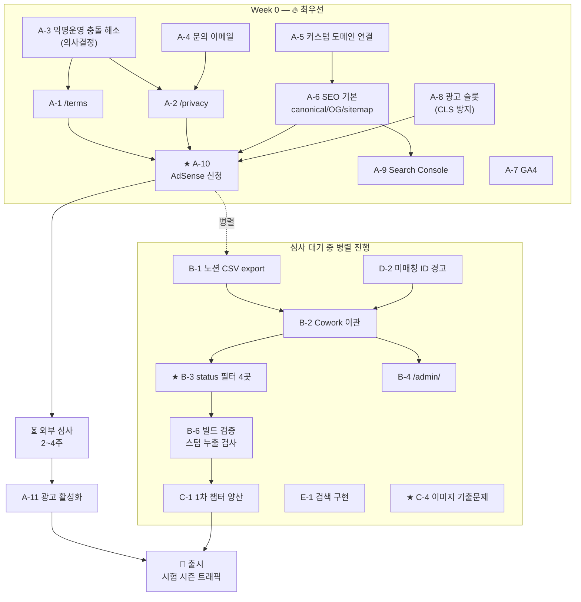

# ROADMAP.md — GetPassLab 개발 로드맵

> **선행 문서**: `PROJECT_CONTEXT.md` / `PRD.md` / `ARCHITECTURE.md` / `DECISION_LOG.md`
> **작성 기준일**: 2026-07-14 / **버전**: v1.0

---

## 0. 결론 먼저

### 0.1 이 로드맵의 핵심 판단 3가지

| # | 판단 |
|---|------|
| **1** | **출시에 필요한 콘텐츠는 이미 다 있다.** 출시 필수 챕터 77개 중 **82개 작성 완료(100%+)**. 남은 것은 콘텐츠가 아니라 **"출시 절차"**다 |
| **2** | 🚨 **AdSense 승인은 2~4주 걸리는 외부 대기 시간이다.** 이것이 **유일한 진짜 병목**이다. **지금 즉시 신청을 걸어놓고, 대기 기간에 나머지 작업을 채워야 한다** |
| **3** | **이관 세션이 AdSense를 막으면 안 된다.** 두 트랙은 독립적이며 **병렬로 간다.** 이관을 먼저 하려다 AdSense가 밀리는 것이 최악의 시나리오 |

### 0.2 🚨 이번 주에 반드시 끝내야 할 것 (총 예상 공수: 1.5일)

```
① 커스텀 도메인 연결          🟢 1시간
② /terms + /privacy 작성      🟡 반나절   ← AdSense 승인 요건
③ SEO 기본 (canonical/OG/sitemap/robots)  🟡 반나절
④ GA4 연동                    🟢 1시간
⑤ Google Search Console 등록  🟢 30분
⑥ AdSense 신청 ★★★           🟢 30분
```

**⑥을 걸어놓지 않으면 이후 모든 일정이 2~4주씩 밀린다.**

---

## 1. 현재 진행률 대시보드

### 1.1 영역별 진행률

| 영역 | 진행률 | 상태 |
|------|--------|------|
| **기획 · 설계** | ██████████ **100%** | 브랜드/IA/스키마/동결키/로드맵 전부 확정 |
| **디자인 시스템** | █████████░ **90%** | 토큰·카드·버튼·GNB 확정. **광고 슬롯 스타일 미정** |
| **데이터 (기출)** | █████████░ **90%** | 1,675문항 탑재 완료. **이미지 문제 미해결** |
| **아키텍처 · 인프라** | ████████░░ **85%** | 배포 파이프라인 개통. **도메인 미연결** |
| **UI 구현** | ███████░░░ **70%** | 페이지 5종 완료. **검색·탭바·부가기능 미완** |
| **콘텐츠 (전체 253 기준)** | ███░░░░░░░ **32%** | 82 / 253 |
| **콘텐츠 (출시 필수 77 기준)** | ██████████ **100%+** | **82 / 77 — 출시 준비 완료** ✅ |
| **운영 도구** | ░░░░░░░░░░ **0%** | `/admin/` 미구현 |
| **SEO** | ██░░░░░░░░ **20%** | URL 구조만 완료. canonical/OG/sitemap/구조화데이터 전무 |
| **수익화** | █░░░░░░░░░ **10%** | 배치 설계만. **AdSense 미신청** |
| **법적 · 정책** | ░░░░░░░░░░ **0%** | `/terms`, `/privacy` 미작성 |

### 1.2 종합 진행률

| 지표 | 값 |
|------|-----|
| **Phase 1 전체 진행률** (계획된 모든 기능 기준) | **≈ 62%** |
| **🎯 출시 준비도** (AdSense 수익 발생까지) | **≈ 45%** |
| **콘텐츠 준비도** (출시 기준) | **✅ 100%** |

> **읽는 법**: 어려운 것(기출 DB 구축, 디자인 시스템, 아키텍처, 82챕터)은 **끝났다.**
> 남은 것은 **개별 난이도는 낮지만 순서가 중요한 절차들**이다.

### 1.3 챕터 콘텐츠 상세

| 우선순위 | 챕터 수 | 작성완료 | 진행률 |
|----------|---------|----------|--------|
| **출시 필수** | 77 | **82** ✅ | **100%+** |
| **1차** | 160 | 0 | 0% |
| **2차** | 16 | 0 | 0% |
| **합계** | **253** | **82** | **32%** |

> ⚠️ 위 수치는 노션 CSV `_all` export 검증값이다. **실물 확인은 `/admin/` 또는 `find src/content/chapters -name "*.md" | wc -l`**

---

## 2. ⚠️ 타임라인 전제 — 반드시 먼저 확인할 것

> **🚨 출시 목표 시점이 확정되지 않았다.**
>
> | 출처 | 기록 |
> |------|------|
> | 프로젝트 초기 설정 | "기간: **2025년** 8월 12일 ~ **2026년** 1월 15일" |
> | 노션 정책서 | "정식 출시 목표: 2025.12 말 ~ 2026.01 초" |
> | **2026-06-16 대화** | Claude가 **"target launch in August"**(8월 출시)를 근거로 지원금 후순위 권고 |
> | 첫 대화 시점 | **2026-06-15** |
>
> **가장 정합적인 해석**: 프로젝트는 **2026년 6월 시작**, 출시 목표는 **2026년 8월**.
> 산업안전기사 **3회차 필기(통상 7~8월)** 시즌 트래픽을 노리는 타이밍과 일치한다.
> → **초기 문서의 "2025년"은 연도 오기**로 추정.
>
> **이 로드맵은 "2026년 8월 중순 출시"를 가정하고 작성됐다.**
> 다르다면 §3의 역산 스케줄을 조정해야 한다. **마일로 확인 필수.**

---

## 3. 🎯 크리티컬 패스 — 역산 스케줄

### 3.1 왜 AdSense 신청이 최우선인가

```
AdSense 신청 → [외부 심사 2~4주] → 승인 → 광고 활성화 → 수익 발생
                    ↑
              이 대기 시간은 우리가 줄일 수 없다.
              그러므로 최대한 빨리 걸어놓고, 대기 중에 다른 일을 한다.
```

**8월 중순 수익 발생을 원한다면 → 최대 4주 심사를 가정 → 7월 중순에는 신청해야 한다 → 지금이다.**

### 3.2 역산 스케줄 (8월 중순 출시 가정)

```
┌─ Week 0 (7/14 ~ 7/20) ─────────────────────── 🔥 최우선 ─┐
│  A-5  커스텀 도메인 연결              🟢 1h              │
│  A-1  /terms 작성                     🟡 3h              │
│  A-2  /privacy 작성                   🟡 3h              │
│  A-3  익명 운영 충돌 해소 (의사결정)  🟢 30m             │
│  A-4  문의 이메일 생성                🟢 30m             │
│  A-6  SEO 기본 (canonical/OG/sitemap/robots) 🟡 4h       │
│  A-7  GA4 연동                        🟢 1h              │
│  A-8  광고 슬롯 컴포넌트 (CLS 방지)   🟡 2h              │
│  A-9  Search Console 등록 + sitemap 제출  🟢 30m         │
│  ★ A-10  AdSense 신청                 🟢 30m             │
│                                        총 ≈ 1.5일         │
└──────────────────────────────────────────────────────────┘
                    ↓
┌─ Week 1~4 (7/21 ~ 8/17) — AdSense 심사 대기 ────────────┐
│  이 기간을 비워두지 마라. 병렬로 진행:                    │
│                                                          │
│  【Track B】 데이터 이관                                  │
│    B-1  노션 CSV export                🟢 30m            │
│    B-2  Cowork 이관 세션 (TRACK 1~4)   🟠 1~2일          │
│    B-3  ★ status 빌드 필터 4곳         🟡 2h  ← 치명적   │
│    B-4  /admin/ 페이지                 🟡 3h             │
│    B-5  불일치·슬러그 공란 처리        🟡 반나절         │
│                                                          │
│  【Track D】 버그 수정 (누적 8건)                         │
│    D-1  BaseLayout Pretendard 누락     🟢 30m            │
│    D-2  filter(Boolean) 조용한 실패    🟡 2h             │
│    D-4  <title> 패턴 통일              🟢 1h             │
│    D-6  명도 대비 검증                 🟢 1h             │
│                                                          │
│  【Track E】 미완 기능                                    │
│    E-1  ★ 사이트 내 검색 (미구현)      🟠 1일            │
│    E-2  과목 탭 바                     🟡 반나절         │
│    E-3  챕터 좌우 이동 + 스와이프      🟡 3h             │
│                                                          │
│  【Track C】 콘텐츠                                       │
│    C-4  ★ 이미지 기출문제 처리         🟠 미정            │
│    C-1  1차 챕터 양산 (160개)          🔴 지속           │
│                                                          │
│  【외부】 SEO 인덱싱 진행 (1~2주 소요)                    │
└──────────────────────────────────────────────────────────┘
                    ↓
┌─ Week 4+ (8월 중순) ─────────────────────────────────────┐
│  A-11  AdSense 승인 → 광고 활성화      🟢 1h             │
│  A-12  광고 배치·RPM 검증              🟡 지속           │
│  🎯 3회차 시험 시즌 트래픽 흡수                           │
└──────────────────────────────────────────────────────────┘
```

### 3.3 의존성 그래프



> 🚨 **B-2(이관)와 B-3(status 필터)는 반드시 한 세트로 실행한다.**
> **스텁 171개를 생성하고 필터를 안 넣으면 사이트가 즉시 깨진다** ("챕터 48개"라고 표시하고 클릭하면 12개만 나옴).

---

## 4. 난이도 · 담당 표기 기준

| 난이도 | 의미 |
|--------|------|
| 🟢 **낮음** | 1~2시간. 단일 파일 수정 또는 설정 변경 |
| 🟡 **중간** | 반나절 ~ 1일. 여러 파일 + 검증 필요 |
| 🟠 **높음** | 2~5일. 신규 시스템 도입 또는 외부 의존 |
| 🔴 **매우 높음** | 1주+. 새 스택 도입 또는 대량 콘텐츠 |

| 담당 | 역할 |
|------|------|
| **마일로** | 의사결정, 외부 계정 작업, 콘텐츠 검수 |
| **Claude** | 설계, 코드 작성, 지시문 초안 |
| **Cowork** | 반복·자동화 실행, 대량 파일 조작 |
| **외부** | AdSense 심사, SEO 인덱싱 (대기 시간) |

---

# TRACK A — 출시 (AdSense) 크리티컬 패스

> **이 트랙이 막히면 수익화가 통째로 밀린다. 다른 무엇보다 먼저.**

---

## A-1. 이용약관 (`/terms`)

| 항목 | 내용 |
|------|------|
| **목적** | ① 법적 보호 ② **AdSense 승인 요건 충족** |
| **우선순위** | **P0 — 최우선** |
| **예상 난이도** | 🟡 중간 (3시간) |
| **담당** | Claude 초안 → 마일로 검토 |
| **선행 조건** | **A-3** (익명 운영 vs 책임자 표기 충돌 해소) |

**필수 포함 항목**

| # | 항목 | 비고 |
|---|------|------|
| 1 | 서비스 이용 조건 | |
| 2 | 콘텐츠 저작권 (운영자 보유) | |
| 3 | **기출문제 출처 및 한국산업인력공단 권리 명시** | 저작권 원칙(D-03)의 명문화 |
| 4 | 사용자 책임 (무단 복제·배포 금지) | |
| 5 | **면책 조항 — 시험 결과 / 콘텐츠 정확성 / 🚨 법령 변동** | **산업안전보건법은 개정이 잦다. 콘텐츠가 구법 기준일 수 있다** |
| 6 | 서비스 변경·중단 권리 | |

**예상 구현 순서**
```
1. A-3 의사결정 (운영자 정보 표기 수준 확정)
2. Claude가 초안 작성 (동종 서비스 약관 구조 참고)
3. 마일로 검토 → 수정
4. src/pages/terms.astro 생성 (BaseLayout 사용, 광고 미배치)
5. 푸터 링크 연결 확인
```

---

## A-2. 개인정보처리방침 (`/privacy`)

| 항목 | 내용 |
|------|------|
| **목적** | ① 법적 의무 ② **AdSense 승인 요건 충족** |
| **우선순위** | **P0 — 최우선** |
| **예상 난이도** | 🟡 중간 (3시간) |
| **담당** | Claude 초안 → 마일로 검토 |
| **선행 조건** | **A-3**, **A-4** (문의 이메일) |

**필수 포함 항목**

| # | 항목 |
|---|------|
| 1 | 수집 정보 (**쿠키, GA4 데이터**) |
| 2 | 수집 목적 (서비스 개선, 광고 게재) |
| 3 | 보유 기간 |
| 4 | **제3자 제공 (Google AdSense, Google Analytics)** |
| 5 | **광고 거부 옵션** (Google 광고 설정 링크) |
| 6 | 이용자 권리 및 행사 방법 |
| 7 | 🚨 **개인정보 보호 책임자 (이메일)** ← A-3의 충돌 지점 |

**예상 구현 순서**: A-1과 동일

> ⚠️ **Phase 2 진입 시 전면 개정 필요** (Supabase 회원 데이터 + Stripe 결제 정보)

---

## A-3. 🚨 익명 운영 vs 책임자 표기 충돌 해소 (의사결정)

| 항목 | 내용 |
|------|------|
| **목적** | **이 결정 없이는 A-1, A-2를 쓸 수 없다** |
| **우선순위** | **P0 — 다른 모든 것의 선행 조건** |
| **예상 난이도** | 🟢 낮음 (30분) — **단, 순수 의사결정** |
| **담당** | **마일로 (결정)** |
| **선행 조건** | 없음 |

**충돌 내용**

| 기존 결정 | 충돌하는 요구 |
|-----------|--------------|
| **D-19: 익명 운영.** 푸터에 운영자 정보 미노출. "개인 사이드 프로젝트가 아니라 하나의 제품으로 보이게" | **개인정보처리방침에는 통상 "개인정보 보호 책임자"의 실명·연락처 표기가 요구된다.** AdSense 승인 시에도 관련될 수 있다 |

**선택지**

| 안 | 내용 | 트레이드오프 |
|----|------|-------------|
| **A** | 정책 페이지에만 최소 정보(이름 이니셜 + 이메일) 표기, 푸터는 익명 유지 | 익명성 대부분 유지. **권장** |
| **B** | 완전 실명 공개 | 신뢰도↑, 익명성 상실 |
| **C** | 이메일만 표기, 실명 생략 | 법적 요건 미달 가능성 ⚠️ |

> ⚠️ **불확실 정보**: 한국 개인정보보호법상 개인 운영 웹사이트의 책임자 표기 의무 범위, AdSense의 정확한 요구 수준을 **확정적으로 알 수 없다.** 신청 전 **최신 기준 확인 필요.**

---

## A-4. 문의 이메일 채널

| 항목 | 내용 |
|------|------|
| **목적** | 사용자 피드백 수신 + **개인정보처리방침의 책임자 연락처 요건 충족** |
| **우선순위** | **P0** (A-2의 선행 조건) |
| **예상 난이도** | 🟢 낮음 (30분) |
| **담당** | 마일로 |
| **선행 조건** | **A-5** (도메인 연결 — `@getpasslab.site` 주소를 쓰려면) |

**예상 구현 순서**
```
1. 도메인 이메일 발급 (getpasslab.site 기반) 또는 Gmail 별칭
2. 푸터 + 정책 페이지에 노출
```
> **문의 폼(form)은 만들지 않는다.** 정적 사이트라 백엔드가 필요하다. **이메일 링크로 대체** (기존 결정).

---

## A-5. 커스텀 도메인 연결 (`getpasslab.site`)

| 항목 | 내용 |
|------|------|
| **목적** | ① AdSense 승인률 향상 ② 브랜드 정체성 ③ SEO |
| **우선순위** | **P0 — 최우선** |
| **예상 난이도** | 🟢 **낮음 (1시간)** |
| **담당** | 마일로(DNS) + Claude(설정 변경) |
| **선행 조건** | 없음 |

**왜 지금 해야 하는가**
- **현재 인덱스가 거의 없다** (sitemap·Search Console 미등록). 즉 **도메인을 바꿔도 잃을 SEO 자산이 없다**
- 콘텐츠가 쌓이고 인덱싱된 뒤에 옮기면 손실이 발생한다
- **지금이 가장 싼 타이밍이다**

**예상 구현 순서**
```
1. 도메인 등록업체에서 DNS 레코드 설정
   - A 레코드 → GitHub Pages IP 4개
   - (또는) CNAME → syjy813.github.io
2. GitHub 저장소 Settings → Pages → Custom domain 입력
3. "Enforce HTTPS" 체크 (인증서 발급 대기 최대 24h)
4. ★ astro.config.mjs 수정
   - site: 'https://getpasslab.site'
   - base: 제거 (또는 '/')
5. 빌드 + 배포
6. 링크 전수 확인 ← withBase()가 전부 처리하므로 자동 정상화
```

> 🏆 **`withBase()` 덕분에 이 작업이 설정 한 줄로 끝난다.** 링크를 하드코딩했다면 253개 페이지를 고쳐야 했다. (D-63)
>
> ⚠️ **주의**: GitHub Pages는 커스텀 도메인 설정 시 `github.io` 주소를 자동으로 리다이렉트한다. 인덱스 이전은 자동 처리된다.

---

## A-6. SEO 기본 마감

| 항목 | 내용 |
|------|------|
| **목적** | **유일한 트래픽 획득 채널.** 광고비 0원이므로 검색 유입이 전부다 |
| **우선순위** | **P0** |
| **예상 난이도** | 🟡 중간 (4시간) |
| **담당** | Claude |
| **선행 조건** | **A-5** (도메인 연결 — canonical/sitemap의 base URL이 확정되어야 함) |

**작업 목록**

| # | 항목 | 현재 | 난이도 |
|---|------|------|--------|
| 1 | **`<link rel="canonical">`** | 🔴 **없음** | 🟢 |
| 2 | **OG 태그** (og:title/description/image/url/type) | 🔴 **없음** | 🟢 |
| 3 | Twitter Card | 🔴 없음 | 🟢 |
| 4 | **`@astrojs/sitemap` 설치 + 설정** | 🟡 미확인 | 🟢 |
| 5 | **`public/robots.txt`** (`Disallow: /admin/`) | 🟡 미확인 | 🟢 |
| 6 | **`<title>` 패턴 통일** (D-4 버그와 동일 작업) | 🔴 불일치 | 🟢 |
| 7 | favicon + OG 이미지 제작 | ⚪ 미확인 | 🟡 |

**`<title>` 확정 패턴**
```
홈           : GetPassLab — 산업안전기사 핵심요약
자격증 허브   : 산업안전기사 — GetPassLab
필기         : 산업안전기사 필기 6과목 — GetPassLab
과목 목차     : {과목명} — 산업안전기사 필기 — GetPassLab
챕터 상세 ★  : {챕터명} — {과목명} — 산업안전기사 필기 | GetPassLab
```
- 구분자 `—`로 통일, **60자 이내**, **조립 책임은 레이아웃**

**예상 구현 순서**
```
1. BaseLayout / ChapterLayout의 <head> 통합 리팩터링
   → SEO 메타를 한 컴포넌트(<SEO />)로 추출 검토
2. canonical + OG 태그 추가
3. @astrojs/sitemap 설치 및 /admin/ 필터 설정
4. robots.txt 작성
5. favicon / OG 이미지 (1200×630) 제작
6. 빌드 → dist/sitemap-index.xml 생성 확인
```

---

## A-7. Google Analytics 4 연동

| 항목 | 내용 |
|------|------|
| **목적** | ① 트래픽 측정 ② 인기 챕터 자동 산출 데이터 소스 ③ **포트폴리오의 "데이터 분석" 파트 근거** |
| **우선순위** | **P0** |
| **예상 난이도** | 🟢 낮음 (1시간) |
| **담당** | 마일로(계정) + Claude(코드) |
| **선행 조건** | A-5 (도메인) — 없어도 되지만 도메인 확정 후가 깔끔 |

**측정 대상**: PV, 세션, 유입 경로, 챕터별 체류시간, 이탈률, **시험 시즌 트래픽 스파이크**

**추가 이벤트 트래킹 (P2)**: 기출 모달 오픈, 검색 사용, 광고 클릭 위치

> 🎯 **포트폴리오 관점**: "출시 → 데이터 분석"의 마지막 고리다. 면접에서 "월 OO 트래픽"을 말하려면 이 데이터가 있어야 한다. **D-01(포트폴리오 1순위)의 직접적 산출물.**

---

## A-8. 광고 슬롯 컴포넌트 (CLS 방지)

| 항목 | 내용 |
|------|------|
| **목적** | AdSense 코드 삽입 위치 사전 구축 + **레이아웃 시프트 방지** |
| **우선순위** | **P0** |
| **예상 난이도** | 🟡 중간 (2시간) |
| **담당** | Claude |
| **선행 조건** | 없음 (승인 전에 슬롯만 만들어둔다) |

**🚨 CLS 방지가 핵심이다**
> **광고가 늦게 뜨면서 본문이 아래로 밀리는 것이 최악의 UX다.** 사용자가 읽던 곳을 잃는다.
> **챕터 페이지에 광고가 3개다 → CLS 리스크가 3배다.**

```css
.ad-slot {
  min-height: 280px;              /* 광고 로드 전에도 자리를 차지 */
  display: flex; align-items: center; justify-content: center;
  background: var(--gray-50);
}
@media (min-width: 768px) {
  .ad-slot { min-height: 90px; }  /* 데스크톱 배너 */
}
```

**광고 배치 (확정)**

| 페이지 | 광고 수 | 위치 |
|--------|---------|------|
| 홈 | 1~2 ⚠️ | 6과목 카드 ↔ 인기 챕터 |
| 자격증 허브 | **0** | — |
| 필기 | 1 | 6과목 ↔ 인기 챕터 |
| 과목 목차 | 2 | 그룹1↔2, 하단 |
| **챕터 상세** | **3** ★ | **섹션 3↔5, 하단 (수익 80%+)** |
| 검색 모달 / 정책 페이지 | **0** | — |

> ⚠️ **미결**: 홈 광고 수가 문서마다 1개/2개로 엇갈린다. 확정 필요.
> ⚠️ **미결**: 광고 슬롯의 디자인 토큰 (구분선, "광고" 라벨 표시 여부)

---

## A-9. Google Search Console 등록

| 항목 | 내용 |
|------|------|
| **목적** | 색인 요청 + 검색 성과 측정 |
| **우선순위** | **P0** |
| **예상 난이도** | 🟢 낮음 (30분) |
| **담당** | 마일로 |
| **선행 조건** | **A-5**(도메인), **A-6**(sitemap) |

**예상 구현 순서**
```
1. Search Console에 getpasslab.site 등록 (DNS TXT 인증)
2. sitemap.xml 제출
3. 주요 페이지 색인 요청 (홈 + 대표 챕터 몇 개)
4. 이후 색인 진행 상황 모니터링
```
> ⏳ **SEO 인덱싱에 1~2주 소요.** AdSense 심사와 병렬로 진행된다.

---

## A-10. ★★★ AdSense 신청

| 항목 | 내용 |
|------|------|
| **목적** | **수익화의 시작점** |
| **우선순위** | **P0 — 이 로드맵에서 가장 중요한 단일 액션** |
| **예상 난이도** | 🟢 낮음 (30분) |
| **담당** | 마일로 |
| **선행 조건** | **A-1** (terms), **A-2** (privacy), **A-5** (도메인), **A-6** (SEO), **A-8** (광고 슬롯) |

**승인 요건 체크리스트**

| # | 요건 | 상태 |
|---|------|------|
| 1 | **콘텐츠 충실도** (기능 다양성 아님) | ✅ 82개 챕터 — **충분** |
| 2 | 이용약관 페이지 | ⬜ A-1 |
| 3 | 개인정보처리방침 페이지 | ⬜ A-2 |
| 4 | 커스텀 도메인 | ⬜ A-5 |
| 5 | 사이트 탐색 구조 | ✅ GNB/브레드크럼/사이드바 |
| 6 | 오리지널 콘텐츠 | ✅ 자체 작성 |
| 7 | 정책 위반 콘텐츠 없음 | ✅ |

> ⏳ **심사 기간: 평균 2주, 최대 4주.** **이 대기 시간이 크리티컬 패스의 전부다.**
> 🚨 **거부되면 재신청까지 추가로 시간이 든다.** 위 요건을 하나도 빠뜨리지 말 것.

---

## A-11. 광고 활성화 + 배치 검증

| 항목 | 내용 |
|------|------|
| **목적** | 실제 수익 발생 |
| **우선순위** | **P0** |
| **예상 난이도** | 🟢 낮음 (1시간) |
| **담당** | 마일로 + Claude |
| **선행 조건** | **A-10 승인** |

**예상 구현 순서**
```
1. AdSense 코드를 A-8의 슬롯에 삽입
2. 배포 후 광고 노출 확인
3. CLS 실측 (Lighthouse / PageSpeed Insights)
4. 1~2주 후 위치별 RPM 측정 → 재배치 검토
```

---

# TRACK B — 데이터 이관 (git 단일화)

> **AdSense 심사 대기 중에 진행한다.** 이것 때문에 A 트랙이 밀리면 안 된다.

---

## B-1. 노션 CSV export

| 항목 | 내용 |
|------|------|
| **목적** | 이관의 원재료 확보 |
| **우선순위** | P1 |
| **예상 난이도** | 🟢 낮음 (30분) |
| **담당** | 마일로 |
| **선행 조건** | 없음 |

**🚨 실패 경험에서 나온 규칙 (D-75)**

| 규칙 | 이유 |
|------|------|
| **반드시 `_all` 파일을 쓴다** | 기본 파일은 **현재 뷰의 필터·숨긴 컬럼이 반영**되어 행이 누락된다. (실제로 "2과목 출시 필수" 뷰에서 export하니 **12행만** 나왔다) |
| **Include subpages 옵션을 끈다** | 켜면 **md 파일 1,690개가 딸려온다** |

**산출물**: 챕터 매핑 CSV (253행) + 기출문제 CSV (약 1,690행) = 2개 파일

---

## B-2. Cowork 이관 세션 (TRACK 1~4)

| 항목 | 내용 |
|------|------|
| **목적** | **노션 의존을 완전히 끊고 git을 단일 진실 원천으로** |
| **우선순위** | P1 |
| **예상 난이도** | 🟠 **높음 (1~2일)** |
| **담당** | Cowork (지시문은 이미 작성 완료) |
| **선행 조건** | **B-1**, **D-2**(미매칭 ID 경고 로직 — 권장) |

**작업 구성**

| TRACK | 내용 |
|-------|------|
| **1** | `questions.json` 재생성 (중복 제거 + 정답 파싱 + `review` 필드 추가) |
| **2** | 챕터 md **스텁 171개** 생성 + 기존 82개 frontmatter 보강 (`priority`/`status`/`order`) |
| **3** | 노션 relation → frontmatter `questions` 배열 **병합** (기존 값과 합집합) |
| **4** | **빌드 필터 4곳** + `/admin/` 페이지 (→ B-3, B-4) |

**🚨 절대 규칙**
```
- 슬러그는 CSV 값 그대로. 임의 생성·수정 절대 금지.
- 슬러그 공란 행은 생성하지 말고 보고.
- 세션은 과목 단위로 분할.
- 시작 전 git pull, 완료 후 git push. 동시 세션 금지.
- 완료 후 npm run build 성공 확인.
```

---

## B-3. ★ `status` 빌드 필터 4곳 — **치명적**

| 항목 | 내용 |
|------|------|
| **목적** | **스텁 챕터가 사이트에 새어나오는 것을 막는다** |
| **우선순위** | **P0 — B-2와 반드시 한 세트** |
| **예상 난이도** | 🟡 중간 (2시간) |
| **담당** | Claude / Cowork |
| **선행 조건** | **B-2 (스텁 생성)와 동시 실행** |

**🚨 현재 코드에 필터가 없다**
```ts
// 실제 코드 (written/index.astro)
const countBy = (id: number) => chapters.filter(c => c.data.subject_id === id).length;
//                                                    ^^^ status 필터 없음!
```

> **이대로 스텁 171개를 생성하면 → "챕터 48개"라고 표시하고 클릭하면 12개만 나온다.**
> **스텁 생성과 필터 추가는 같은 커밋에 들어가야 한다.**

**필터가 필요한 4곳**

| # | 위치 |
|---|------|
| 1 | 챕터 상세 `getStaticPaths` |
| 2 | 과목 목차 카드·카운트 |
| 3 | 홈 과목 카드 카운트 |
| 4 | 챕터 사이드바 `sideChapters` |

**검증 (필수)**
```bash
npm run build
find dist -name index.html | wc -l   # 작성완료 챕터 수와 일치해야 함
# dist에 미작성 챕터 페이지가 있으면 → 작업 실패
```

---

## B-4. `/admin/` 현황 페이지

| 항목 | 내용 |
|------|------|
| **목적** | **노션을 대체하는 "자동 생성 장부."** 실물(md)에서 생성되므로 **어긋날 방법이 물리적으로 없다** |
| **우선순위** | P1 |
| **예상 난이도** | 🟡 중간 (3시간) |
| **담당** | Claude / Cowork |
| **선행 조건** | **B-2** (frontmatter 보강) |

**사양**
- `src/pages/admin/index.astro` — 전체 챕터(**스텁 포함**)를 `getCollection`으로 읽어 표로 나열
- 컬럼: 챕터명 / 과목 / 그룹 / 우선순위 / 상태 / **기출 매칭 수**
- 상단 요약: 전체 N / 작성완료 N / 미작성 N
- **기존 `global.css` 토큰·표 스타일 재사용. 신규 디자인 금지**

**🚨 3중 검색 차단**
```
① <meta name="robots" content="noindex, nofollow">
② robots.txt: Disallow: /admin/
③ sitemap({ filter: (page) => !page.includes('/admin') })
```

**향후 개선 (P2)**
- 정렬 가능한 테이블 (클라이언트 소팅)
- 본문 파생 지표 (글자 수, 수식 포함 여부)
- **기출 매칭 0건 챕터 하이라이트** ← 콘텐츠 우선순위 재조정에 유용

---

## B-5. 불일치 목록 / 슬러그 공란 처리

| 항목 | 내용 |
|------|------|
| **목적** | 이관 후 남은 데이터 정합성 문제 해소 |
| **우선순위** | P1 |
| **예상 난이도** | 🟡 중간 (반나절) |
| **담당** | 마일로(결정) + Claude/Cowork(실행) |
| **선행 조건** | **B-2 완료 보고** |

**🚨 슬러그 공란은 동결 키 부여 문제다.** 잘못 만들면 되돌릴 수 없다. **반드시 마일로가 확정한다.**

---

# TRACK C — 콘텐츠

---

## C-1. 1차 우선순위 챕터 양산 (160개)

| 항목 | 내용 |
|------|------|
| **목적** | 콘텐츠 커버리지 확대 → SEO 랜딩 페이지 증가 |
| **우선순위** | **P2** (출시 필수 아님 — 출시 콘텐츠는 이미 확보) |
| **예상 난이도** | 🔴 **매우 높음 (지속 작업)** |
| **담당** | Cowork (과목 단위 세션) |
| **선행 조건** | **B-2** (스텁 생성 완료) |

**작업 방식: "스텁 채우기"**
```
스텁 md (frontmatter만) → 섹션 1~3 본문 작성 → status: 작성완료
                          ↑
                    섹션 4·5는 빌드가 자동 생성 (D-33)
```

**챕터당 수작업 분량: 700~900자** (자연 분량 원칙 — 억지로 늘리지 않는다)

**예상 구현 순서**
```
1. 과목 단위 Cowork 세션 (한 번에 253개를 시키지 않는다)
2. 세션당 20~30개 목표
3. 완료 후 npm run build 검증 → push
4. /admin/ 페이지에서 진행률 확인
5. 마일로 샘플 검수 (품질 편차 관리)
```

> 💡 **품질 관리 포인트**: **"출제 경향 코멘트"가 유일한 수작업 차별화 지점**이다. 여기서 품질 편차가 나면 서비스의 핵심 가치가 흔들린다.

---

## C-2. 2차 챕터 양산 (16개)

| 항목 | 내용 |
|------|------|
| **목적** | 커버리지 완성 |
| **우선순위** | **P3** (후순위) |
| **예상 난이도** | 🟡 중간 |
| **담당** | Cowork |
| **선행 조건** | C-1 |

---

## C-3. 미매칭 기출문제 → 신규 챕터 도출

| 항목 | 내용 |
|------|------|
| **목적** | **역설계 전략(D-35)의 핵심 루프를 닫는다** |
| **우선순위** | **P2** |
| **예상 난이도** | 🟡 중간 |
| **담당** | Claude(분석) + 마일로(결정) |
| **선행 조건** | **B-2** (relation 병합 완료) |

**논리**
> 어느 챕터에도 붙지 않는 기출문제가 있다면, 그건 **챕터 체계에 빠진 주제**라는 뜻이다.
> **미매칭 목록 = 신규 챕터 후보 목록.**

**예상 구현 순서**
```
1. /admin/에서 "기출 매칭 0건" 챕터 + 어느 챕터에도 안 붙은 기출 ID 추출
2. 미매칭 기출을 주제별로 클러스터링
3. 신규 챕터 도출 → 마일로 검토
4. 챕터 추가 (⚠️ 슬러그는 신중히 — 동결 키다)
```

> 💡 **224 → 253개로 챕터가 30개 늘어난 것도 이 과정의 결과로 추정된다.** (D-36)

---

## C-4. ★ 이미지 포함 기출문제 처리

| 항목 | 내용 |
|------|------|
| **목적** | **현재 도형·회로도 문제는 텍스트만 나와서 누구도 이해할 수 없다** |
| **우선순위** | **P1 — 데이터 품질 문제** |
| **예상 난이도** | 🟠 **높음 (방식 미정)** |
| **담당** | 마일로(결정) + Cowork(실행) |
| **선행 조건** | **B-2** (`review` 필드 이관) |

**현재 상태**
- 노션에 `검수 상태 = "jpg 확필"` (red 옵션)로 **표기만** 되어 있다
- **이미지 자체가 없다**
- `questions.json`의 `review` 필드로 이관될 예정

**선택지**

| 안 | 내용 | 난이도 | 트레이드오프 |
|----|------|--------|-------------|
| **A** | **해당 문제를 모달에서 노출 제외** | 🟢 낮음 | 즉시 가능. 콘텐츠 손실 |
| **B** | PDF에서 이미지 추출 → `public/questions/` 저장 → 모달에 표시 | 🟠 높음 | 완전한 해결. 저작권 재검토 필요 ⚠️ |
| **C** | 이미지 문제에 "이미지 문제 — 원본 참조 필요" 배지 표시 | 🟢 낮음 | 정직하되 가치 없음 |

> **권장: 우선 A로 막고(출시 리스크 제거), 이후 B를 검토.**
> ⚠️ **B의 저작권**: 기출문제 이미지는 공공 저작물 범주에 들어갈 가능성이 높으나, **해설집 PDF의 재가공 이미지라면 다르다.** 확인 필요.

**먼저 해야 할 일**
```bash
# review 필드로 이미지 문제가 몇 개인지 파악
python3 -c "
import json; qs=json.load(open('src/data/questions.json'))
img=[q for q in qs if q.get('review')]
print(f'이미지 문제: {len(img)}건 / 전체 {len(qs)}건')
"
```
**이 숫자를 모르면 의사결정을 할 수 없다. 가장 먼저 확인할 것.**

---

## C-5. 오타 교정 세션

| 항목 | 내용 |
|------|------|
| **목적** | 콘텐츠 품질 |
| **우선순위** | P2 |
| **예상 난이도** | 🟡 중간 |
| **담당** | Cowork |
| **선행 조건** | 없음 |
| **비고** | **지시문이 이미 전달된 것으로 보임. 실행 여부 미확인** ⏳ |

---

## C-6. 최신 회차 기출 추가 (2023~2025)

| 항목 | 내용 |
|------|------|
| **목적** | **"최신 기출 없음"이 시간이 지날수록 약점이 된다** |
| **우선순위** | **P2** |
| **예상 난이도** | 🟠 높음 (파이프라인은 있으나 파싱·매핑 작업 필요) |
| **담당** | 마일로(PDF 수집) + Cowork(파싱) |
| **선행 조건** | B-2 (questions.json 안정화) |

**현재 DB는 2018~2022 기준**이다. 2026년 수험생에게 "최근 5개년"은 2021~2025여야 한다.

> ⚠️ **확실하지 않음**: DB의 실제 연도 범위를 `questions.json`에서 확인할 것. "5개년 14회차"와 "7개년" 표현이 혼재한다.

**예상 구현 순서**
```
1. questions.json의 실제 회차 목록 확인
2. 누락 회차의 CBT 해설집 PDF 수집
3. Cowork 파싱 (D-40 파이프라인 재사용)
4. 중복 제거 + 정답 파싱 → questions.json 병합
5. 챕터 매핑 (D-43: 매칭 실패 시 보고, 임의 매핑 금지)
6. 빈도 라벨 문구 갱신 ("최근 5개년" → 실제 범위)
```

---

# TRACK D — 버그 · 기술 부채

> **AdSense 심사 대기 중에 소화한다. 개별 난이도는 전부 낮다.**

| # | 항목 | 우선순위 | 난이도 | 선행 조건 | 내용 |
|---|------|----------|--------|-----------|------|
| **D-1** | **BaseLayout Pretendard 링크 누락** | **P0** | 🟢 30m | 없음 | `ChapterLayout`에만 폰트 링크가 있다. **홈·과목 목차에서 폰트가 안 뜰 수 있다.** `global.css`에 `@import`가 있는지 먼저 확인 |
| **D-2** | **`filter(Boolean)` 조용한 실패** | **P0** | 🟡 2h | 없음 | frontmatter의 오타 문제 ID가 **빌드를 통과하고 조용히 누락**된다. **B-2(relation 대량 병합) 전에 넣어야 오류를 잡는다** |
| **D-3** | 조인 O(n×m) → Map 인덱싱 | P2 | 🟢 1h | 없음 | D-2와 함께 처리. 지금은 빌드가 빠르지만 자격증 확장 시 문제 |
| **D-4** | `<title>` 패턴 불일치 | P1 | 🟢 1h | 없음 | **A-6에 통합** |
| **D-5** | 인라인 style 재사용 → `.card-disabled` | P2 | 🟢 30m | 없음 | `opacity:.55;cursor:default`가 실기 카드 + 빈 과목 카드에 중복 |
| **D-6** | **명도 대비 검증** (`--gray-600` on `--gray-100`) | **P1** | 🟢 1h | 없음 | **약 4.3:1로 WCAG AA(4.5:1) 미달 가능.** 챕터 카드의 요약·챕터 수가 이 조합. WebAIM으로 실측 |
| **D-7** | CDN → 자체 호스팅 (Pretendard, KaTeX) | P2 | 🟡 2h | 없음 | jsDelivr 장애 시 폰트·수식 깨짐 |
| **D-8** | path alias (`@config/*`) 도입 | P3 | 🟢 1h | 없음 | 현재 `../../../../`. **자격증 확장 직전에 반드시** |

**D-2 개선 코드**
```ts
const qMap = new Map(allQuestions.map(q => [q.data.id, q.data]));   // D-3도 해결
const missing: string[] = [];
const linked = chapter.data.questions
  .map(id => { const q = qMap.get(id); if (!q) missing.push(id); return q; })
  .filter((q): q is NonNullable<typeof q> => q !== undefined)
  .sort((a, b) => b.id.localeCompare(a.id));

if (missing.length) console.warn(`⚠️ [${chapter.data.slug}] 미매칭 문제 ID: ${missing.join(', ')}`);
```

---

# TRACK E — 미완 기능

---

## E-1. ★ 사이트 내 검색 — **미구현**

| 항목 | 내용 |
|------|------|
| **목적** | **키워드를 아는 사용자의 최단 경로 진입.** ("사망만인율"만 알고 몇 과목인지 모르는 사용자가 다수) |
| **우선순위** | **P1** |
| **예상 난이도** | 🟠 **높음 (1일)** |
| **담당** | Claude |
| **선행 조건** | **B-3** (status 필터 — 검색 인덱스에 스텁이 들어가면 안 된다) |

**🔴 현재 상태: 아예 없다**
- `package.json`에 **Pagefind 없음**
- **GNB 코드에 검색 아이콘조차 없다** (로고 + "필기 과목" 드롭다운뿐)
- 정책서의 GNB 구성(로고/필기/검색/소개)과 다르다

**사양 (설계 완료)**

| 항목 | 값 |
|------|-----|
| 트리거 | GNB 검색 아이콘 + 홈 Hero 검색창 |
| 형태 | **모달 오버레이** (`/search` 별도 페이지 없음) |
| 결과 | **평면 리스트 + 과목 태그** (과목별 그룹화 아님) |
| 빈 상태 | 인기 챕터 Top 5 |
| 결과 없음 | 6과목 카드 |
| 닫기 | X / ESC / 밖 클릭 |
| 광고 | **없음** |

**예상 구현 순서**
```
1. 검색 엔진 결정 (Pagefind 권장 — 빌드 타임 인덱스, JS 번들 작음)
2. npm install pagefind + astro.config 통합
3. 빌드 후 인덱스 생성 확인 (스텁 제외 검증 ★)
4. GNB에 검색 아이콘 추가 (Lucide Search — 인라인 SVG)
5. 검색 모달 컴포넌트 (<dialog> 사용 — D-64 원칙)
6. 홈 Hero 검색창 연결
```

> ⚠️ **보류된 결정**: 결과가 많을 때의 처리(모달 단독 vs 하이브리드 `/search` 페이지).
> **마일로가 "UI를 봐야 결정"이라며 보류했다.** 구현 후 재논의.

---

## E-2. 과목 탭 바

| 항목 | 내용 |
|------|------|
| **목적** | **필기 하위 어느 페이지에서든 과목 이동을 1클릭으로** |
| **우선순위** | **P1** |
| **예상 난이도** | 🟡 중간 (반나절) |
| **담당** | Claude |
| **선행 조건** | 없음 |
| **상태** | ⏳ Claude Design 지시문 작성 완료. **구현 여부 미확인** |

**근거 (사용자 관찰)**
> **수험생은 한 학습 세션에 여러 과목을 오간다.**
> 현재 과목 이동은 GNB 드롭다운 또는 브레드크럼 역행뿐이라 **2~3클릭**이 든다.
> **모바일에서는 챕터 사이드바가 숨어 있어 사실상 경로가 하나뿐이다.**

**사양**
- 6과목 가로 탭, 짧은 라벨("1과목"~"6과목")
- 현재 과목 활성 하이라이트
- **과목 목차 + 챕터 상세**의 브레드크럼 아래 공통 삽입
- 모바일: **가로 스크롤 + 현재 과목이 처음부터 뷰포트 안에 보이도록**

> ⚠️ **미정**: 탭 클릭 시 이동 대상이 **과목 목차 vs 해당 과목 첫 챕터** 중 무엇인가. **구현 전 결정 필요.**

---

## E-3. 챕터 좌우 이동 + 모바일 스와이프

| 항목 | 내용 |
|------|------|
| **목적** | 연속 학습의 클릭 부담 제거 + **PV 증가 (= 광고 수익)** |
| **우선순위** | **P1** |
| **예상 난이도** | 🟡 중간 (3시간) |
| **담당** | Claude |
| **선행 조건** | **B-3** (status 필터 — 스텁으로 이동하면 404) |

**사양**
- 챕터 하단 좌우 이동 버튼 + **다음 챕터명 미리보기** ("← 강도율 / 연천인율 →")
- 모바일 좌우 스와이프
- 순서는 `order` 필드 기준, **작성완료 챕터만**

> ⚠️ **검증 필요**: 스와이프가 **표(챕터 섹션 2)의 가로 스크롤**과 충돌하지 않는가
> ⚠️ **미정**: 과목 마지막 챕터에서 **다음 과목으로 연결할지**

---

## E-4. 인기 챕터 데이터 소스

| 항목 | 내용 |
|------|------|
| **목적** | 홈·필기·검색 모달의 "인기 챕터" 섹션을 채운다 |
| **우선순위** | **P1** (섹션은 있는데 데이터가 없으면 빈 화면) |
| **예상 난이도** | 🟢 낮음 (1시간) → 🟡 (자동화 시) |
| **담당** | 마일로(수동 선정) → Claude(자동화) |
| **선행 조건** | 자동화는 **A-7** (GA4) |

**하이브리드 구현 (확정 방식)**
```
Phase 1 (출시 초기): 마일로가 수동 선정 (JSON 또는 config 파일)
       ↓ GA4 데이터 누적 (1~2개월)
Phase 2: GA4 → 인기 챕터 자동 산출
```

> ⚠️ **미정의**: "인기"의 정의 — PV 기준? 체류시간 가중?
> ⚠️ **알려진 이슈**: 모바일에서 인기 챕터 카드의 정보가 잘린다. **2줄 레이아웃으로 변경 권장**

---

## E-5. 최근 업데이트 5개 (날짜 필드)

| 항목 | 내용 |
|------|------|
| **목적** | 사이트가 살아있음을 보여주고 재방문 동기 부여 |
| **우선순위** | P2 |
| **예상 난이도** | 🟡 중간 |
| **담당** | Claude / Cowork |
| **선행 조건** | **스키마 변경 필요** |

**🚨 문제: frontmatter에 날짜 필드가 없다**

| 선택지 | 내용 | 난이도 |
|--------|------|--------|
| **A** | `published` / `updated` 필드를 스키마에 추가 | **253개 파일 일괄 수정 필요** → **B-2(이관)와 함께 처리하는 것이 효율적** |
| **B** | git 커밋 시각을 빌드 타임에 읽기 | 🟡 중간. 파일 추가 없음 |

> 💡 **A를 택한다면 지금 B-2 지시문에 필드를 추가하라.** 나중에 하면 253개를 또 건드려야 한다.

---

## E-6. 시험 D-day 카운트다운

| 항목 | 내용 |
|------|------|
| **목적** | 학습 긴박감 부여 + 인게이지먼트 |
| **우선순위** | P2 |
| **예상 난이도** | 🟢 낮음 (2시간) |
| **담당** | Claude |
| **선행 조건** | 없음 |

**사양**: 자격증 허브의 시험 일정 표 + JS 카운트다운. **외부 의존성 없음.**

**정책**: **시험 일정은 수동 갱신** (Q-net API는 PDF 기반이라 동적 연동 폐기 — D-08 계열 결정)

**예상 구현 순서**
```
1. 시험 일정을 별도 JSON으로 분리 (src/data/exam-schedule.json)
   → 매년 1회 1파일만 수정하면 됨
2. 회차 자동 전환 로직 (시험일이 지나면 다음 회차)
3. 자격증 허브에 렌더
4. (검토) 홈 Hero에도 노출
```

> ⚠️ **출시 전 Q-net 공식 데이터 재확인 필수**: 응시자격 / 합격기준 / **시험 비용** / 일정.
> 기록된 시험 비용(필기 19,400원 / 실기 22,600원)은 **연도별 변동 가능.**

---

## E-7. `/all` 과목 전체 보기 페이지

| 항목 | 내용 |
|------|------|
| **목적** | 시험 직전 과목 전체를 클릭 없이 통독 |
| **우선순위** | **P2** (MVP 필수 아님) |
| **예상 난이도** | 🟡 중간 |
| **담당** | Claude |
| **선행 조건** | B-3 (status 필터) |

**🔴 SEO 리스크 — 먼저 해결할 것**
> `/all`은 챕터 페이지와 **동일 콘텐츠**를 모은다 → **중복 콘텐츠 페널티** 가능.
>
> **권장 대응**: `<meta name="robots" content="noindex, follow">`
> `/all`은 **사용자 편의 기능이지 SEO 자산이 아니다.** `follow`는 유지해 내부 링크는 전달한다.

**사양**: 스크롤 진행률 바 + 그룹 헤더 + 챕터 divider + **3챕터마다 광고 1개**

---

## E-8. 구조화 데이터 (JSON-LD)

| 항목 | 내용 |
|------|------|
| **목적** | 검색 결과 리치 스니펫 → **클릭률 향상** |
| **우선순위** | P2 |
| **예상 난이도** | 🟢 낮음 (2시간) |
| **담당** | Claude |
| **선행 조건** | A-6 (SEO 기본) |

**적용 스키마**

| 스키마 | 대상 | 효과 |
|--------|------|------|
| `Article` | 챕터 상세 | 기본 |
| `BreadcrumbList` | 전 페이지 | **검색 결과에 경로 표시 → CTR 향상** |
| `FAQPage` | 기출 출제 이력 섹션 | ⚪ 리치 스니펫 가능성 (검토) |

---

# PHASE 1.5 — 출시 직후 (P2)

| # | 항목 | 목적 | 난이도 | 선행 조건 |
|---|------|------|--------|-----------|
| 1 | **GA4 기반 인기 챕터 자동화** | 운영 부담 0으로 | 🟡 | GA4 데이터 1~2개월 |
| 2 | **AdSense Rewarded Interstitial** | RPM 향상 | 🟡 | 배너 승인·안정화 후 |
| 3 | **★ 모의고사 A타입 (기출 랜덤 출제)** | **체류시간·재방문 증대** | 🟠 | questions.json |
| 4 | **광고 위치별 RPM 측정 → 재배치** | 수익 최적화 | 🟢 | 광고 활성화 + 2주 |
| 5 | **실기 콘텐츠** | 블루오션 (요약 콘텐츠 부족) | 🔴 | 마일로 실기 학습 진행 |
| 6 | **빈출 챕터 미리보기 카드** (폐기안 부활) | 홈 카드 정보량 | 🟢 | GA4 자동화 (①) |

### 🎯 특별 권고 — 모의고사를 앞당겨라

> **모의고사 A타입(기출 랜덤 출제 + 클라이언트 채점)은 Phase 3에 배치되어 있지만, 기술적으로는 정적 사이트에서 지금 구현 가능하다.**
>
> | 필요한 것 | 상태 |
> |-----------|------|
> | 문제 데이터 | ✅ `questions.json` 1,675문항 |
> | 랜덤 추출 | ✅ 클라이언트 JS |
> | 채점 | ✅ 클라이언트 JS (정답이 이미 내려가 있다) |
> | 기록 저장 | ❌ DB 필요 → **저장 없이 1회성으로 제공하면 됨** |
>
> **효과**: 체류시간 급증 → **광고 노출 증가** + 재방문 동기 + **차별화**
> **비용**: 🟠 2~3일
>
> **AdSense 심사 대기 기간에 만들 수 있는 최고 가치의 기능이다.**

---

# PHASE 2 — 웹앱 전환 (P3)

> **전제**: Phase 1의 광고 모델에서는 **로그인 게이트가 순손실**이다. Phase 2는 **일회성 검색 유입을 재방문 사용자로 전환**하는 단계.
>
> **핵심 원칙**: **DB로 가는 것은 사용자 데이터뿐이다. 콘텐츠는 계속 git + 정적 빌드.**

| # | 기능 | 목적 | 난이도 | 선행 조건 |
|---|------|------|--------|-----------|
| **P2-1** | **Supabase Auth** | 사용자별 데이터 저장의 전제 | 🟠 | 트래픽 확보 |
| **P2-2** | **Astro Islands 도입** (`@astrojs/react`) | 인터랙티브 섬 | 🟡 | P2-1 |
| **P2-3** | **RLS (Row Level Security)** | 🚨 **없으면 남의 데이터가 보인다** | 🟡 | P2-1 |
| **P2-4** | **학습 진도 저장** | 이어보기, 성취감 | 🟡 | P2-1 |
| **P2-5** | **오답노트** (로컬 → 클라우드) | **가장 강력한 회원 유인책** | 🟠 | P2-1 |
| **P2-6** | 북마크 | 관심 챕터 저장 | 🟢 | P2-1 |
| **P2-7** | 기출문제 풀이 모드 (CBT) | 학습→검증 루프 | 🟠 | P2-1 |
| **P2-8** | **개인정보처리방침 전면 개정** | 법적 의무 | 🟡 | P2-1 |

**예상 구현 순서**
```
1. Supabase 프로젝트 생성 + 스키마 적용
   (users / attempts / wrong_notes / progress / bookmarks — ERD 이미 있음)
2. RLS 정책 작성 ★ (클라이언트에서 직접 DB를 호출하므로 필수)
3. @astrojs/react 통합 + 로그인 Island
4. 학습 진도 (가장 단순) → 북마크 → 오답노트 순
5. 개인정보처리방침 개정
```

**비용**: Supabase 무료 티어 **MAU 50,000**까지 무료. 산업안전기사 연 응시자가 약 10만 명이므로 **회원가입 도입 ≠ 즉시 비용 발생.**

> 💡 **오답노트는 MVP에서도 로컬스토리지로 구현 가능하다.** Phase 1.5로 앞당길 여지가 있다.

---

# PHASE 3 — 수익화 고도화 (P4)

> **핵심 맥락**: 마일로가 결제 시스템을 붙이려는 이유는 수익이 아니라 **"결제·구독 시스템을 실제로 만들어보는 것 자체가 목표"**다. (D-53)

| # | 기능 | 목적 | 난이도 | 선행 조건 |
|---|------|------|--------|-----------|
| **P3-0** | **🚨 가격 모델·유료 경계선 결정** | **이것 없이 아무것도 못 만든다** | 🟢 (의사결정) | **Phase 2 진입 전** |
| **P3-1** | Stripe 구독 결제 | 반복 수익 + **포트폴리오** | 🔴 | P2-1, P3-0 |
| **P3-2** | 단건 결제 | 구독 부담 완화 | 🟠 | P3-1 |
| **P3-3** | 모의고사 (기록 저장 버전) | 실전 감각 | 🟠 | P2-1 |
| **P3-4** | **약점 문제 추천** (B타입) | 공부 시간 대비 합격률 | 🟠 | P2-5 (오답노트) |
| **P3-5** | 필기 요약 PDF 다운로드 | 오프라인 + 단건 상품 | 🟠 | P3-2 |
| **P3-6** | 광고 제거 (유료 혜택) | 구독 유인 | 🟢 | P3-1 |
| **P3-7** | **AI 약점 분석 리포트** | **"EdTech 개인화 학습 플랫폼" 리프레이밍의 핵심** | 🔴 | P3-4 |

### 🚨 P3-0 — 반드시 먼저 결정할 것

| 미결정 항목 | 상태 |
|-------------|------|
| **구독 가격 모델** (월간 / 연간 / 둘 다) | ⚠️ 미결정 |
| **가격대** | ⚠️ 미결정 (월 4,900원 / 9,900원 후보만) |
| **유료/무료 경계선** | ⚠️ 미결정 |
| **Stripe vs Toss Payments** | ⚠️ **국내 카드 결제 지원 이슈 확인 필요** |

> ⚠️ **경고**: **"광고 제거"만으로 구독 전환이 일어날 가능성은 낮다.**
> 국내 사용자의 "광고 제거 유료 결제" 전환율은 일반적으로 낮다.
> **약점 분석·PDF 등 적극적 가치와 번들링**이 필요하다.

> 💡 **P3-7(AI 약점 분석)이 정부 창업 지원금 재검토의 열쇠다.** (D-12)
> 이 기능이 있어야 "EdTech 개인화 학습 플랫폼"이라고 말할 수 있다.

---

# PHASE 4 — 자격증 확장 (P4)

| # | 항목 | 난이도 | 선행 조건 |
|---|------|--------|-----------|
| **P4-0** | **`subjects.ts`에 자격증 스코프 추가 (`cert_id`)** | 🟠 | — |
| **P4-1** | 페이지를 `[cert]/[exam]/[subject]/[slug].astro`로 일반화 | 🟠 | P4-0 |
| **P4-2** | path alias 도입 (D-8) | 🟢 | — |
| **P4-3** | GNB에 자격증 선택 계층 추가 | 🟡 | P4-1 |
| **P4-4** | **홈 재설계** (현재 홈은 사실상 산업안전기사 전용) | 🟠 | P4-1 |
| **P4-5** | **컴퓨터활용능력 2급** 콘텐츠 구축 | 🔴 | 전부 |

### 🚨 현재 코드의 확장 부채

```ts
// src/config/subjects.ts — 자격증 개념이 없다
export const SUBJECTS = {
  1: { slug: 'safety-management', ... },   // ← 어느 자격증의 1과목인가?
  ...
};
```
> 두 번째 자격증이 들어오면 **`subject_id: 1`이 모호해진다.**
>
> **대응**: `subject_id`를 동결 키로 유지하되 **`cert_id` 필드를 신설**한다.
> **⏰ 타이밍: 두 번째 자격증을 추가하기 직전에 한다.** 지금 미리 일반화하면 YAGNI다.

**절대 금지**: **무관 카테고리(정치·선거 등) 추가.** **AdSense 계정 자체가 위험하다.** (D-07)

---

# 백로그 · 재검토 대상

| 항목 | 상태 | 재검토 조건 |
|------|------|-------------|
| **다크모드** | ❌ 폐기 | 사용자 요청 발생 시. 토큰 체계가 있어 구현 비용 낮음 |
| **View Transitions** | ⚪ 미적용 | 도입 시 **AdSense 재로드 이슈** 주의 |
| **자체 작성 해설** (기출 모달) | ❌ 폐기 (저작권+공수) | **고빈출 문제 일부**만 자체 작성 → 저작권 안전 + 차별화 |
| **`/search` 별도 페이지** | ⏸️ 보류 | E-1 구현 후 UI를 보고 결정 |
| **댓글 / 커뮤니티** | ❌ 영구 폐기 | 없음 (모더레이션 불가) |
| **무관 카테고리 확장** | ❌ 영구 폐기 | **없음. AdSense 계정 위험** |
| **정부 창업 지원금** | ⏸️ 보류 | 트래픽 지표 + 구독 모델 전환 후 |
| **사이트 매각** (Flippa) | 💤 인지만 | 월 순이익 × 20~40배 |
| **소개 페이지** | ⚠️ 불확실 | `/terms`, `/privacy`가 대체. **GNB에 "소개" 메뉴가 남아 있는지 확인 필요** |

---

# 리스크 레지스터

| # | 리스크 | 확률 | 영향 | 대응 |
|---|--------|------|------|------|
| **1** | 🚨 **AdSense 신청이 늦어져 시험 시즌을 놓친다** | **중** | **치명** | **이번 주에 신청. §3.2 준수** |
| **2** | 🚨 **AdSense 거부** (정책 페이지 누락 등) | 중 | 높음 | A-10 체크리스트 전수 확인 |
| **3** | 🚨 **스텁 생성 후 status 필터 누락 → 사이트 깨짐** | **높음** | **높음** | **B-2와 B-3를 같은 커밋에** |
| **4** | **이미지 기출문제가 그대로 노출되어 신뢰도 하락** | 높음 | 중 | **C-4를 A안(노출 제외)으로 우선 막기** |
| **5** | **frontmatter 오타 ID가 조용히 누락됨** | 중 | 중 | **D-2를 B-2 전에** |
| **6** | **법령 개정으로 콘텐츠가 구법 기준이 됨** | 중 | 중 | **면책 조항(A-1) 필수** + 연 1회 점검 리듬 |
| **7** | **커스텀 도메인 연결 시 링크 대량 깨짐** | 낮음 | 중 | `withBase()`가 방어. 배포 후 전수 확인 |
| **8** | **명도 대비 미달로 접근성 지적** | 중 | 낮음 | D-6 실측 |
| **9** | **콘텐츠 양산 품질 편차** | 중 | 중 | 마일로 샘플 검수. "출제 경향 코멘트"가 핵심 |
| **10** | **1인 운영 리소스 고갈** | 중 | 높음 | **P0에만 집중.** P2 이하는 출시 후로 |

---

# 부록 — 이번 주 실행 체크리스트

```
□ 0. 출시 목표 시점 확정 (마일로)                          ★★★
□ 1. questions.json에서 이미지 문제 건수 확인
     python3 -c "import json;qs=json.load(open('src/data/questions.json'));print(len([q for q in qs if q.get('review')]))"
□ 2. 익명 운영 vs 책임자 표기 결정 (A-3)                    ★★★
□ 3. 커스텀 도메인 DNS 설정 + astro.config 수정 (A-5)
□ 4. /terms 작성 (A-1)
□ 5. /privacy 작성 (A-2)
□ 6. 문의 이메일 생성 (A-4)
□ 7. canonical + OG + sitemap + robots (A-6)
□ 8. GA4 연동 (A-7)
□ 9. 광고 슬롯 컴포넌트 (A-8)
□ 10. Search Console 등록 + sitemap 제출 (A-9)
□ 11. ★★★ AdSense 신청 (A-10)
□ 12. BaseLayout Pretendard 링크 확인 (D-1)
```

**⑪을 걸어놓으면, 그 뒤의 2~4주는 자유 시간이다. 그 시간에 이관·검색·양산을 전부 끝낼 수 있다.**
