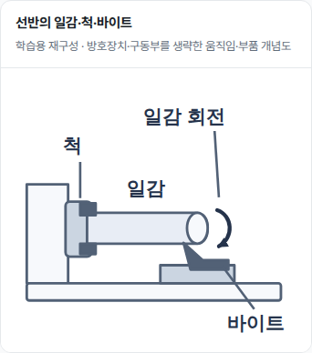
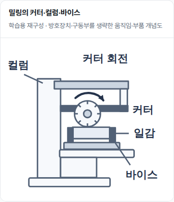
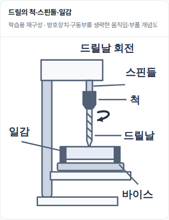
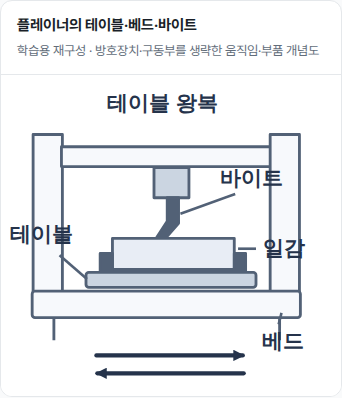

# 그림 4장 검증 결과 — 검토본

- [Draft PR #125](https://github.com/syjy813/getpasslab/pull/125) · 이미지 Production Merge/Deploy 미실행
- 학습 이미지 정본 v1.2 §§1–9, 제작 전 `brief.json` 작성 및 정본 24문항 본문/선택지/답안 독해
- CCOHS/NPTEL은 움직임·고정 관계 대조 근거이며 도판 복사 없음. 새 L1 SVG 4장 · 방호/구동부·피트 형상 추정 안 함
- 로컬 Build·분리 전용·SEO·공개 본문·XML 검사 PASS. 기존 frontmatter·URL·24문항·정본/원본 에셋 및 580개 보호 파일 불변
- [SEO 37135549568](https://github.com/syjy813/getpasslab/actions/runs/37135549568) success
- [CI preview QA 37135549560](https://github.com/syjy813/getpasslab/actions/runs/37135549560) success: 390/1440/320px 각 5개 챕터·24문항 팝업 전수·목차/관련/이전다음·4개 회귀 및 12개 그림 표시 검사 PASS/오류 0
- 그림 4개 HTTP 200·SVG 원본 동일성·alt·치수·실제 표시 폭 확인. SVG 22 단위 핵심 라벨의 표시 크기는 390px에서 약20.8px, 320px에서16.5px, PC에서23.8px. 이미지 표시 폭 340/270/390px
- 그림 캡처 직접 검수: 네 그림 390px, 선반·드릴 320px, 드릴·플레이너 PC. 초기 선반 라벨/베드 선 겹침과 작은 화살촉 정리 후 재검사
- 모바일 고정 이동 메뉴가 캡처 하단을 가리던 문제는 그림을 뷰포트 중앙으로 스크롤한 뒤 캡처해 해소. 운영 탐색 UI 변경 없음
- artifact `11278152317`, ZIP SHA-256 `7beb4c00c6a8db1b710f5d90d17ce0287c9e1f651d1cf0e52ef08d3b235f3454` 대조. full results / visual results 모두 `passed:true` 및 오류 0. 세부 `visual-verification.json`
- 검토본에 브라우저 캡처 4장을 보존함. 실물 스마트폰·실제 기계 운전·원본 PDF·학습자 효과 검증 미실행

## 390px 검토 캡처

| 선반 | 밀링 |
|---|---|
|  |  |

| 드릴 | 플레이너 |
|---|---|
|  |  |
