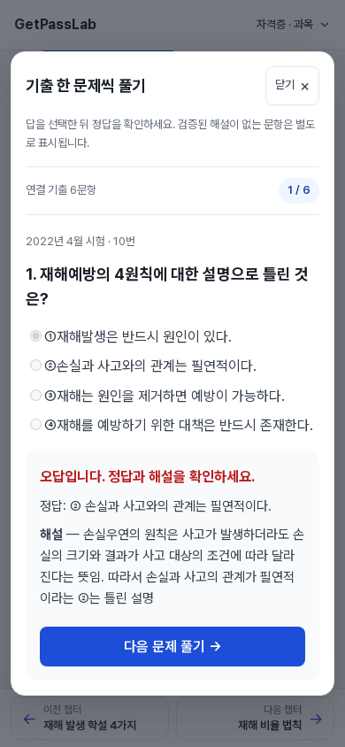
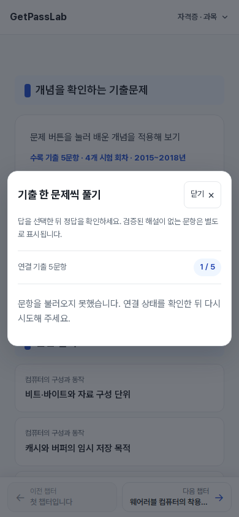

# GetPassLab 전체 챕터 문제풀이 실서버 통합 QA

## ① 최종 판정

**전체 QA: 부분 PASS. 실서버의 문제풀이·채점·점수 집계는 사용 가능하지만, UI 결함 2종을 고친 뒤 전체 PASS로 판정해야 함.**

- 데이터 손상·정답 번호 변경·공개 URL 변경·풀이 진행 불능 등의 치명적 결함은 확인되지 않음
- 중간 심각도: 동적 선택지의 scoped CSS 미적용(작은 터치 영역·정답/오답 행 색상 누락), 팝업 배경의 본문 스크롤 미잠금
- 검증 스크립트와 CI 보완만 별도 PR으로 반영. 제품 CSS·콘텐츠·정본 데이터는 수정하지 않음
- 실서버 기준 커밋: `9fea932bb8c46d3d65fb7291cf29612a0a67dcf3`. 과거 QA 결과를 현재 정상 동작의 증거로 재사용하지 않고 이번에 재검증
- HTTP 검사: 2026-10-10T14:43:59.193Z ~ 2026-10-10T14:52:44.502Z; 브라우저: 2026-10-10T14:57:52.750Z ~ 2026-10-10T15:07:33.337Z (UTC)

## ② 검증 현황

| 자격증 | 공개 챕터 | 문제풀이 적용 | 버튼 미노출 | 연결 문항 |
|---|---:|---:|---:|---:|
| 산업안전기사 | 263 | 253 | 10 | 1,032 |
| 에너지관리기능사 | 21 | 21 | 0 | 1,588 |
| 컴퓨터활용능력 2급 | 163 | 132 | 31 | 301 |
| 합계 | 447 | 406 | 41 | 2,921 |

전체 447개 Production HTML의 본문 해시·문제 메타데이터·이미지/주의/해설 메타·버튼 수/문항 수·title·description·canonical을 현재 main의 빌드 출력과 대조. frontmatter의 실제 주 기출 배정과 기출 출제 이력·풀이 ID 배열도 대조함. 공개 소스 447개가 모두 경로를 갖는지 검사해 누락을 방지함. 보조 기출은 기존 구조대로 별도 유지됨.

정본 JSON의 3,621문항(산업안전 1,680·에너지 1,620·컴활 321)의 ID·지문·선택지·수록 답안·출처 표기를 Production 엔드포인트와 전수 대조하여 일치 확인. 연결 2,921은 챕터별 연결 건수의 합이며 엔드포인트 전체 문항 수와 구분함. 검수 보류 문항은 풀이 대상으로 제외되는지 검사. 컴활의 기존 주의 메타 9개도 Production과 일치함.

**전수 HTTP 검사: 447개 챕터 + 데이터 3개 + 리소스 124개, 오류 0개.** 리소스에는 본문/기출 이미지, 공용 스크립트, sitemap, robots, 홈 응답이 포함됨. Sitemap에 모든 공개 챕터가 포함됨을 확인함.

학습 이미지 정본 v1.2의 §6·§9 기준을 적용해 기존 원본 유지, 모바일 표시 폭·비율·응답·alt·치수를 확인함. 기출 이미지 메타 57건은 ID와 이미지 파일명 대응·대체 텍스트·양의 width/height 검사 통과. 그림의 기술 관계나 원본 내용 자체를 새로 전수 재감사한 것은 아님.

**브라우저: 10개 챕터·26개 화면 조건·1,126회 선택/채점/다음 이동. 완료·정답 집계·다시 풀기 확인 18개 조건.**

세 자격증 대표는 320/390/768/1440px에서 확인. 예외는 320/1440px에서 긴 지문·선택지·이미지·주의 문항을 의도적으로 선택. 167·116·74문항의 큰 묶음은 마지막 문항과 완료 화면까지 확인함.

| 항목 | 판정 및 근거 |
|---|---|
| 열기·지문·선택지·수록 답안 | PASS — 실제 브라우저에서 정본 대조 |
| 정답/오답 판정·선택 고정·정답 개수 | PASS — 정답/오답을 교대로 선택해 독립 집계 |
| 선택지 행의 정답/오답 색상 | FAIL — 클래스는 붙지만 스타일이 적용되지 않음 |
| 해설 | PASS — 시범 6개는 제공, 나머지는 검증 해설 미확보 안내. 임의 해설 생성 없음 |
| 다음·마지막·완료·재시작 | PASS — 아래 조건별 실제 풀이 수 참조 |
| 닫기·Esc·배경 클릭·재열기 | PASS — 재열면 1번, 선택/채점 상태 초기화 |
| 팝업 화면 이탈·제목/닫기 겹침·가로 넘침 | PASS — 네 화면 폭의 실제 경계 측정 |
| 이미지 로드·비율·내부 스크롤 | PASS — 이미지 decode와 실제 표시 폭/비율 확인 |
| 선택지 터치 영역·배경 본문 스크롤 | FAIL — 아래 중간 심각도 결함 |
| 초기 데이터 요청 | PASS — 버튼 클릭 전 practice-data 요청 0, 클릭 뒤 1회, 재열기 시 추가 요청 없음 |
| 로딩 실패·저속 네트워크 | PASS — 의도적 503 후 안내/재시도, 400ms 지연·50KiB/s 환경 회복 확인 |
| 404·JS 오류 | 정상 경로 오류 0. 주입한 503, 광고/분석 차단, 탐색 취소 요청은 정상 경로 장애와 구분 |
| 기존 기출 팝업·내부 링크 | PASS — 각 버튼 aria-controls에 연결된 실제 기존 팝업 확인·내부 이동/복귀 |
| Test/Build·SEO·기존 콘텐츠 | PASS — 아래 CI/로그 및 447개 본문 해시 대조 |

### 실제 브라우저 대상

| 챕터/Production URL | 화면 폭(px) | 실제 풀이/총 문항 | 완료 검증 |
|---|---:|---:|---|
| [iptv-smart-tv](https://getpasslab.co.kr/computer-literacy/written/computer-basics/iptv-smart-tv/) | 320 | 1/2 | 지정 예외 문항까지 확인 |
| [iptv-smart-tv](https://getpasslab.co.kr/computer-literacy/written/computer-basics/iptv-smart-tv/) | 1440 | 1/2 | 지정 예외 문항까지 확인 |
| [network-device-roles](https://getpasslab.co.kr/computer-literacy/written/computer-basics/network-device-roles/) | 320 | 5/6 | 지정 예외 문항까지 확인 |
| [network-device-roles](https://getpasslab.co.kr/computer-literacy/written/computer-basics/network-device-roles/) | 1440 | 5/6 | 지정 예외 문항까지 확인 |
| [cell-entry-edit-navigation](https://getpasslab.co.kr/computer-literacy/written/spreadsheets/cell-entry-edit-navigation/) | 320 | 6/6 | 완료·재시작 확인 |
| [cell-entry-edit-navigation](https://getpasslab.co.kr/computer-literacy/written/spreadsheets/cell-entry-edit-navigation/) | 390 | 6/6 | 완료·재시작 확인 |
| [cell-entry-edit-navigation](https://getpasslab.co.kr/computer-literacy/written/spreadsheets/cell-entry-edit-navigation/) | 768 | 6/6 | 완료·재시작 확인 |
| [cell-entry-edit-navigation](https://getpasslab.co.kr/computer-literacy/written/spreadsheets/cell-entry-edit-navigation/) | 1440 | 6/6 | 완료·재시작 확인 |
| [boiler-protection-devices](https://getpasslab.co.kr/energy-management/written/thermal-equipment/boiler-protection-devices/) | 320 | 74/74 | 완료·재시작 확인 |
| [boiler-protection-devices](https://getpasslab.co.kr/energy-management/written/thermal-equipment/boiler-protection-devices/) | 1440 | 74/74 | 완료·재시작 확인 |
| [energy-laws-and-inspection](https://getpasslab.co.kr/energy-management/written/thermal-equipment/energy-laws-and-inspection/) | 320 | 167/167 | 완료·재시작 확인 |
| [energy-laws-and-inspection](https://getpasslab.co.kr/energy-management/written/thermal-equipment/energy-laws-and-inspection/) | 390 | 167/167 | 완료·재시작 확인 |
| [energy-laws-and-inspection](https://getpasslab.co.kr/energy-management/written/thermal-equipment/energy-laws-and-inspection/) | 768 | 167/167 | 완료·재시작 확인 |
| [energy-laws-and-inspection](https://getpasslab.co.kr/energy-management/written/thermal-equipment/energy-laws-and-inspection/) | 1440 | 167/167 | 완료·재시작 확인 |
| [heating-systems](https://getpasslab.co.kr/energy-management/written/thermal-equipment/heating-systems/) | 320 | 116/116 | 완료·재시작 확인 |
| [heating-systems](https://getpasslab.co.kr/energy-management/written/thermal-equipment/heating-systems/) | 1440 | 116/116 | 완료·재시작 확인 |
| [fta-event-symbols](https://getpasslab.co.kr/industrial-safety/written/ergonomics/fta-event-symbols/) | 320 | 4/5 | 지정 예외 문항까지 확인 |
| [fta-event-symbols](https://getpasslab.co.kr/industrial-safety/written/ergonomics/fta-event-symbols/) | 1440 | 4/5 | 지정 예외 문항까지 확인 |
| [quantitative-assessment-items](https://getpasslab.co.kr/industrial-safety/written/ergonomics/quantitative-assessment-items/) | 320 | 4/4 | 완료·재시작 확인 |
| [quantitative-assessment-items](https://getpasslab.co.kr/industrial-safety/written/ergonomics/quantitative-assessment-items/) | 1440 | 4/4 | 완료·재시작 확인 |
| [press-safety-devices](https://getpasslab.co.kr/industrial-safety/written/mechanical/press-safety-devices/) | 320 | 1/12 | 지정 예외 문항까지 확인 |
| [press-safety-devices](https://getpasslab.co.kr/industrial-safety/written/mechanical/press-safety-devices/) | 1440 | 1/12 | 지정 예외 문항까지 확인 |
| [accident-prevention-principles](https://getpasslab.co.kr/industrial-safety/written/safety-management/accident-prevention-principles/) | 320 | 6/6 | 완료·재시작 확인 |
| [accident-prevention-principles](https://getpasslab.co.kr/industrial-safety/written/safety-management/accident-prevention-principles/) | 390 | 6/6 | 완료·재시작 확인 |
| [accident-prevention-principles](https://getpasslab.co.kr/industrial-safety/written/safety-management/accident-prevention-principles/) | 768 | 6/6 | 완료·재시작 확인 |
| [accident-prevention-principles](https://getpasslab.co.kr/industrial-safety/written/safety-management/accident-prevention-principles/) | 1440 | 6/6 | 완료·재시작 확인 |

첫 로딩 관측값: 최소 111ms·중앙값 231ms·최대 397ms. QA의 프록시/네트워크·브라우저 실행 경로가 포함된 값으로 국내 사용자 속도나 서버 자체 지연으로 일반화하지 않음. 전체 데이터를 클릭 뒤 자격증별로 받는 구조이며 캐시가 재열기 중복 로드를 막음. 본문은 초기에 별도 문제 데이터 없이 제공됨. 대량 풀이 중 선택지 DOM은 매 문항 4개로 확인했으며 167문항 진행/완료가 정상. 장시간 힙 누수 프로파일·실물 스마트폰·Core Web Vitals는 별도 미측정임.

## ③ 발견 문제

### M1. 동적 선택지 스타일 미적용 — 중간 심각도 / 세 자격증 전체 풀이 UI

- URL: https://getpasslab.co.kr/industrial-safety/written/safety-management/accident-prevention-principles/
- 조건: PC·모바일. 390px 실제 측정에서 짧은 선택지 높이 **25.59375px**, 정답/오답 행 배경 `rgba(0, 0, 0, 0)`, 테두리 `none`
- 재현: 문제 풀기 → 1번 문항에서 ① 선택 → 정답 확인. 수록 정답②와 선택①의 행에 색상/테두리가 나타나야 하나 표시되지 않음. 결과 문장 자체의 정답/오답 색상과 채점은 정상
- 원인: JS에서 생성한 `label.practice-choice`·하위 요소에 Astro scope 속성이 없음. 빌드 CSS는 `.practice-choice[data-astro-cid-pfsuwkax]` 등으로 제한되어 실제 동적 노드와 불일치
- 영향: 선택지 구분·터치 영역·선택/정답/오답 강조·키보드 포커스 스타일이 의도대로 적용되지 않음
- 해결: 미수정. 해당 팝업 범위로 제한한 global selector 또는 동적 노드를 포함하는 스타일 범위를 정비하고 재검증 필요

### M2. 팝업 배경 본문 스크롤 미잠금 — 중간 심각도 / 공통 풀이 팝업

- 같은 URL, 390px Chromium 실제 측정: 팝업 열린 상태에서 배경 영역 휠 입력 시 `scrollY 2182 → 2582`로 이동
- 재현: 문제 풀기 → 팝업 바깥 배경에 포인터/스크롤 입력 → 뒤쪽 학습 본문이 이동하는지 확인
- 기대: 풀이 팝업 내부만 스크롤되고 학습 본문의 위치는 유지
- 원인: native `dialog.showModal()`로 배경은 inert 상태지만 문서 스크롤을 잠그는 처리 없음
- 해결: 미수정. 모달 열기/닫기 동안 본문 스크롤을 잠그고 기존 위치 복원을 확인해야 함

기능/데이터 치명 결함 없음. 선택지 행 색상과 터치 영역은 동일 원인(M1)의 증상으로 묶었으며 결함 수를 중복 집계하지 않음. 알려진 UI 결함이 있으면 새 브라우저 QA 스크립트는 정상 종료 코드로 PASS 처리하지 않고 보고서를 쓴 뒤 실패를 반환함.

## ④ CI 정상화

### 기존 배포 후 실패 로그

| 기존 실패 Workflow/로그 | 실제 첫 실패 원인 |
|---|---|
| [Industrial remaining splits QA](https://github.com/syjy813/getpasslab/actions/runs/38059189604) | 신규 practice-data/[cert].json.ts 파일 목록 불일치 |
| [Industrial safety chapter splits QA](https://github.com/syjy813/getpasslab/actions/runs/38059189589) | ChapterLayout.astro 해시 불일치 |
| [Earth retaining structure QA](https://github.com/syjy813/getpasslab/actions/runs/38059189558) | 신규 practice-data/[cert].json.ts 파일 목록 불일치 |
| [FTA symbols split QA](https://github.com/syjy813/getpasslab/actions/runs/38059189492) | 신규 practice-data/[cert].json.ts 파일 목록 불일치 |
| [Industrial remaining chapter review QA](https://github.com/syjy813/getpasslab/actions/runs/38059189662) | ChapterLayout.astro 해시 불일치 |

2개는 layout SHA 차이, 3개는 신규 endpoint 인벤토리 차이. 실제 로그와 Diff를 각각 확인했으며 전체 실패를 동일 원인으로 가정하지 않음. 해당 단계에서 browser QA는 실행되지 않았으므로 과거 실패를 브라우저 회귀의 증거로 해석하지 않음.

### 수정

- `scripts/read-before-hanging-scaffold-wire-rope.mjs`: PR #164의 layout 해시를 확인하고 정확한 4개 추가 행만 역복원. 복원 결과가 기존 역사적 해시와 일치하는지 검증
- 같은 helper의 `beforePracticeEndpointInventory`: 해당 변경 이전 감사 3개에서만 정확한 endpoint 해시를 확인한 뒤 목록에서 제외. 다른 신규 파일은 계속 노출하여 기존 인벤토리 검사가 실패하도록 유지
- `check-industrial-remaining-splits.mjs`, `check-earth-retaining-structure.mjs`, `check-fta-original-options.mjs`: 위 엄격한 인벤토리 투영에만 opt-in
- 관련 Workflow 5개: helper 변경 시 기존 검사를 다시 실행하도록 path 추가. 테스트 제거/skip/PASS 강제 처리 없음
- `check-historical-practice-guard.mjs`: 격리 fixture에서 허용 변경·layout 변조·endpoint 변조·미승인 추가 파일·endpoint 삭제 등 6개 검사. 실제 제품 파일은 변이하지 않음
- 과거 감사 JSON·원본 자료·해시 값은 수정하지 않음. 새 QA 스크립트 2개와 이 새 보고서만 추가

### 재실행

**CI 보완 검증 커밋 `a4d287a82b8cf98a0e8a21f0bf5d970e26f3e6cd`: 관련 CI 8/8 성공.** 원래 실패한 5개가 모두 포함됨. main의 과거 실패 run 기록은 남으며 PR을 병합하지 않았으므로 main 자체를 새 검증 커밋으로 바꾸지 않음.

| Workflow | 재실행 결과/Actions |
|---|---|
| Industrial remaining splits QA | [success](https://github.com/syjy813/getpasslab/actions/runs/38061327733) |
| Earth retaining structure QA | [success](https://github.com/syjy813/getpasslab/actions/runs/38061327803) |
| Industrial safety chapter splits QA | [success](https://github.com/syjy813/getpasslab/actions/runs/38061327735) |
| Industrial remaining chapter review QA | [success](https://github.com/syjy813/getpasslab/actions/runs/38061327760) |
| FTA symbols split QA | [success](https://github.com/syjy813/getpasslab/actions/runs/38061327739) |
| Industrial question source repair QA | [success](https://github.com/syjy813/getpasslab/actions/runs/38061327777) |
| All chapter formula style QA | [success](https://github.com/syjy813/getpasslab/actions/runs/38061327734) |
| SEO validation | [success](https://github.com/syjy813/getpasslab/actions/runs/38061327758) |

추가 로컬 확인: Build, 전체 연결, 엔드포인트, SEO, public-content, deferred-question-content, 컴활 001~081/082~159, contrast, 시범 해설, 역사적/후속 보호 검사 14개, 격리 변이 검사 6개 통과. 세부 stdout은 증거 ZIP의 `logs/`에 있음.

## ⑤ Git 상태

- 브랜치: `codex/practice-production-qa-20261010`
- PR: https://github.com/syjy813/getpasslab/pull/166 (Draft, 미병합)
- CI 보완 검증 커밋: `a4d287a82b8cf98a0e8a21f0bf5d970e26f3e6cd`. 최종 브라우저 검사/보고서 커밋은 PR의 최신 HEAD/commits에서 확인 가능
- 변경 범위: 검사 helper/스크립트·Workflow path·신규 QA 스크립트·새 보고서/검증 증거
- `src/`, `public/`, 원본 기출/정답/식별자/URL, 기존 감사 자료는 기준 main과 diff 없음
- main Merge/Push, Production 재배포: **미실행**. 기존 Production 유지

## ⑥ 최종 권고 및 검증 한계

현재 운영은 유지 가능하나, M1·M2를 보완하고 네 화면 폭에서 재검증해야 전체 QA PASS를 선언할 수 있음. 현재 PR은 CI/검증 보완용이며 제품 결함을 해결하는 PR로 오해하지 않기. 제품 CSS/스크롤 처리 변경과 main 병합/배포는 이 작업에서 수행하지 않음.

검증 범위는 정본 JSON과 배포 데이터의 일치, 실제 브라우저 작동, 공개 소스/HTML/기출 연결/SEO 보존임. 모든 문항의 원문 PDF·공식 확정 답안·현행 법령을 새로 전수 재감사한 결과는 아님. Chromium 화면/터치 에뮬레이션으로 검증했으며 실제 iOS Safari·Android 하드웨어·스크린리더·장시간 힙 누수·광고 실제 노출·국내 실사용 Core Web Vitals는 미확인임. 광고/분석 요청은 시험 트래픽 방지를 위해 차단했으며 폰트 요청은 유지함.

전체 HTTP/브라우저 원시 결과, 스크린샷, 초기 실패 로그와 CI 증거는 전달한 ZIP에 포함함. `summary.json`은 요약 집계이며 `http-report.json`·`browser-report.json`이 조건별 실제 검사 기록임.
