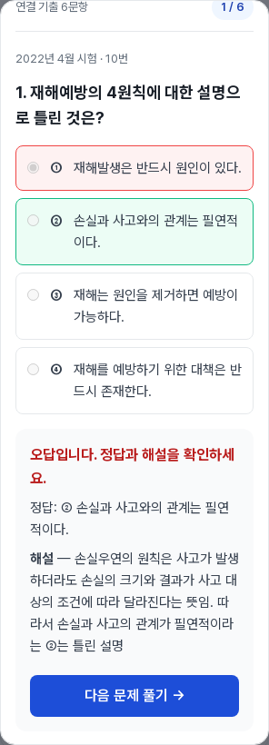
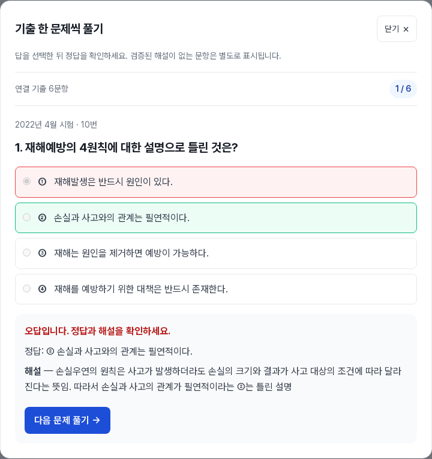
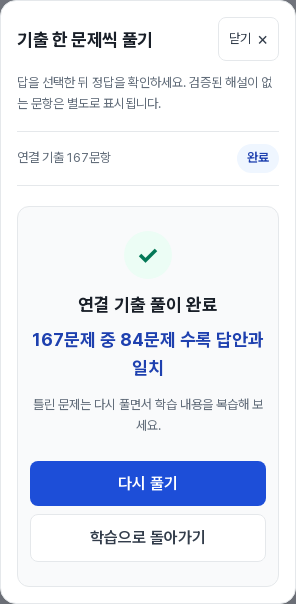

# 문제풀이 팝업 UI 결함 2건 수정 검토본

수정본의 로컬 Build·기존 콘텐츠/정본 검사·브라우저 QA는 PASS. 배포 전 검토본이며 **Production에는 아직 반영하지 않음**. main 병합과 배포는 별도 승인 이후 수행한다.

## 변경

1. **선택지 스타일**: Astro scope를 갖는 기존 fieldset 아래의 JS 생성 label/input/span만 `:global()`로 선택한다. 선택지의 테두리·여백·기호·키보드 포커스와 정답/오답 행 색상을 복구했다. 선택 전 강조는 채점 전의 활성 radio에만 적용해 수록 답안 색상을 덮지 않도록 했다. 최소 터치 높이는 44px, 실제 검증 최솟값은 **50px**.
2. **배경 스크롤**: 팝업을 열 때 본문의 화면 위치를 유지한 채 fixed로 잠그고, 문서 스크롤을 숨긴다. 기존 inline style 값과 priority 및 X/Y 위치를 보관한다. 공통 close 이벤트에서 닫기·Esc·배경 클릭·학습으로 돌아가기 모두 스타일·위치·포커스를 복원한다. 스크롤바 폭을 보정하며 modal 열기 실패도 잠금을 해제한다.

제품 수정 파일은 `src/components/InstantQuestionPractice.astro` 하나다. 정답 판정·문항 순서·데이터 로딩·해설 생성 로직은 변경하지 않았다.

## 로컬 검증

| 검사 | 실제 결과 |
|---|---|
| Build | PASS, 466 build routes |
| 전체 공개 챕터·기출 연결 | 447개 공개 / 406개 적용 / 41개 미노출 / 2,921개 연결 유지 |
| 주요 브라우저 QA | 10개 챕터, 26개 화면 조건, **1,154회** 선택·채점·다음 이동. 26개 조건 모두 완료·점수·다시 풀기 확인 |
| 대표 화면 폭 | 세 자격증 320/390/768/1440px, 긴 지문·선택지·이미지·주의 문항은 320/1440px |
| 대량 문항 | 167·116·74문항을 마지막/완료까지 검증 |
| UI 결함 재현 검사 | 선택지 터치 영역·정답/오답 색상·배경 휠 스크롤 문제 0건 |
| 별도 모달 상태 검사 | 4개 화면 폭 × 4개 닫기 경로 = **16회** 기존 위치/inline style/priority/포커스 복원. 추가 36회 채점 |
| 입력/스타일 | 키보드 Tab/Space와 선택 상태, 의미 색상 토큰의 실제 RGB·테두리 일치. 모바일 화면의 배경 터치 스와이프 잠금 확인 |
| 닫은 뒤 | 본문 스크롤이 다시 동작하고, 재열면 첫 문항/미선택 상태 |
| 네트워크 | 클릭 전 데이터 요청 없음, 재열기 캐시, 의도적 503 안내/닫기/재시도, 저속 네트워크 회복 PASS |
| 정상 경로 JS/네트워크 오류 | 0개 |
| 보호/데이터 스크립트 | 18개 PASS, 그중 역사적/후속 보호 검사 14개와 격리 변이 12개 포함 |
| 기존 사이트 회귀 | 대비·SEO·공개 본문·deferred 기출·컴활 4계열 8개 검사 PASS |

원시 기록: [browser-report.json](browser-report.json), [dialog-state-report.json](dialog-state-report.json), [static-checks.json](static-checks.json), [content-checks.json](content-checks.json).

### 화면 증거

모바일 채점 화면은 feedback/다음 버튼으로 포커스가 이동해 팝업 내부가 스크롤된 상태다. 실제 초기 제목·닫기 버튼 경계와 겹침도 자동 검사했다.

## 보호 검사 보완과 콘텐츠 보존

[source-preservation.json](source-preservation.json): `src/`·`public/` 732개 파일 중 제품 컴포넌트 1개만 변경, 731개는 byte 일치. 정본 3,621문항·정답·ID·이미지·챕터 원문·공개 경로·canonical을 유지했다.

447개 챕터 본문 중 446개는 byte 일치. 시범 챕터 `accident-prevention-principles`의 본문에 포함된 공용 practice script src 한 곳만 `BgvjTz7n.js` → `DWjhNYN0.js`로 변경됐으며, 그 src를 역치환하면 전체 본문 byte가 기존과 일치한다. 지문·본문·기출 배정 변경이 아니다.

이를 과거 검사에서 인정하기 위해 기존 helper에 **정확한 수정 컴포넌트 SHA와 시범 본문 SHA만 추가 허용**했다. 최신 달비계 보호 검사도 같은 허용 함수를 재사용한다. 과거 rollout 허용 목록과 감사 JSON·원본·해시는 그대로 보존했다. 격리 fixture 검사에 새 source/본문의 승인 사례·1byte/본문 변조·삭제 거부 검사를 추가해 6개 → 12개로 확장했다. 테스트 skip·무조건 PASS·범위 축소는 없다.

- 컴포넌트 기존 SHA: `cc622a10bf43b49e2c1a2c17fc2412da06bf831c308317f65555d1b1c2e6edc3`
- 컴포넌트 수정 SHA: `43f7428d6c43cc1b0492b54b56dc29425fb382afa485d3984770b33c62e3f9e3`
- 시범 본문 수정 SHA: `5936242ddc2698e50b49dd83dbd6b9ee6281f0dd1dccd832ac89ae5bc73b76de`

학습 이미지 정본 v1.2 §6·§9의 기존 원본 유지·모바일 표시 크기/비율·alt 기준을 재검증에 적용했다. 이미지 생성·편집·교체는 하지 않았다.

## Git·CI·배포 경계

- 브랜치: `codex/practice-dialog-ui-fix-20261011`
- 기준: CI/QA 보완 [PR #166](https://github.com/syjy813/getpasslab/pull/166)의 검증된 HEAD `b4901a3d73eaed1ab0de6768731778cdb3284967`
- 이번 수정 PR은 #166 브랜치를 base로 삼는 별도 PR이다. #166 병합 후 main으로 retarget하여 병합해야 한다. 기존 PR/main/Production을 변경하지 않았다.
- 신규 `Practice dialog UI QA` workflow는 이 의존 PR에서도 Build·18개 보호/정본·8개 회귀·모달 상태·26개 전체 풀이 조건을 검증하고 결과를 artifact로 보존한다. 최종 CI 결과와 commit은 해당 수정 PR Checks/설명에서 확인한다.
- main/Production 기준: `9fea932bb8c46d3d65fb7291cf29612a0a67dcf3`. **Merge·Deploy·수정본 Production QA 미실행**.

로컬 Chromium 131의 PC/터치 에뮬레이션 결과다. 물리 iOS/Android·Safari·스크린리더·장시간 힙 누수·Core Web Vitals는 미검증이며, 배포 뒤 실제 Production에서 두 결함 수정 여부와 주요 흐름을 다시 확인해야 한다. 광고/분석 요청은 시험 트래픽을 막기 위해 차단했다.
