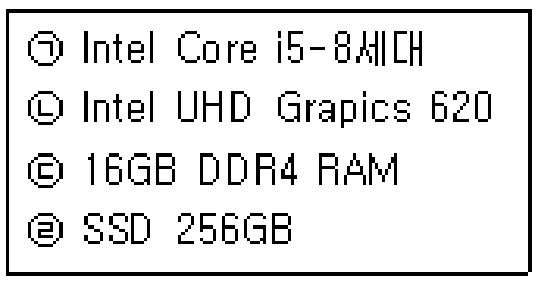

## 사양의 이름과 단위 연결

- **㉠ Core i5:** 프로세서(CPU)
- **㉡ UHD Graphics:** 그래픽 장치(GPU)
- **㉢ 16GB DDR4 RAM:** 메모리 종류·용량
- **㉣ SSD 256GB:** 저장장치 종류·용량

`GB`가 붙어도 모두 같은 장치는 아님 → **RAM인지 SSD인지 이름을 함께 확인**

따라서 원본 보기의 `㉣ — 저장장치 종류와 용량`이 올바른 연결
