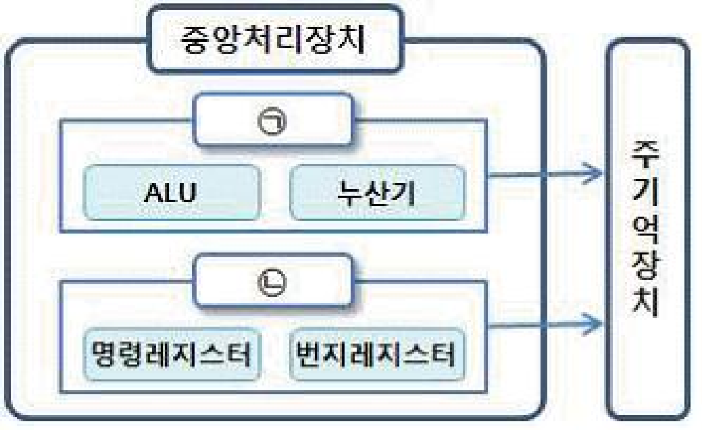

## 계산·제어·임시 저장 구별

| CPU 구성 | 역할 |
|---|---|
| ALU | 산술·논리 연산 |
| CU | 명령 해독·각 장치에 제어 신호 전달 |
| 레지스터 | CPU 내부에서 명령·주소·연산 결과 임시 저장 |

`명령 해독`, `장치에 지시·감독` → **CU의 제어 기능**

SSD는 데이터를 장기간 저장하는 보조기억장치이므로 CPU 구성 요소가 아님

## 기출 그림의 내부 명칭 확인

- **(ㄱ):** ALU·누산기 포함 → 연산장치
- **(ㄴ):** 명령 레지스터·번지 레지스터 포함 → 제어장치

기출의 단순화된 구성도에서 내부 명칭을 보고 영역의 역할 판단
